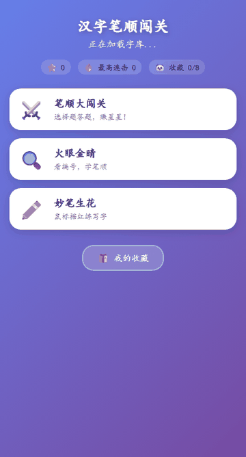
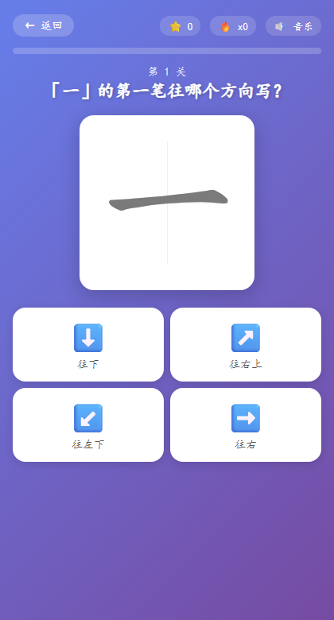
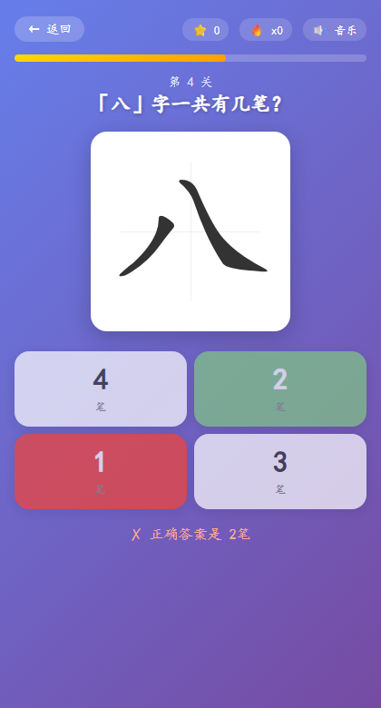
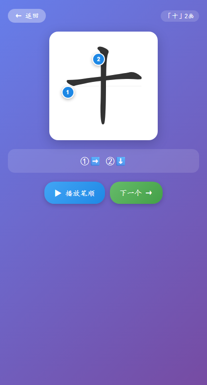
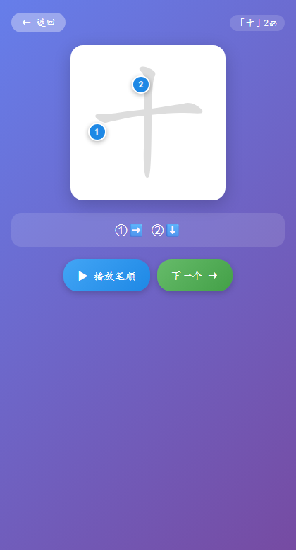
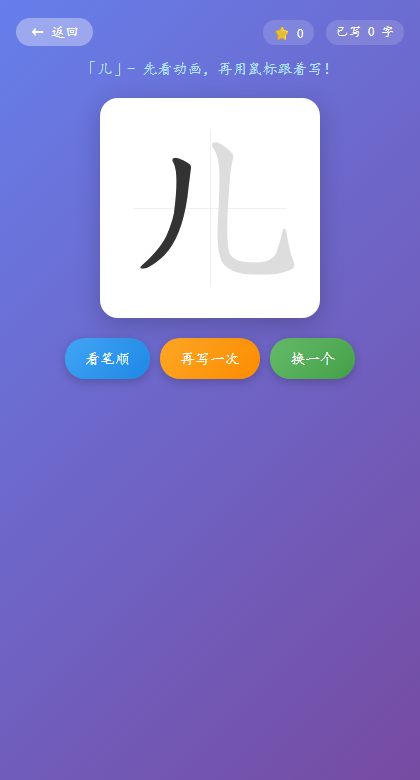
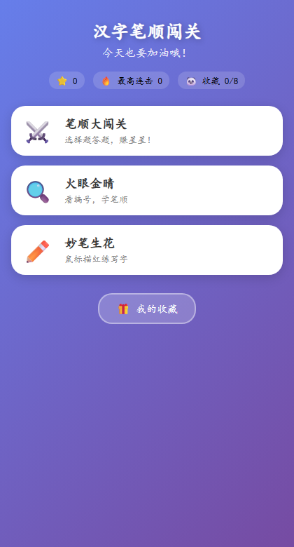

# 汉字笔顺闯关 · Hanzi Stroke Quest

> 一款专为小学低年级孩子打造的 **纯前端** 汉字笔顺学习小游戏。三种互动模式 + 星星奖励 + 动物收藏馆，让孩子在玩中掌握 200+ 常用汉字的正确笔顺。

<p align="center">
  
</p>

<p align="center">
  <a href="#-在线体验">在线体验</a> ·
  <a href="#-核心功能">核心功能</a> ·
  <a href="#-三大模式详解">模式详解</a> ·
  <a href="#-技术栈">技术栈</a> ·
  <a href="#-快速开始">快速开始</a>
</p>

---

## ✨ 项目亮点

- 🎯 **零构建、零后端**：单文件 `index.html` 打开即用，任何静态托管都能部署（GitHub Pages / Vercel / Netlify / Nginx）。
- 🧒 **儿童友好 UI**：糖果紫渐变背景、大圆角按钮、田字格练字区，专为 6–9 岁孩子设计。
- 🎮 **游戏化激励**：星星 ⭐ + 连击 🔥 + 动物收藏 🐼 + 全屏彩带彩蛋，学习成就感拉满。
- 🔊 **多感官反馈**：Web Audio API 合成音效（正确 / 错误 / 完成 / 彩蛋）+ Web Speech API 中文语音鼓励（"太棒了！""你真厉害！"）。
- 📚 **难度渐进**：字库按笔画数从少到多排序，同笔画组内随机洗牌，避免挫败感也保留趣味性。
- 🌐 **多 CDN 容错**：`hanzi-writer` 库依次尝试 jsDelivr / unpkg / cdnjs，任一可用即可运行。
- 💾 **本地进度保存**：`localStorage` 持久化星星数、最高连击、已解锁动物，关掉浏览器也不丢。

---

## 🎮 三大模式详解

### ⚔️ 笔顺大闯关（Quiz 模式）

选择题闯关，每关随机出题，答对得星星、连击越高倍率越大：

| 题型 | 出现概率 | 示例 |
| --- | --- | --- |
| 数笔画 | 60% | 「大」字一共有几笔？ |
| 判方向 | 40% | 「大」的第二笔往哪个方向写？（➡️⬇️↙️↘️↗️） |

- 连击 ≥ 3 触发屏幕中央 "**连击 x3!**" 金色爆炸字
- 连击 ≥ 5 触发 "**超级连击 x5!!**"，星星奖励翻倍（1 → 2 → 3）
- 连击 ≥ 10 触发 "**无敌连击 x10!!!**"
- 每闯 5 关自动弹出全屏动物彩蛋 + 彩带雨

<p align="center">
  
  
</p>

### 🔍 火眼金睛（Labels 模式）

看编号学笔顺：
- 每一笔的起点位置显示 **蓝色圆形编号**（1、2、3…），当前笔画高亮为橙色，完成变绿。
- 底部信息栏用带圈数字 ①②③ + 方向箭头图标直观展示笔画顺序。
- **▶ 播放笔顺** 按钮：逐笔动画演示整个字的书写过程。
- 点击任意编号可单独重播该笔画。

<p align="center">
  
  
</p>

### ✏️ 妙笔生花（Write 模式）

鼠标描红练写字：
1. 打开先自动播放一次完整笔顺动画
2. 孩子用鼠标跟着虚线轮廓书写
3. `hanzi-writer` 内置 Quiz 引擎实时判断每一笔是否规范
4. 错 3 次自动高亮提示正确路径
5. **完美零失误 +3 星**，有失误 +1 星
6. 每写满 5 个字触发一次动物彩蛋

<p align="center">
  
</p>

---

## 🎁 动物收藏馆

每积攒 **50 颗星星** 自动解锁一只动物，共 8 只可收集：

| 顺序 | 动物 | 需要星星 |
| --- | --- | --- |
| 1 | 🐼 熊猫 | 50 |
| 2 | 🐵 猴子 | 100 |
| 3 | 🐰 兔子 | 150 |
| 4 | 🐱 小猫 | 200 |
| 5 | 🐶 小狗 | 250 |
| 6 | 🐘 大象 | 300 |
| 7 | 🐧 企鹅 | 350 |
| 8 | 🐯 老虎 | 400 |

解锁瞬间：全屏遮罩 + 动物弹跳动画 + 4 音符欢快旋律 + 25 片彩带从顶部飘落。

<p align="center">
  
</p>

---

## 📚 字库

内置 **200+ 小学一二年级必会汉字**，覆盖人教版语文课本常见生字：

```
一 二 三 十 人 八 大 小 上 下 口 日 月 水 火 山 石 田 木 禾 米 白 云
女 儿 子 了 不 在 有 是 我 你 他 的 来 去 会 个 中 长 门 出 开 见 对
妈 爸 哥 姐 书 读 写 字 本 笔 春 风 冬 花 飞 入 姓 什 么 双 国 王 方
青 清 气 晴 情 请 生 时 动 万 吃 叫 主 住 没 以 后 更 种 样 伙 伴 玩
前 再 成 片 回 事 知 道 声 笑 跑 走 坐 站 看 听 说 唱 画 草 林 鸟 虫
鱼 牛 马 羊 猫 狗 宜 实 色 华 谷 金 尽 层 照 炉 烟 挂 川 劳 尤 其 区
...（更多见 index.html 中 CHARS 常量）
```

启动时并行预加载所有字符的 `hanzi-writer-data` JSON 数据，按 **笔画数从少到多** 排序后进入随机队列，实现难度渐进。

---

## 🛠️ 技术栈

| 类别 | 技术 |
| --- | --- |
| 前端框架 | **无框架** · 原生 HTML + CSS + JavaScript |
| 笔顺引擎 | [hanzi-writer 3.0.0](https://hanziwriter.org/) · SVG 渲染 |
| 字形数据 | [hanzi-writer-data 2.0](https://www.npmjs.com/package/hanzi-writer-data) · CDN 按需加载 |
| 音效 | Web Audio API · 代码合成正弦 / 方波 / 三角波 |
| 语音 | Web Speech API · `SpeechSynthesisUtterance` 中文播报 |
| 动画 | CSS `@keyframes` · 无第三方动画库 |
| 存储 | `localStorage` · 三个键：`hz_stars` / `hz_maxCombo` / `hz_collected` |
| 部署 | 任意静态服务器 · 已内置多 CDN 容错 |

---

## 🚀 快速开始

### 方式 1：直接双击运行（最简单）

```bash
git clone git@github.com:shixingya/hanzi-practice.git
cd hanzi-practice
# 直接用浏览器打开 index.html 即可
```

> ⚠️ 需要联网访问 CDN 加载笔顺库和字形数据。

### 方式 2：本地 HTTP 服务（推荐）

某些浏览器对 `file://` 协议的 fetch 请求有限制，用 HTTP 服务更稳：

```bash
# Python 3
python -m http.server 8765

# 或 Node.js
npx serve -l 8765
```

浏览器打开 http://127.0.0.1:8765 。

### 方式 3：部署到 GitHub Pages

1. 把仓库 fork 到自己的账号
2. Settings → Pages → Source 选 `main` 分支根目录
3. 等 1 分钟后访问 `https://<你的用户名>.github.io/hanzi-practice/`

---

## 📂 目录结构

```
hanzi-practice/
├── index.html          # 主应用（585 行单文件，包含 HTML/CSS/JS）
├── assets/             # README 用图片资源
│   ├── demo.gif        # 运行演示 GIF
│   ├── scene_home.png
│   ├── scene_quiz.png
│   ├── scene_quiz_answer.png
│   ├── scene_labels.png
│   ├── scene_labels_play.png
│   ├── scene_write.png
│   └── scene_collection.png
├── record_demo.js      # Puppeteer 自动录屏脚本（开发用）
├── make_gif.py         # PNG 帧合成 GIF 脚本（开发用）
├── package.json
└── README.md
```

---

## 🎬 重新录制演示 GIF

如果你想修改代码后重录 README 顶部的演示 GIF：

```bash
# 1. 安装依赖（首次）
npm install puppeteer-core
python -m pip install pillow

# 2. 启动本地服务器
python -m http.server 8765

# 3. 另开一个终端录制帧（约 30 秒）
node record_demo.js

# 4. 合成 GIF
python make_gif.py
```

录屏脚本会用无头 Chrome 依次访问：首页 → 笔顺大闯关（答 3 题）→ 火眼金睛（播放笔顺）→ 妙笔生花 → 我的收藏，全程约 92 帧 @ 5.5fps，输出 `assets/demo.gif`（约 1.9 MB）。

如需修改 Chrome 路径，设置环境变量：
```powershell
$env:CHROME_PATH = "D:\Your\Path\chrome.exe"
```

---

## 🔧 关键实现细节

### 笔画方向自动识别

`detectDir()` 函数根据 `hanzi-writer-data` 提供的 `medians`（笔画中线坐标）自动判断每一笔的方向类型：

| 代码 | 方向 | 图标 | 判定条件（角度） |
| --- | --- | --- | --- |
| R | 往右（横） | ➡️ | -25° ≤ θ < 25° |
| D | 往下（竖） | ⬇️ | -115° ≤ θ < -65° |
| P | 往左下（撇） | ↙️ | -180° ≤ θ < -115° |
| N | 往右下（捺） | ↘️ | -65° ≤ θ < -25° |
| T | 往右上（提） | ↗️ | 25° ≤ θ < 80° |

位移小于 60 单位的短笔画统一判定为「点」（往下）。

### CDN 备用加载

```javascript
var cdns = [
  'https://cdn.jsdelivr.net/npm/hanzi-writer@3.0.0/dist/hanzi-writer.min.js',
  'https://unpkg.com/hanzi-writer@3.0.0/dist/hanzi-writer.min.js',
  'https://cdnjs.cloudflare.com/ajax/libs/hanzi-writer/3.0.0/hanzi-writer.min.js'
];
```

任一 CDN 加载成功即停止尝试，全部失败时首页显示"加载失败，请检查网络后刷新"。

### 进度持久化

```javascript
localStorage.setItem('hz_stars', stars);           // 累计星星数
localStorage.setItem('hz_maxCombo', maxCombo);     // 历史最高连击
localStorage.setItem('hz_collected', JSON.stringify(collected)); // 已解锁动物名列表
```

清除数据：浏览器 DevTools → Application → Local Storage → 删除以上三个 key。

---

## 📱 兼容性

| 环境 | 支持情况 |
| --- | --- |
| Chrome / Edge 90+ | ✅ 完整支持 |
| Firefox 90+ | ✅ 完整支持 |
| Safari 14+ | ✅ 支持（语音可能受限于用户手势策略） |
| iOS Safari | ✅ 触屏操作 OK |
| Android Chrome | ✅ 触屏操作 OK |
| 微信内置浏览器 | ⚠️ 语音合成可能被禁用，其他正常 |

移动端已做响应式适配（`@media max-width: 420px`），字符框从 260px 缩至 220px。

---

## 🐛 已知问题

- Web Speech API 首次触发需要用户手势，个别浏览器可能第一句语音不播报，第二次起正常。
- 完整预加载 200+ 字形数据需 3–8 秒（取决于网络），期间首页显示"正在加载字库..."。
- 极少数生僻字（如「宜」「谷」）的 `medians` 数据可能不完全符合方向判定规则，会以默认「横」处理。

---

## 📄 License

MIT © 2026 shixingya

---

## 🙏 致谢

- [hanzi-writer](https://github.com/chanind/hanzi-writer) by Chanind — 提供核心笔顺动画与 Quiz 引擎
- [hanzi-writer-data](https://github.com/chanind/hanzi-writer-data) — 提供 9000+ 汉字的 SVG 路径与笔画中线数据
- [Make Me a Hanzi](https://github.com/skishore/makemeahanzi) — 字形数据的原始来源

---

<p align="center">
  <b>如果这个项目帮到了你家小朋友，欢迎点个 ⭐ Star 支持一下！</b>
</p>
