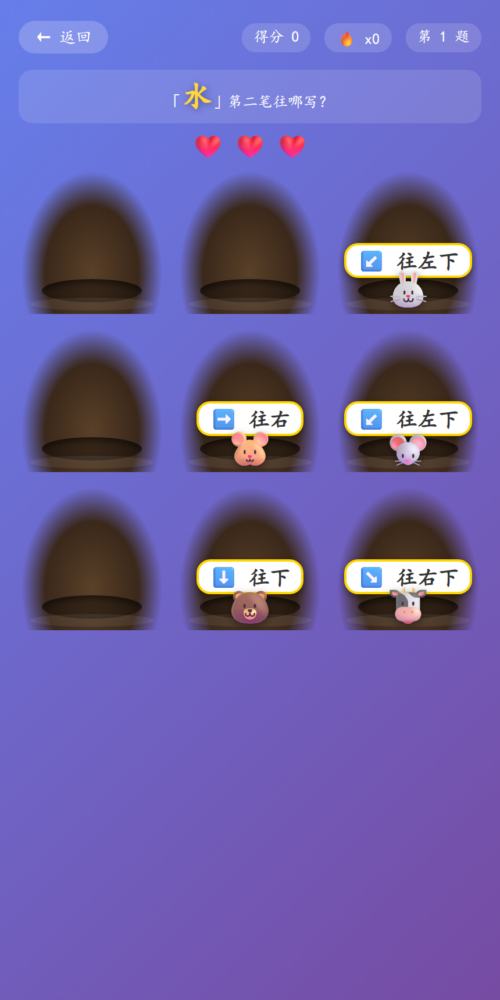
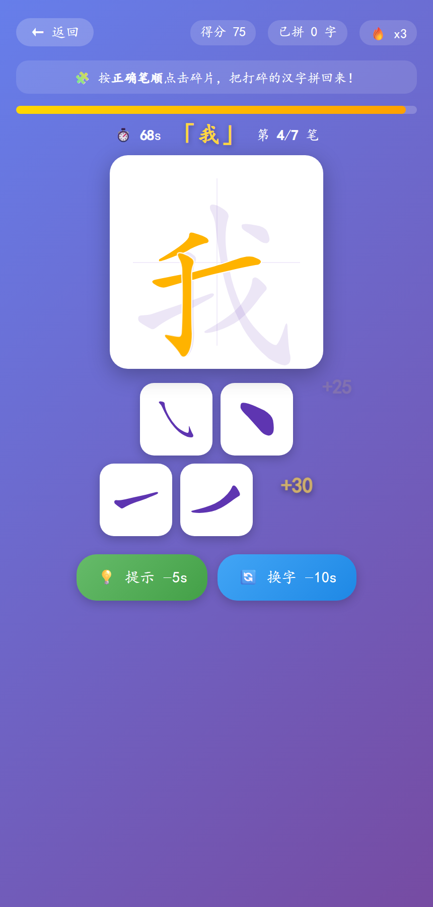
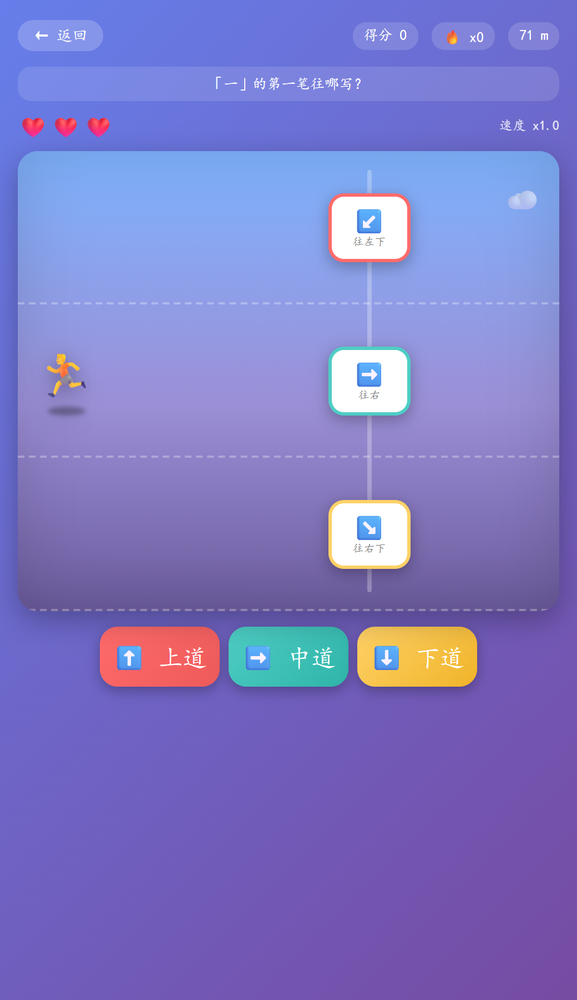
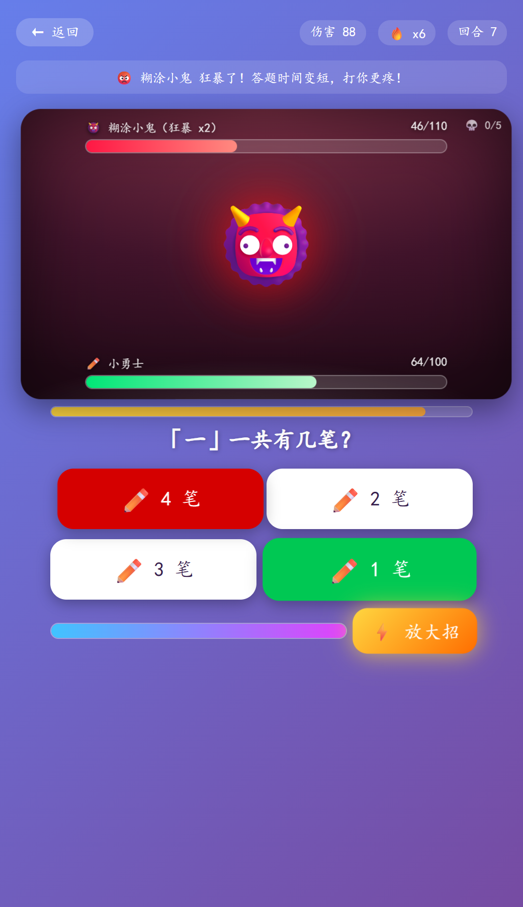
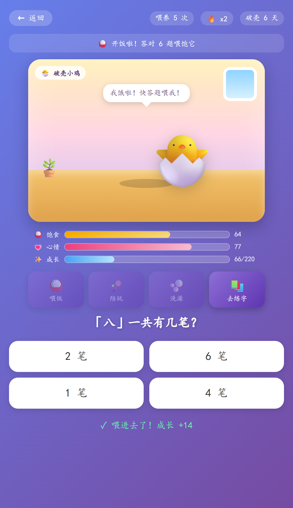
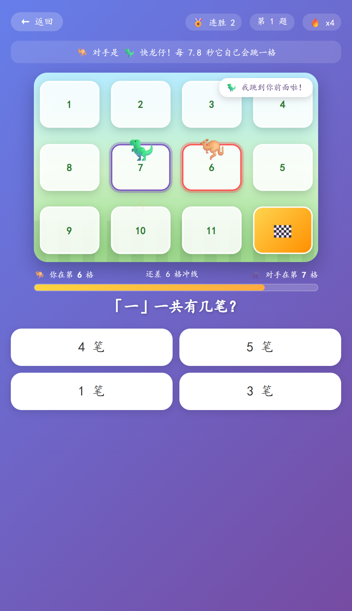
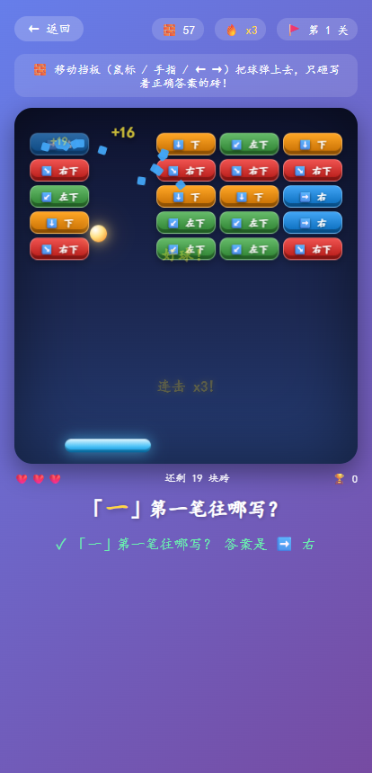
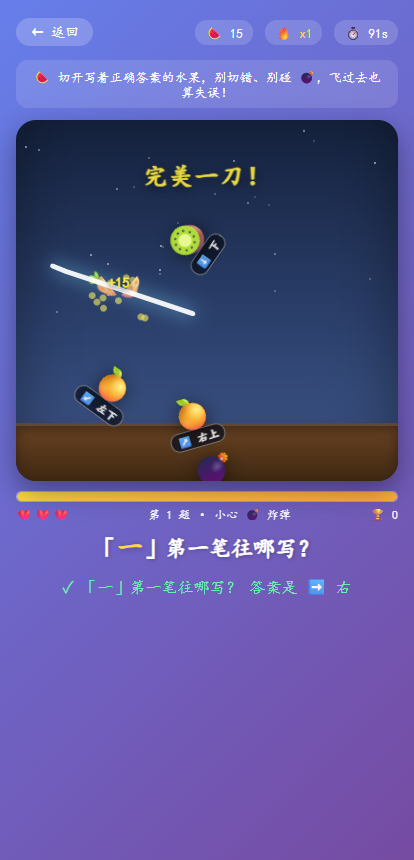
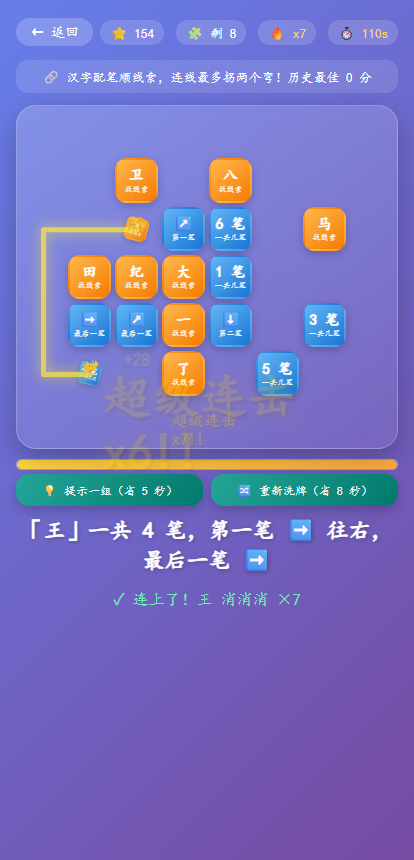

# 汉字笔顺闯关 · Hanzi Stroke Quest

> 一款专为小学低年级孩子打造的 **纯前端** 汉字笔顺学习小游戏。16 种互动模式（笔顺音游 / 汉字俄罗斯方块 / 笔顺打地鼠 / 笔顺拼图 / 笔顺跑酷 / 笔顺大魔王 / 笔顺宠物屋 / 笔顺跳房子 / 笔顺连连消 / 笔顺切水果 / 笔顺打砖块…）+ 星星奖励 + 动物收藏馆，让孩子在玩中掌握 200+ 常用汉字的正确笔顺。

<p align="center">
  
</p>

<p align="center">
  <a href="https://shixingya.github.io/hanzi-practice/"></a>
  &nbsp;&nbsp;
  <a href="https://github.com/shixingya/hanzi-practice/releases/latest"></a>
  &nbsp;&nbsp;
  
  &nbsp;&nbsp;
  
</p>

<p align="center">
  <a href="#-在线体验">在线体验</a> ·
  <a href="#-核心功能">核心功能</a> ·
  <a href="#-模式详解">模式详解</a> ·
  <a href="#-技术栈">技术栈</a> ·
  <a href="#-快速开始">快速开始</a>
</p>

---

## 🌐 在线体验

**👉 立即试玩：<https://shixingya.github.io/hanzi-practice/>**

（已通过 GitHub Pages 部署，无需下载，打开即玩。建议用 Chrome / Edge / Safari，移动端也支持。）

---

## ✨ 项目亮点

**核心功能一览：**

- 🎯 **零构建、零后端**：单文件 `index.html` 打开即用，任何静态托管都能部署（GitHub Pages / Vercel / Netlify / Nginx）。
- 🧒 **儿童友好 UI**：糖果紫渐变背景、大圆角按钮、田字格练字区，专为 6–9 岁孩子设计。
- 🎮 **游戏化激励**：星星 ⭐ + 连击 🔥 + 动物收藏 🐼 + 全屏彩带彩蛋，学习成就感拉满。
- 🕹️ **16 种玩法不重样**：选择题闯关、冒险地图、限时挑战、笔顺音游、汉字俄罗斯方块、笔顺打地鼠、笔顺拼图、笔顺跑酷、笔顺大魔王、笔顺宠物屋、笔顺跳房子、笔顺连连消、笔顺切水果、笔顺打砖块、火眼金睛、妙笔生花，同一个笔顺知识点反复练也不腻。
- 🔊 **多感官反馈**：Web Audio API 合成音效（正确 / 错误 / 完成 / 彩蛋）+ Web Speech API 中文语音鼓励（"太棒了！""你真厉害！"）。
- 📚 **难度渐进**：字库按笔画数从少到多排序，同笔画组内随机洗牌，避免挫败感也保留趣味性。
- 🌐 **多 CDN 容错**：`hanzi-writer` 库依次尝试 jsDelivr / unpkg / cdnjs，任一可用即可运行。
- 💾 **本地进度保存**：`localStorage` 持久化星星数、最高连击、已解锁动物，关掉浏览器也不丢。

---

## 🎮 模式详解

### 🎵 笔顺音游（Rhythm 模式）

把写字变成打架子鼓！汉字的每一笔化作下落的音符，像音乐游戏一样踩着节奏按出来：

- 🎼 **笔画即音符**：随机抽取 6–9 个汉字，每个字按正确笔顺拆成一串音符，按 4 轨道下落（横➡️ / 竖⬇️ / 撇↙️ / 捺↘️，提并入横轨）
- ⌨️ **双操作方式**：电脑用 F / G / J / K 键，手机直接点屏幕底部四个彩色按键
- 🎯 **三档判定**：完美 / 良好 / MISS，判定窗口对幼儿友好；音符砸到金色判定线时按下
- 🎹 **命中即奏乐**：每次命中按五声音阶上行发音，连击越高旋律越亮，整局自动演奏成一段小乐曲；节拍器滴答声帮你找节奏
- 🔥 **连击爆炸特效** + 屏幕中央「超级连击」大字 + 星星飞散
- ✨ **写完一个字** 触发「写完啦 +50」奖励音和星星雨，笔顺记忆潜移默化
- 🎵 **背景乐**：Web Audio 实时合成小学生经典儿歌（欢乐颂 / 两只老虎 / 小星星 / 粉刷匠 / 铃儿响叮当），每局随机一首，🎵 按钮一键开关
- 🐢 **三档速度**：慢速 / 中速 / 快速自由调节（只改下落速度，节奏不变），选择自动保存
- 🏆 **结算段位**：🌈 全连击演奏家 / 🎼 节奏之神 / 🎹 小小钢琴家 / 🥁 节奏小鼓手，历史最高分本地保存，高分还可赢得星星并触发彩带彩蛋

### 🧱 汉字俄罗斯方块（Tetris 模式）

笔顺知识变成消除武器，像俄罗斯方块一样越堆越高：

- 🎯 答对一笔一画的问题 → **消除最顶层一行方块**（+100 分起，连击加成最高 +200）
- ❌ 答错 → **方块叠高一层**，堆满 10 层游戏结束（危险时棋盘红框闪烁警告）
- 🧨 **全消波次**：把方块全部清空触发「全消 +300」，下一波堆得更高、更刺激
- 🟦 双色糖果方块塔 + 消除闪光动画 + 新层弹跳落下动画
- 🈵 大号楷体当前汉字 + 数笔画 / 判方向两种题型，全程循环出题
- 🏆 结算评段：方块终结者 🏆 / 堆叠高手 🥇 / 消除新星 🥈，历史最高分保存，赚星星解锁动物

### 🐹 笔顺打地鼠（Whack-a-Mole 模式）

答案从洞里钻出来，眼疾手快才能打中——练笔顺顺便练反应力：

- 🐭 **地鼠扛答案**：每题随机钻出 4–7 只地鼠，各举一块答案牌（`3 笔` / `➡️ 往右`），只有一只是正确答案
- 👀 **先想清楚再出手**：题目「「水」第二笔往哪写？」常驻顶部，孩子必须先心算笔顺，再在一堆地鼠里找到那只
- ⏱️ **手速压制**：地鼠停留时间从 2.5 秒起，每答一题缩短 140ms，越玩越快，逼出条件反射
- ❤️ **三颗爱心**：打错、或眼看地鼠扛着答案钻回去，都掉一颗心；心掉光这局结束
- ⚡ **秒了奖励**：地鼠刚冒头 0.9 秒内就打中 → 额外 +30 分并弹出「⚡秒了！」
- 🔨 **打击感拉满**：💥 爆炸贴图、地鼠被打飞旋转缩小、金色分数飘字、星星飞散、连击爆炸字、五声音阶上行的锤击音效
- 🎚️ **难度自适应**：题数越多，同屏地鼠越多（最多 7 只），永远不重样
- 🏆 结算评段：地鼠克星 🏆 / 快手小达人 🥇 / 打得不错 🥈，命中率与历史最高分本地保存

<p align="center">
  
</p>

### 🧩 笔顺拼图（Puzzle 模式）

把汉字**打碎成笔画碎片**，按正确笔顺一块块拼回来——最直接的笔顺肌肉记忆训练：

- 🧩 **真·笔画碎片**：直接从 `hanzi-writer-data` 的 SVG 笔画路径裁出每一笔（自动测量包围盒），随机打乱、随机微旋转后摊在碎片盘里
- 👻 **影子字提示**：田字格里淡紫色显示目标字轮廓，孩子对照着找「下一笔是哪块」
- 🎯 **必须按笔顺**：点错碎片 → 抖动 + 扣 3 秒 + 连击清零，逼孩子真正想清楚下一笔而不是乱试
- ⏱️ **倒计时压力**：70 秒起步，每拼好一个字 +9 秒，拼得越快时间越充裕，天然「再来一局」
- ✨ **落位动画**：点对的碎片淡出，对应笔画立刻在田字格里弹跳定格（金色），整字完成时外圈金光扩散 + 星星雨 + 完成和弦
- 💡 **提示 / 换字**：提示会点亮正确的下一块（−5 秒），换字跳过难题（−10 秒），孩子自己掌控难度
- 🌟 **完美零失误**：整字一次不错 +150 分并触发语音表扬，结算统计「完美字数」
- 🏆 结算评段：拼图宗师 🏆 / 结构小达人 🥇 / 越拼越顺 🥈，历史最高分本地保存

<p align="center">
  
</p>

### 🏃 笔顺跑酷（Runner 模式）

孩子操控小人一路狂奔，前方不断落下**三道抢答门**——想穿过去，只能冲进正确的那一栏：

- 🚪 **三道抢答门**：上/中/下三条跑道各挂一个答案，点跑道、点底部按钮、键盘 ↑↓（或 WASD / 数字 1-2-3）、手机上下滑动都能变道，怎么顺手怎么来
- 🧠 **边跑边算**：题目「「一」的第一笔往哪写？」「「山」一共几笔？」常驻顶部，孩子必须心算笔顺再选道，答错直接撞墙
- 💥 **撞墙有代价**：三颗爱心，撞错一次掉一颗并屏幕震动；每通过 10 道门补一颗心（最多 3 颗），逼出「谨慎但又想冲」的紧张感
- 🎚️ **越跑越快**：速度随通过门数线性提升（1.8% → 4.5% 屏宽/毫秒），距离米数实时增长，天然刷纪录
- ✨ **通过特效**：撞对 → 小人起跳 + 正确门牌飞散 + 五声音阶上行 + 连击爆炸字 + 星星雨；每 5 连击语音表扬
- 🏆 结算评段：跑酷之王 🏆 / 飞毛腿 🥇 / 越跑越顺 🥈 / 起步啦 🥉，总跑动距离与历史最高分本地保存

<p align="center">
  
</p>

### 👹 笔顺大魔王（Boss 战模式）

不是刷完就散的答题——**五位魔王排着队等你**，答对砍它一刀，答错它打你，血条见底才算赢：

- 🩸 **双血条对战**：魔王血量 110 → 280 逐位变厚，小勇士 100 点血，答对回 5 血，答错扣 22~39 血，紧张感全靠这两条槽
- ⚔️ **答对即输出**：伤害 = 8 + 连击×2（上限 16）+ 速攻加成 6，越连击砍得越狠，屏幕飘出「-18」伤害数字
- ⏱️ **回合限时**：每回合 9 秒倒计时条（后段变红），超时视为魔王抢先出手，逼孩子**看清笔顺再下手**
- ⚡ **能量大招**：每答对攒 22 点能量，攒满 100 点亮「⚡放大招」按钮，一键砍掉 40+ 血 + 全屏刀光，键盘空格也能放
- 😡 **狂暴阶段**：血量掉到 50% / 20% 时魔王狂暴，场景变红、魔王发亮、答题时间砍到 78% / 60%，伤害更高
- 🏅 **魔王阵容收集**：击败一位解锁下一位（`hz_boss_beat` 存档），结算页用 💀 标出已打倒的魔王，通关五位即「笔顺宗师」
- 🎮 **四种操作**：点选项、键盘 1-4、空格放大招，手机直接点，怎么快怎么来

<p align="center">
  
</p>

### 🐣 笔顺宠物屋（养成模式）

一只**真的会饿、会难过、会长大**的汉字宠物住在房间里，它的口粮只有一种——你答对的笔顺题：

- 🍖 **三条状态槽**：饱食 / 心情 / 成长值实时显示，宠物状态直接反映在表情和动作上（饿了会耷拉变灰）
- ⏳ **真实时间衰减**：按 `localStorage` 里的时间戳结算，离开 3 小时回来它就饿了 60 多点——**明天还想看看它**的钩子全靠这个
- 🍚 **喂饭 = 答题**：一顿饭 6 道笔顺题，答对食物掉进嘴里 + 咀嚼动画 + 连击叠成长，全对触发「加餐 +25」
- 🎾 **陪玩**：5 秒内点中乱弹的小球，点一次心情 +6、成长 +3，音调随连击升高
- 🫧 **洗澡**：房间里爬出 4 只小脏东西，逐个点掉，洗完亮晶晶 + 经验奖励
- ❤️ **摸摸头**：随时点宠物，飘爱心 + 心情 +2，它会跟你说话（气泡台词按饥饿/心情/阶段变化）
- 🐉 **五阶段进化**：🥚 汉字蛋 → 🐣 破壳小鸡 → 🐥 笔顺雏鸟 → 🐔 神气大公鸡 → 🐉 汉字神兽，进化时全屏白光 + 彩带弹窗
- 🔗 **全局成长联动**：**在任何模式里拿到星星都会顺便给宠物 +2 成长值**，首页卡片实时显示它的阶段，练字越勤它长得越快
- 📅 **每日见面礼**：第一次打开送 +20 成长、+12 心情

<p align="center">
  
</p>

### 🦘 笔顺跳房子（对战赛跑模式）

12 格蛇形赛道，你和一只 AI 小怪兽**同时往前跳**——答对才动，答错就让它偷跳一格：

- 🏁 **真正的竞速感**：谁先踩到第 12 格谁赢，对手每 6~9 秒**自己往前跳一格**，你不答题它照样冲线
- 🧠 **答对才跳得动**：笔顺题（数笔画 / 判方向）四选一，答对跳 1 格；连击 ≥3 且手速快 → **⚡连跳加倍一次跨 2 格**
- 😈 **答错代价明确**：连击清零 + 对手立刻白赚一格，小怪兽还会弹气泡嘲讽你「我跳到你前面啦！」
- 🏅 **连胜解锁更强对手**：👾 小紫怪 → 🐒 急猴子 → 🦖 快龙仔 → 🤖 铁蛋机器人 → 🐆 闪电豹，连胜越多它跳得越快、答题时限越短（9 秒 → 6 秒）
- 💨 **跳跃手感**：格子高亮描边、起跳抛物线动画、落地扬尘、音阶随前进格数升高，冲线撒花
- ⌨️ **键盘 1-4 直接抢答**，鼠标手机点选都行
- 📈 结算记录答题数 / 最长连跳 / 当前连胜 / 历史最长连胜（`hz_hop_wins` / `hz_hop_best`），输了连胜清零——「再来一局把它赢回来」

<p align="center">
  
</p>

### 🧱 笔顺打砖块（弹球 Breakout 模式）

一整面砖墙压在头顶，每块砖上写着一个候选答案，脚下是一块会发光的挡板——**把球弹上去，只砸写着正确答案的那块砖**：

- 🕹️ **真弹球手感**：鼠标 / 手指 / ← → 都能控挡板，球打在挡板不同位置会**改变反弹角度**，想砸哪一块得自己算线路
- 🧠 **边弹边算**：题目问「『一』第一笔往哪写？」「『人』一共有几笔？」，25 块砖分四种颜色写着四个候选答案，先想清楚答案，再守好角度
- 💥 **砸对**：砖块当场**炸成碎片**、飘出 +分、五声音阶随连击往上爬，「漂亮！」「真准！」弹在墙上；把这一题的正确答案全砸完立刻换新题
- 😅 **砸错**：砖也会碎，但连击清零、扣 4 分、屏幕一震，并提醒你这题的正确答案是什么
- ❤️ **球掉地下才扣心**：三颗心，掉完结束一局——比手速更考走位
- 🚩 **无限过关**：清空整面砖墙进下一关，球更快、挡板更窄；`hz_brick_lv` 记录最高关数、`hz_brick_best` 记录最高分，结算给出正确率与最长连击

<p align="center">
  
</p>

### 🍉 笔顺切水果（刀刃切割模式）

夜空下的木台，答案写在飞来的水果上——**用鼠标/手指划一刀**，把正确的那颗切开：

- 🔪 **真·刀感**：按住划过水果才算切中（触屏直接点也行），切中瞬间水果**裂成两半飞散**、果汁四溅、刀刃拖出蓝色光轨，「完美一刀！」「好刀法！」大字弹在天上
- 🧠 **先算再切**：题目问「『一』第一笔往哪写？」「『人』一共有几笔？」，四颗水果上写着四个候选答案，看准了才下刀——切错一下就去一颗 ❤️
- 💣 **炸弹别碰**：混在果子里的 💣 越到后面越多，切到直接扣心 + 屏幕震动，贪刀必翻车
- 🔥 **连击加分**：连切正确答案，五声音阶一路往上爬，分数随连击水涨船高（最高 +36/颗），每切中一颗回 1.5 秒
- 🍃 **放走也算失误**：写着正确答案的水果掉下木台，连击清零并提醒你别再让它飞走
- ⏱️ 90 秒一局、3 颗心，结算给出得分 / 最长连击 / 切中数与**刀法评级**（🔰 水果学徒 → 🥷 水果忍者大师），记录 `hz_fruit_best` / `hz_fruit_wins`，连胜越多炸弹越密、下一波水果来得越快

<p align="center">
  
</p>

### 🔗 笔顺连连消（知识连连看模式）

30 个字块铺满棋盘，一半是**汉字**、一半是**笔顺线索**（「4 笔」/「第一笔 ➡️」/「最后一笔 ⬇️」），把一对连起来就能消除：

- 🧠 **连线要考笔顺**：光找一样的字没用，得先数清「王」到底几笔、第一笔往哪写，才知道它配哪块线索——15 对线索文字互不重复，每一对都是唯一解
- 📐 **经典连连看规则**：两点之间的连线最多**拐两个弯**，可以绕出棋盘外沿；被挡住的字块要先消掉，越消路越开，空间推理一起练
- 💥 **连击越打越响**：连对一串，五声音阶一路往上爬，消除处炸星屑、连线闪光、头顶飘 +分，连击 ≥5 还有语音夸你
- ⏱️ **抢时间**：100 秒倒计时，每消一对 +2 秒，连错一对扣 3 秒；💡 提示（扣 5 秒）、🔀 洗牌（扣 8 秒）自己权衡着用，死局会自动洗牌
- 🎓 **消完就复盘**：每次消除都把「这个字几笔、首笔末笔往哪写」写在屏幕下方，连错时还会主动告诉你正确答案
- 🏆 通关记录得分与连胜（`hz_lian_best` / `hz_lian_wins`），连胜越多下一局初始时间越短；结算页列出本局复习到的字

<p align="center">
  
</p>

### ⚔️ 笔顺大闯关（Quiz 模式）

选择题闯关，每关随机出题，答对得星星、连击越高倍率越大：

| 题型 | 出现概率 | 示例 |
| --- | --- | --- |
| 数笔画 | 60% | 「大」字一共有几笔？ |
| 判方向 | 40% | 「大」的第二笔往哪个方向写？（➡️⬇️↙️↘️↗️） |

- 连击 ≥ 3 触发屏幕中央 "**连击 x3!**" 金色爆炸字
- 连击 ≥ 5 触发 "**超级连击 x5!!**"，星星奖励翻倍（1 → 2 → 3）
- 连击 ≥ 10 触发 "**无敌连击 x10!!!**"
- 每闯 5 关自动弹出全屏动物彩蛋 + 彩带雨

<p align="center">
  
  
</p>

### 🔍 火眼金睛（Labels 模式）

看编号学笔顺：
- 每一笔的起点位置显示 **蓝色圆形编号**（1、2、3…），当前笔画高亮为橙色，完成变绿。
- 底部信息栏用带圈数字 ①②③ + 方向箭头图标直观展示笔画顺序。
- **▶ 播放笔顺** 按钮：逐笔动画演示整个字的书写过程。
- 点击任意编号可单独重播该笔画。

<p align="center">
  
  
</p>

### ✏️ 妙笔生花（Write 模式）

鼠标描红练写字：
1. 打开先自动播放一次完整笔顺动画
2. 孩子用鼠标跟着虚线轮廓书写
3. `hanzi-writer` 内置 Quiz 引擎实时判断每一笔是否规范
4. 错 3 次自动高亮提示正确路径
5. **完美零失误 +3 星**，有失误 +1 星
6. 每写满 5 个字触发一次动物彩蛋

<p align="center">
  
</p>

---

## 🎁 动物收藏馆

每积攒 **50 颗星星** 自动解锁一只动物，共 8 只可收集：

| 顺序 | 动物 | 需要星星 |
| --- | --- | --- |
| 1 | 🐼 熊猫 | 50 |
| 2 | 🐵 猴子 | 100 |
| 3 | 🐰 兔子 | 150 |
| 4 | 🐱 小猫 | 200 |
| 5 | 🐶 小狗 | 250 |
| 6 | 🐘 大象 | 300 |
| 7 | 🐧 企鹅 | 350 |
| 8 | 🐯 老虎 | 400 |

解锁瞬间：全屏遮罩 + 动物弹跳动画 + 4 音符欢快旋律 + 25 片彩带从顶部飘落。

<p align="center">
  
</p>

---

## 📚 字库

内置 **200+ 小学一二年级必会汉字**，覆盖人教版语文课本常见生字：

```
一 二 三 十 人 八 大 小 上 下 口 日 月 水 火 山 石 田 木 禾 米 白 云
女 儿 子 了 不 在 有 是 我 你 他 的 来 去 会 个 中 长 门 出 开 见 对
妈 爸 哥 姐 书 读 写 字 本 笔 春 风 冬 花 飞 入 姓 什 么 双 国 王 方
青 清 气 晴 情 请 生 时 动 万 吃 叫 主 住 没 以 后 更 种 样 伙 伴 玩
前 再 成 片 回 事 知 道 声 笑 跑 走 坐 站 看 听 说 唱 画 草 林 鸟 虫
鱼 牛 马 羊 猫 狗 宜 实 色 华 谷 金 尽 层 照 炉 烟 挂 川 劳 尤 其 区
...（更多见 index.html 中 CHARS 常量）
```

启动时并行预加载所有字符的 `hanzi-writer-data` JSON 数据，按 **笔画数从少到多** 排序后进入随机队列，实现难度渐进。

---

## 🛠️ 技术栈

| 类别 | 技术 |
| --- | --- |
| 前端框架 | **无框架** · 原生 HTML + CSS + JavaScript |
| 笔顺引擎 | [hanzi-writer 3.0.0](https://hanziwriter.org/) · SVG 渲染 |
| 字形数据 | [hanzi-writer-data 2.0](https://www.npmjs.com/package/hanzi-writer-data) · CDN 按需加载 |
| 音效 | Web Audio API · 代码合成正弦 / 方波 / 三角波 |
| 语音 | Web Speech API · `SpeechSynthesisUtterance` 中文播报 |
| 动画 | CSS `@keyframes` · 无第三方动画库 |
| 存储 | `localStorage` · 进度：`hz_stars` / `hz_maxCombo` / `hz_collected` / `hz_settings` / `hz_grade` · 各玩法最高分：`hz_challenge_best` / `hz_rhythm_best` / `hz_tetris_best` / `hz_mole_best` / `hz_puzzle_best` / `hz_runner_best` / `hz_boss_beat` / `hz_boss_best` · 宠物养成：`hz_pet`（成长/饱食/心情/上线时间，跨真实时间衰减） · 跳房子：`hz_hop_wins` / `hz_hop_best` · 连连消：`hz_lian_wins` / `hz_lian_best` · 切水果：`hz_fruit_wins` / `hz_fruit_best` · 打砖块：`hz_brick_lv` / `hz_brick_best` |
| 部署 | 任意静态服务器 · 已内置多 CDN 容错 |

---

## 🚀 快速开始

### 方式 1：直接双击运行（最简单）

```bash
git clone git@github.com:shixingya/hanzi-practice.git
cd hanzi-practice
# 直接用浏览器打开 index.html 即可
```

> ⚠️ 需要联网访问 CDN 加载笔顺库和字形数据。

### 方式 2：本地 HTTP 服务（推荐）

某些浏览器对 `file://` 协议的 fetch 请求有限制，用 HTTP 服务更稳：

```bash
# Python 3
python -m http.server 8765

# 或 Node.js
npx serve -l 8765
```

浏览器打开 http://127.0.0.1:8765 。

### 方式 3：部署到 GitHub Pages

1. 把仓库 fork 到自己的账号
2. Settings → Pages → Source 选 `main` 分支根目录
3. 等 1 分钟后访问 `https://<你的用户名>.github.io/hanzi-practice/`

---

## 📂 目录结构

```
hanzi-practice/
├── index.html          # 主应用（5500 行单文件，包含 HTML/CSS/JS）
├── assets/             # README 用图片资源
│   ├── demo.gif        # 运行演示 GIF
│   ├── scene_home.png
│   ├── scene_quiz.png
│   ├── scene_quiz_answer.png
│   ├── scene_labels.png
│   ├── scene_labels_play.png
│   ├── scene_write.png
│   ├── scene_collection.png
│   ├── scene_mole.png
│   ├── scene_puzzle.png
│   ├── scene_runner.png
│   ├── scene_boss.png
│   ├── scene_pet.png
│   ├── scene_hop.png
│   ├── scene_lian.png
│   ├── scene_fruit.png
│   └── scene_brick.png
├── record_demo.js      # Puppeteer 自动录屏脚本（开发用）
├── make_gif.py         # PNG 帧合成 GIF 脚本（开发用）
├── package.json
└── README.md
```

---

## 🎬 重新录制演示 GIF

如果你想修改代码后重录 README 顶部的演示 GIF：

```bash
# 1. 安装依赖（首次）
npm install puppeteer-core
python -m pip install pillow

# 2. 启动本地服务器
python -m http.server 8765

# 3. 另开一个终端录制帧（约 30 秒）
node record_demo.js

# 4. 合成 GIF
python make_gif.py
```

录屏脚本会用无头 Chrome 依次访问：首页 → 笔顺大闯关（答 3 题）→ 火眼金睛（播放笔顺）→ 妙笔生花 → 我的收藏，全程约 92 帧 @ 5.5fps，输出 `assets/demo.gif`（约 1.9 MB）。

如需修改 Chrome 路径，设置环境变量：
```powershell
$env:CHROME_PATH = "D:\Your\Path\chrome.exe"
```

---

## 🔧 关键实现细节

### 笔画方向自动识别

`detectDir()` 函数根据 `hanzi-writer-data` 提供的 `medians`（笔画中线坐标）自动判断每一笔的方向类型：

| 代码 | 方向 | 图标 | 判定条件（角度） |
| --- | --- | --- | --- |
| R | 往右（横） | ➡️ | -25° ≤ θ < 25° |
| D | 往下（竖） | ⬇️ | -115° ≤ θ < -65° |
| P | 往左下（撇） | ↙️ | -180° ≤ θ < -115° |
| N | 往右下（捺） | ↘️ | -65° ≤ θ < -25° |
| T | 往右上（提） | ↗️ | 25° ≤ θ < 80° |

位移小于 60 单位的短笔画统一判定为「点」（往下）。

### CDN 备用加载

```javascript
var cdns = [
  'https://cdn.jsdelivr.net/npm/hanzi-writer@3.0.0/dist/hanzi-writer.min.js',
  'https://unpkg.com/hanzi-writer@3.0.0/dist/hanzi-writer.min.js',
  'https://cdnjs.cloudflare.com/ajax/libs/hanzi-writer/3.0.0/hanzi-writer.min.js'
];
```

任一 CDN 加载成功即停止尝试，全部失败时首页显示"加载失败，请检查网络后刷新"。

### 进度持久化

```javascript
localStorage.setItem('hz_stars', stars);           // 累计星星数
localStorage.setItem('hz_maxCombo', maxCombo);     // 历史最高连击
localStorage.setItem('hz_collected', JSON.stringify(collected)); // 已解锁动物名列表
```

清除数据：浏览器 DevTools → Application → Local Storage → 删除以上 key。

---

## 📱 兼容性

| 环境 | 支持情况 |
| --- | --- |
| Chrome / Edge 90+ | ✅ 完整支持 |
| Firefox 90+ | ✅ 完整支持 |
| Safari 14+ | ✅ 支持（语音可能受限于用户手势策略） |
| iOS Safari | ✅ 触屏操作 OK |
| Android Chrome | ✅ 触屏操作 OK |
| 微信内置浏览器 | ⚠️ 语音合成可能被禁用，其他正常 |

移动端已做响应式适配（`@media max-width: 420px`），字符框从 260px 缩至 220px。

---

## 🐛 已知问题

- Web Speech API 首次触发需要用户手势，个别浏览器可能第一句语音不播报，第二次起正常。
- 完整预加载 200+ 字形数据需 3–8 秒（取决于网络），期间首页显示"正在加载字库..."。
- 极少数生僻字（如「宜」「谷」）的 `medians` 数据可能不完全符合方向判定规则，会以默认「横」处理。

---

## 📄 License

MIT © 2026 shixingya

---

## 🙏 致谢

- [hanzi-writer](https://github.com/chanind/hanzi-writer) by Chanind — 提供核心笔顺动画与 Quiz 引擎
- [hanzi-writer-data](https://github.com/chanind/hanzi-writer-data) — 提供 9000+ 汉字的 SVG 路径与笔画中线数据
- [Make Me a Hanzi](https://github.com/skishore/makemeahanzi) — 字形数据的原始来源

---

<p align="center">
  <b>如果这个项目帮到了你家小朋友，欢迎点个 ⭐ Star 支持一下！</b>
</p>
