# 汉字笔顺闯关 · Hanzi Stroke Quest

> 一款专为小学低年级孩子打造的 **纯前端** 汉字笔顺学习小游戏。49 种互动模式（笔顺音游 / 汉字俄罗斯方块 / 笔顺打地鼠 / 笔顺拼图 / 笔顺跑酷 / 笔顺大魔王 / 笔顺宠物屋 / 笔顺跳房子 / 笔顺连连消 / 笔顺切水果 / 笔顺打砖块 / 笔顺塔防 / 笔顺钓鱼 / 笔顺双人大乱斗 / 笔顺挖宝 / 每日签到星运转盘 / 笔顺贪吃蛇 / 笔顺消消乐 / 笔顺刮刮卡 / 笔顺多米诺 / 笔顺叠叠塔 / 笔顺扭蛋机 / 笔顺合合合 / 笔顺保龄球 / 笔顺跳一跳 / 笔顺推箱子 / 笔顺天平屋 / 记忆翻翻屋 / 笔顺倒水杯 / 笔顺泡泡龙 / 笔顺大富翁 / 笔顺水管屋 / 笔顺弹珠台 / 笔顺娃娃机 / 笔顺神探 / 笔顺四子棋 / 笔顺闪现 / 笔顺猜字 / 笔顺小镇 / 笔顺无双 / 笔顺堆堆消 / 笔顺地宫 / 笔顺星图 / 笔顺排排队…）+ 星星奖励 + 动物收藏馆，让孩子在玩中掌握 200+ 常用汉字的正确笔顺。

<p align="center">
  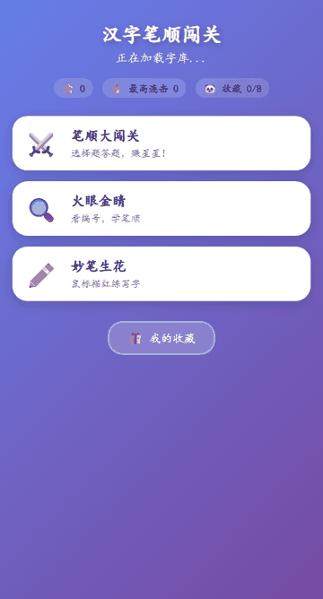
</p>

<p align="center">
  <a href="https://shixingya.github.io/hanzi-practice/"></a>
  &nbsp;&nbsp;
  <a href="https://github.com/shixingya/hanzi-practice/releases/latest"></a>
  &nbsp;&nbsp;
  
  &nbsp;&nbsp;
  
</p>

<p align="center">
  <a href="#-在线体验">在线体验</a> ·
  <a href="#-核心功能">核心功能</a> ·
  <a href="#-模式详解">模式详解</a> ·
  <a href="#-技术栈">技术栈</a> ·
  <a href="#-快速开始">快速开始</a>
</p>

---

## 🌐 在线体验

**👉 立即试玩：<https://shixingya.github.io/hanzi-practice/>**

（已通过 GitHub Pages 部署，无需下载，打开即玩。建议用 Chrome / Edge / Safari，移动端也支持。）

---

## ✨ 项目亮点

**核心功能一览：**

- 🎯 **零构建、零后端**：单文件 `index.html` 打开即用，任何静态托管都能部署（GitHub Pages / Vercel / Netlify / Nginx）。
- 🧒 **儿童友好 UI**：糖果紫渐变背景、大圆角按钮、田字格练字区，专为 6–9 岁孩子设计。
- 🎮 **游戏化激励**：星星 ⭐ + 连击 🔥 + 动物收藏 🐼 + 全屏彩带彩蛋，学习成就感拉满。
- 🕹️ **49 种玩法不重样**：选择题闯关、冒险地图、限时挑战、笔顺音游、汉字俄罗斯方块、笔顺打地鼠、笔顺拼图、笔顺跑酷、笔顺大魔王、笔顺宠物屋、笔顺跳房子、笔顺连连消、笔顺切水果、笔顺打砖块、笔顺塔防、笔顺钓鱼、笔顺双人大乱斗、笔顺挖宝、每日签到星运转盘、笔顺贪吃蛇、笔顺消消乐、笔顺刮刮卡、笔顺多米诺、笔顺叠叠塔、笔顺扭蛋机、笔顺合合合、笔顺保龄球、笔顺跳一跳、笔顺推箱子、笔顺天平屋、记忆翻翻屋、笔顺倒水杯、笔顺泡泡龙、笔顺大富翁、笔顺水管屋、笔顺弹珠台、笔顺娃娃机、笔顺神探、笔顺四子棋、笔顺闪现、笔顺猜字、笔顺小镇、笔顺无双、笔顺堆堆消、笔顺地宫、笔顺星图、笔顺排排队、火眼金睛、妙笔生花，同一个笔顺知识点反复练也不腻。
- 🔊 **多感官反馈**：Web Audio API 合成音效（正确 / 错误 / 完成 / 彩蛋）+ Web Speech API 中文语音鼓励（"太棒了！""你真厉害！"）。
- 📚 **难度渐进**：字库按笔画数从少到多排序，同笔画组内随机洗牌，避免挫败感也保留趣味性。
- 🌐 **多 CDN 容错**：`hanzi-writer` 库与字形数据依次尝试 jsDelivr / unpkg，任一可用即可运行；取字队列为空时自动回退到全字库，不会再出现「空字」请求。
- 💾 **本地进度保存**：`localStorage` 持久化星星数、最高连击、已解锁动物，关掉浏览器也不丢。

---

## 🎮 模式详解

### 🎵 笔顺音游（Rhythm 模式）

把写字变成打架子鼓！汉字的每一笔化作下落的音符，像音乐游戏一样踩着节奏按出来：

- 🎼 **笔画即音符**：随机抽取 6–9 个汉字，每个字按正确笔顺拆成一串音符，按 4 轨道下落（横➡️ / 竖⬇️ / 撇↙️ / 捺↘️，提并入横轨）
- ⌨️ **双操作方式**：电脑用 F / G / J / K 键，手机直接点屏幕底部四个彩色按键
- 🎯 **三档判定**：完美 / 良好 / MISS，判定窗口对幼儿友好；音符砸到金色判定线时按下
- 🎹 **命中即奏乐**：每次命中按五声音阶上行发音，连击越高旋律越亮，整局自动演奏成一段小乐曲；节拍器滴答声帮你找节奏
- 🔥 **连击爆炸特效** + 屏幕中央「超级连击」大字 + 星星飞散
- ✨ **写完一个字** 触发「写完啦 +50」奖励音和星星雨，笔顺记忆潜移默化
- 🎵 **背景乐**：Web Audio 实时合成小学生经典儿歌（欢乐颂 / 两只老虎 / 小星星 / 粉刷匠 / 铃儿响叮当），每局随机一首，🎵 按钮一键开关
- 🐢 **三档速度**：慢速 / 中速 / 快速自由调节（只改下落速度，节奏不变），选择自动保存
- 🏆 **结算段位**：🌈 全连击演奏家 / 🎼 节奏之神 / 🎹 小小钢琴家 / 🥁 节奏小鼓手，历史最高分本地保存，高分还可赢得星星并触发彩带彩蛋

### 🧱 汉字俄罗斯方块（Tetris 模式）

笔顺知识变成消除武器，像俄罗斯方块一样越堆越高：

- 🎯 答对一笔一画的问题 → **消除最顶层一行方块**（+100 分起，连击加成最高 +200）
- ❌ 答错 → **方块叠高一层**，堆满 10 层游戏结束（危险时棋盘红框闪烁警告）
- 🧨 **全消波次**：把方块全部清空触发「全消 +300」，下一波堆得更高、更刺激
- 🟦 双色糖果方块塔 + 消除闪光动画 + 新层弹跳落下动画
- 🈵 大号楷体当前汉字 + 数笔画 / 判方向两种题型，全程循环出题
- 🏆 结算评段：方块终结者 🏆 / 堆叠高手 🥇 / 消除新星 🥈，历史最高分保存，赚星星解锁动物

### 🐹 笔顺打地鼠（Whack-a-Mole 模式）

答案从洞里钻出来，眼疾手快才能打中——练笔顺顺便练反应力：

- 🐭 **地鼠扛答案**：每题随机钻出 4–7 只地鼠，各举一块答案牌（`3 笔` / `➡️ 往右`），只有一只是正确答案
- 👀 **先想清楚再出手**：题目「「水」第二笔往哪写？」常驻顶部，孩子必须先心算笔顺，再在一堆地鼠里找到那只
- ⏱️ **手速压制**：地鼠停留时间从 2.5 秒起，每答一题缩短 140ms，越玩越快，逼出条件反射
- ❤️ **三颗爱心**：打错、或眼看地鼠扛着答案钻回去，都掉一颗心；心掉光这局结束
- ⚡ **秒了奖励**：地鼠刚冒头 0.9 秒内就打中 → 额外 +30 分并弹出「⚡秒了！」
- 🔨 **打击感拉满**：💥 爆炸贴图、地鼠被打飞旋转缩小、金色分数飘字、星星飞散、连击爆炸字、五声音阶上行的锤击音效
- 🎚️ **难度自适应**：题数越多，同屏地鼠越多（最多 7 只），永远不重样
- 🏆 结算评段：地鼠克星 🏆 / 快手小达人 🥇 / 打得不错 🥈，命中率与历史最高分本地保存

<p align="center">
  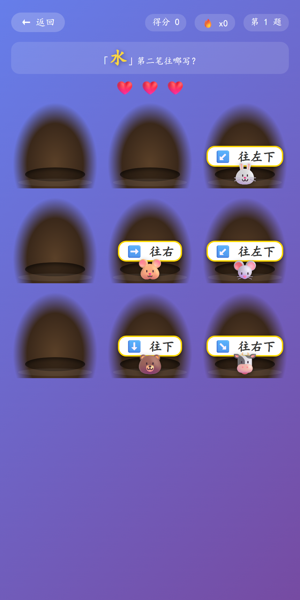
</p>

### 🧩 笔顺拼图（Puzzle 模式）

把汉字**打碎成笔画碎片**，按正确笔顺一块块拼回来——最直接的笔顺肌肉记忆训练：

- 🧩 **真·笔画碎片**：直接从 `hanzi-writer-data` 的 SVG 笔画路径裁出每一笔（自动测量包围盒），随机打乱、随机微旋转后摊在碎片盘里
- 👻 **影子字提示**：田字格里淡紫色显示目标字轮廓，孩子对照着找「下一笔是哪块」
- 🎯 **必须按笔顺**：点错碎片 → 抖动 + 扣 3 秒 + 连击清零，逼孩子真正想清楚下一笔而不是乱试
- ⏱️ **倒计时压力**：70 秒起步，每拼好一个字 +9 秒，拼得越快时间越充裕，天然「再来一局」
- ✨ **落位动画**：点对的碎片淡出，对应笔画立刻在田字格里弹跳定格（金色），整字完成时外圈金光扩散 + 星星雨 + 完成和弦
- 💡 **提示 / 换字**：提示会点亮正确的下一块（−5 秒），换字跳过难题（−10 秒），孩子自己掌控难度
- 🌟 **完美零失误**：整字一次不错 +150 分并触发语音表扬，结算统计「完美字数」
- 🏆 结算评段：拼图宗师 🏆 / 结构小达人 🥇 / 越拼越顺 🥈，历史最高分本地保存

<p align="center">
  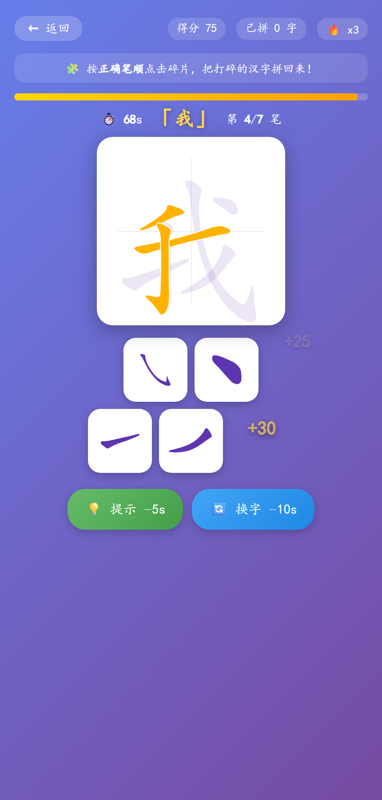
</p>

### 🏃 笔顺跑酷（Runner 模式）

孩子操控小人一路狂奔，前方不断落下**三道抢答门**——想穿过去，只能冲进正确的那一栏：

- 🚪 **三道抢答门**：上/中/下三条跑道各挂一个答案，点跑道、点底部按钮、键盘 ↑↓（或 WASD / 数字 1-2-3）、手机上下滑动都能变道，怎么顺手怎么来
- 🧠 **边跑边算**：题目「「一」的第一笔往哪写？」「「山」一共几笔？」常驻顶部，孩子必须心算笔顺再选道，答错直接撞墙
- 💥 **撞墙有代价**：三颗爱心，撞错一次掉一颗并屏幕震动；每通过 10 道门补一颗心（最多 3 颗），逼出「谨慎但又想冲」的紧张感
- 🎚️ **越跑越快**：速度随通过门数线性提升（1.8% → 4.5% 屏宽/毫秒），距离米数实时增长，天然刷纪录
- ✨ **通过特效**：撞对 → 小人起跳 + 正确门牌飞散 + 五声音阶上行 + 连击爆炸字 + 星星雨；每 5 连击语音表扬
- 🏆 结算评段：跑酷之王 🏆 / 飞毛腿 🥇 / 越跑越顺 🥈 / 起步啦 🥉，总跑动距离与历史最高分本地保存

<p align="center">
  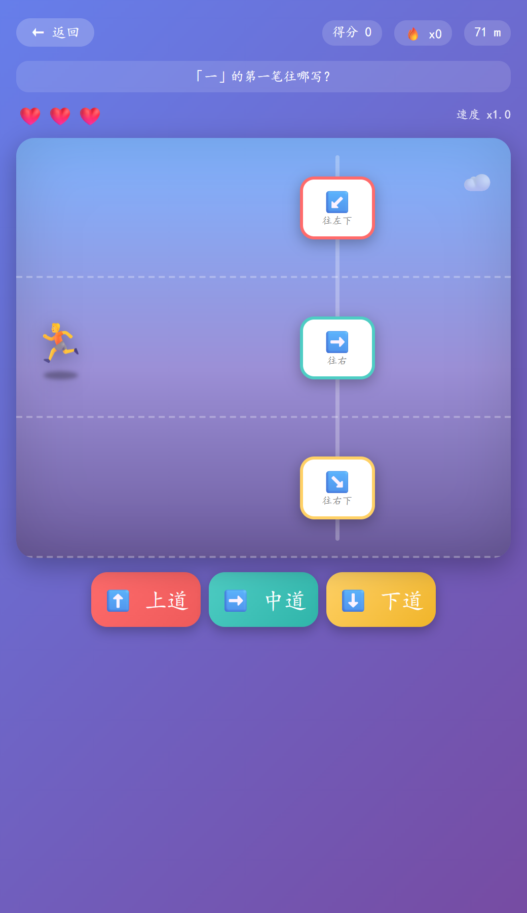
</p>

### 👹 笔顺大魔王（Boss 战模式）

不是刷完就散的答题——**五位魔王排着队等你**，答对砍它一刀，答错它打你，血条见底才算赢：

- 🩸 **双血条对战**：魔王血量 110 → 280 逐位变厚，小勇士 100 点血，答对回 5 血，答错扣 22~39 血，紧张感全靠这两条槽
- ⚔️ **答对即输出**：伤害 = 8 + 连击×2（上限 16）+ 速攻加成 6，越连击砍得越狠，屏幕飘出「-18」伤害数字
- ⏱️ **回合限时**：每回合 9 秒倒计时条（后段变红），超时视为魔王抢先出手，逼孩子**看清笔顺再下手**
- ⚡ **能量大招**：每答对攒 22 点能量，攒满 100 点亮「⚡放大招」按钮，一键砍掉 40+ 血 + 全屏刀光，键盘空格也能放
- 😡 **狂暴阶段**：血量掉到 50% / 20% 时魔王狂暴，场景变红、魔王发亮、答题时间砍到 78% / 60%，伤害更高
- 🏅 **魔王阵容收集**：击败一位解锁下一位（`hz_boss_beat` 存档），结算页用 💀 标出已打倒的魔王，通关五位即「笔顺宗师」
- 🎮 **四种操作**：点选项、键盘 1-4、空格放大招，手机直接点，怎么快怎么来

<p align="center">
  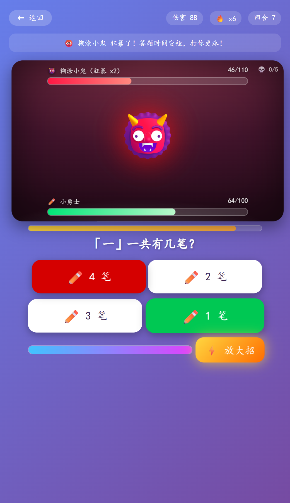
</p>

### 🐣 笔顺宠物屋（养成模式）

一只**真的会饿、会难过、会长大**的汉字宠物住在房间里，它的口粮只有一种——你答对的笔顺题：

- 🍖 **三条状态槽**：饱食 / 心情 / 成长值实时显示，宠物状态直接反映在表情和动作上（饿了会耷拉变灰）
- ⏳ **真实时间衰减**：按 `localStorage` 里的时间戳结算，离开 3 小时回来它就饿了 60 多点——**明天还想看看它**的钩子全靠这个
- 🍚 **喂饭 = 答题**：一顿饭 6 道笔顺题，答对食物掉进嘴里 + 咀嚼动画 + 连击叠成长，全对触发「加餐 +25」
- 🎾 **陪玩**：5 秒内点中乱弹的小球，点一次心情 +6、成长 +3，音调随连击升高
- 🫧 **洗澡**：房间里爬出 4 只小脏东西，逐个点掉，洗完亮晶晶 + 经验奖励
- ❤️ **摸摸头**：随时点宠物，飘爱心 + 心情 +2，它会跟你说话（气泡台词按饥饿/心情/阶段变化）
- 🐉 **五阶段进化**：🥚 汉字蛋 → 🐣 破壳小鸡 → 🐥 笔顺雏鸟 → 🐔 神气大公鸡 → 🐉 汉字神兽，进化时全屏白光 + 彩带弹窗
- 🔗 **全局成长联动**：**在任何模式里拿到星星都会顺便给宠物 +2 成长值**，首页卡片实时显示它的阶段，练字越勤它长得越快
- 📅 **每日见面礼**：第一次打开送 +20 成长、+12 心情

<p align="center">
  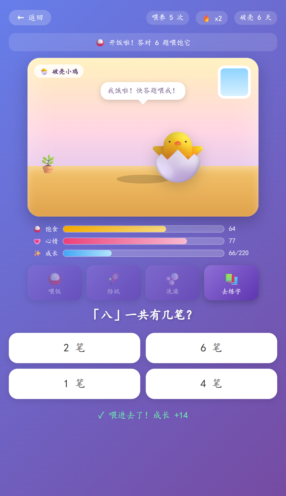
</p>

### 🦘 笔顺跳房子（对战赛跑模式）

12 格蛇形赛道，你和一只 AI 小怪兽**同时往前跳**——答对才动，答错就让它偷跳一格：

- 🏁 **真正的竞速感**：谁先踩到第 12 格谁赢，对手每 6~9 秒**自己往前跳一格**，你不答题它照样冲线
- 🧠 **答对才跳得动**：笔顺题（数笔画 / 判方向）四选一，答对跳 1 格；连击 ≥3 且手速快 → **⚡连跳加倍一次跨 2 格**
- 😈 **答错代价明确**：连击清零 + 对手立刻白赚一格，小怪兽还会弹气泡嘲讽你「我跳到你前面啦！」
- 🏅 **连胜解锁更强对手**：👾 小紫怪 → 🐒 急猴子 → 🦖 快龙仔 → 🤖 铁蛋机器人 → 🐆 闪电豹，连胜越多它跳得越快、答题时限越短（9 秒 → 6 秒）
- 💨 **跳跃手感**：格子高亮描边、起跳抛物线动画、落地扬尘、音阶随前进格数升高，冲线撒花
- ⌨️ **键盘 1-4 直接抢答**，鼠标手机点选都行
- 📈 结算记录答题数 / 最长连跳 / 当前连胜 / 历史最长连胜（`hz_hop_wins` / `hz_hop_best`），输了连胜清零——「再来一局把它赢回来」

<p align="center">
  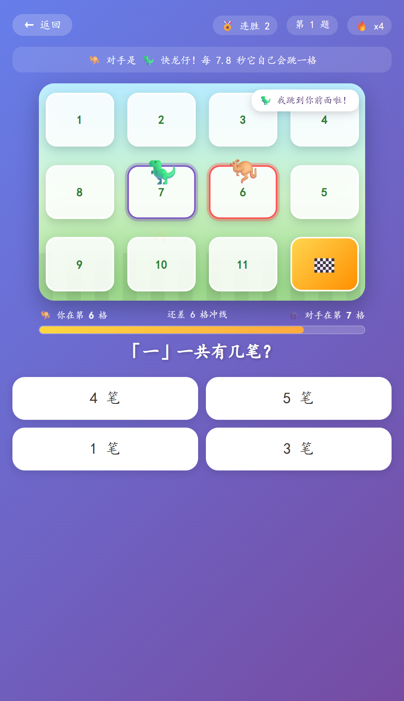
</p>

### 🧱 笔顺打砖块（弹球 Breakout 模式）

一整面砖墙压在头顶，每块砖上写着一个候选答案，脚下是一块会发光的挡板——**把球弹上去，只砸写着正确答案的那块砖**：

- 🕹️ **真弹球手感**：鼠标 / 手指 / ← → 都能控挡板，球打在挡板不同位置会**改变反弹角度**，想砸哪一块得自己算线路
- 🧠 **边弹边算**：题目问「『一』第一笔往哪写？」「『人』一共有几笔？」，25 块砖分四种颜色写着四个候选答案，先想清楚答案，再守好角度
- 💥 **砸对**：砖块当场**炸成碎片**、飘出 +分、五声音阶随连击往上爬，「漂亮！」「真准！」弹在墙上；把这一题的正确答案全砸完立刻换新题
- 😅 **砸错**：砖也会碎，但连击清零、扣 4 分、屏幕一震，并提醒你这题的正确答案是什么
- ❤️ **球掉地下才扣心**：三颗心，掉完结束一局——比手速更考走位
- 🚩 **无限过关**：清空整面砖墙进下一关，球更快、挡板更窄；`hz_brick_lv` 记录最高关数、`hz_brick_best` 记录最高分，结算给出正确率与最长连击

<p align="center">
  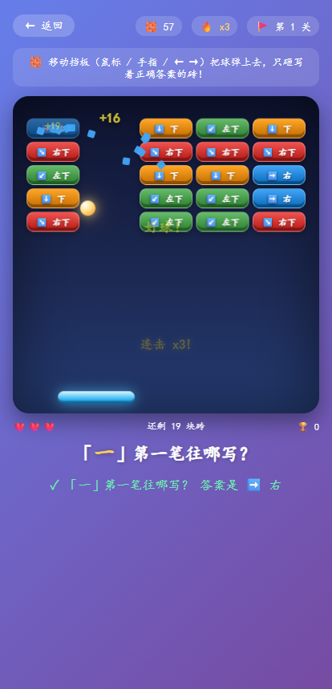
</p>

### 🍉 笔顺切水果（刀刃切割模式）

夜空下的木台，答案写在飞来的水果上——**用鼠标/手指划一刀**，把正确的那颗切开：

- 🔪 **真·刀感**：按住划过水果才算切中（触屏直接点也行），切中瞬间水果**裂成两半飞散**、果汁四溅、刀刃拖出蓝色光轨，「完美一刀！」「好刀法！」大字弹在天上
- 🧠 **先算再切**：题目问「『一』第一笔往哪写？」「『人』一共有几笔？」，四颗水果上写着四个候选答案，看准了才下刀——切错一下就去一颗 ❤️
- 💣 **炸弹别碰**：混在果子里的 💣 越到后面越多，切到直接扣心 + 屏幕震动，贪刀必翻车
- 🔥 **连击加分**：连切正确答案，五声音阶一路往上爬，分数随连击水涨船高（最高 +36/颗），每切中一颗回 1.5 秒
- 🍃 **放走也算失误**：写着正确答案的水果掉下木台，连击清零并提醒你别再让它飞走
- ⏱️ 90 秒一局、3 颗心，结算给出得分 / 最长连击 / 切中数与**刀法评级**（🔰 水果学徒 → 🥷 水果忍者大师），记录 `hz_fruit_best` / `hz_fruit_wins`，连胜越多炸弹越密、下一波水果来得越快

<p align="center">
  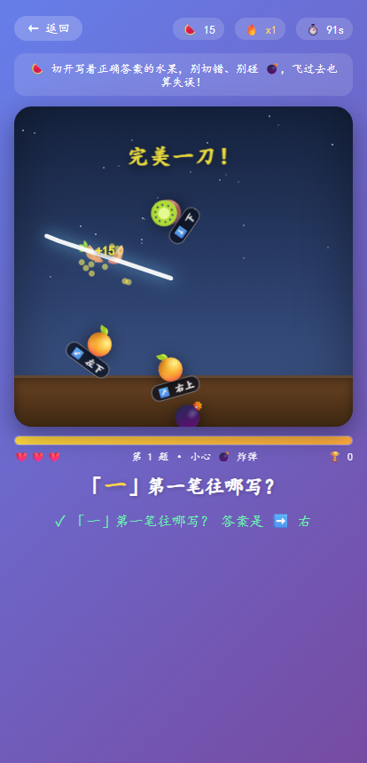
</p>

### 🔗 笔顺连连消（知识连连看模式）

30 个字块铺满棋盘，一半是**汉字**、一半是**笔顺线索**（「4 笔」/「第一笔 ➡️」/「最后一笔 ⬇️」），把一对连起来就能消除：

- 🧠 **连线要考笔顺**：光找一样的字没用，得先数清「王」到底几笔、第一笔往哪写，才知道它配哪块线索——15 对线索文字互不重复，每一对都是唯一解
- 📐 **经典连连看规则**：两点之间的连线最多**拐两个弯**，可以绕出棋盘外沿；被挡住的字块要先消掉，越消路越开，空间推理一起练
- 💥 **连击越打越响**：连对一串，五声音阶一路往上爬，消除处炸星屑、连线闪光、头顶飘 +分，连击 ≥5 还有语音夸你
- ⏱️ **抢时间**：100 秒倒计时，每消一对 +2 秒，连错一对扣 3 秒；💡 提示（扣 5 秒）、🔀 洗牌（扣 8 秒）自己权衡着用，死局会自动洗牌
- 🎓 **消完就复盘**：每次消除都把「这个字几笔、首笔末笔往哪写」写在屏幕下方，连错时还会主动告诉你正确答案
- 🏆 通关记录得分与连胜（`hz_lian_best` / `hz_lian_wins`），连胜越多下一局初始时间越短；结算页列出本局复习到的字

<p align="center">
  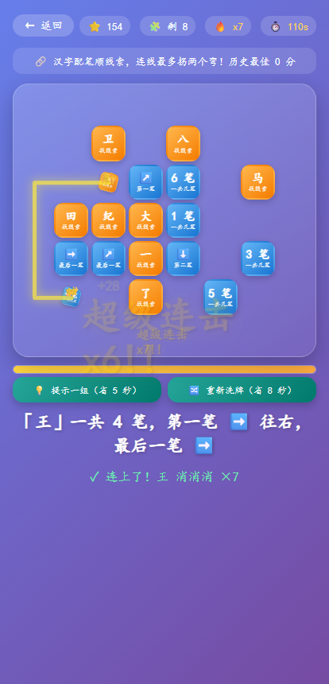
</p>

### 🏰 笔顺塔防（守城开炮模式）

怪兽排着队沿小路走向城门——**答对一题，大炮就开一炮**，答错全场怪兽红眼加速：

- 💣 **答题就是开火**：题目问「『菊』第十笔往哪写？」「一共有几笔？」，答对立刻锁定最靠前的怪兽，炮弹拖着弧线飞过去炸开火星；连击 ≥4 两连炮、≥8 三炮齐发
- 👾 **怪兽带血条**：🐛 毛毛虫 1 炮、👹 红鬼 3 炮，每 5 波一只 6 血的 🐲 恶龙压轴，血条就写在脚下，一题一血慢慢磨
- 💨 **答错看得见**：答错清连击、扣分，所有怪兽还会**加速冲刺 1.8 秒**，瞎蒙的代价当场就还
- 🏯 **5 座城楼**：每闯进一只怪塌一座城楼，城门被撞特效 + 屏幕震动，5 座全塌这局就结束了
- 🌊 **越守越猛**：波次递增——怪兽更多、更快、更肉，第 9 波起每只怪额外加一格血
- 🏆 无限波次，记录最高波数与最高分（`hz_td_wave` / `hz_td_best`），结算给出守住的波数、消灭数与正确率

<p align="center">
  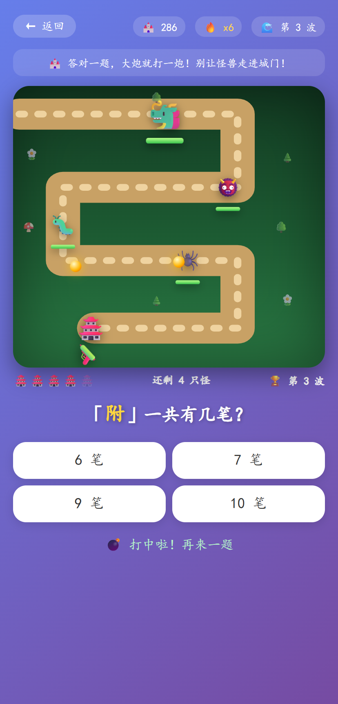
</p>

### 🎣 笔顺钓鱼（蓄力抛竿模式）

水面上漂着小船，四个候选答案写在四条鱼的肚子上——**看准答案，蓄力抛竿，把它钓上来**：

- 🎣 **按住蓄力、松手抛竿**：力度条来回摆动，决定鱼钩落水的远近；鱼在五条水道上左右游动，力度差一点就落到隔壁那条鱼旁边
- 🐟 **答案写在鱼身上**：题目问「『春』一共有几笔？」「第二笔往哪写？」，四条鱼各举一个答案，游得越快（🦈 大鲨鱼）分越高，🐢 海龟爷爷慢但值钱
- ⬆️ **咬钩提竿 QTE**：鱼钩附近最近的鱼会被吸引过来咬钩，此时出现「小白条」——滑进绿区的一瞬点一下（或按空格）才钓得上来，太早太晚都会挣脱（-3 秒）
- 🥾 **水里有垃圾**：偶尔漂过一只旧靴子 🥾，钓上来又臭又扣分扣时间；等待时乱点会把整群鱼吓跑（-2 秒）
- 📖 **鱼图鉴收集**：7 种鱼跨局记录在 `hz_fish_book`，钓到新鱼种会「🌟 新鱼收录图鉴！」并额外加星星，集齐才有 👑
- ⏱ **90 秒限时**：答对 +3 秒、答错 -5 秒，连击越深鱼游得越快也越值钱，结算给出条数、连击、正确率与图鉴进度（`hz_fish_best` / `hz_fish_caught`）

<p align="center">
  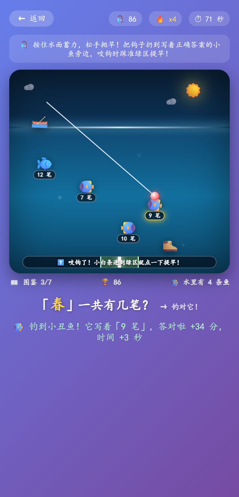
</p>

### 🤼 笔顺双人大乱斗（分屏拔河模式）

一块屏幕两个人玩——**上下两个答题面板，中间一根拔河绳**，谁答得又快又准，就把绳子拉过自己这边：

- 🎯 **答对就是拉力**：红队（上半屏）答对一格往自己这边拉，蓝队（下半屏）同理；绳子上的 🚩 拖过线的一方直接获胜，先拉满 5 格定胜负
- ⚡ **连击双倍拉绳**：同一方连对 3 题以上，之后每答对一题拉两格，翻盘就靠这一波
- 💥 **答错当场还债**：答错不仅断连击，还把绳子**白送给对手一格**，自己的面板还会被锁 1.3 秒（变灰），瞎蒙在双人局里是会被抓住的
- ⌨️ **两个人同时按**：红队用键盘 1/2/3/4，蓝队用 7/8/9/0，平板上就分上下半屏各按各的，谁手快谁占便宜
- 🤖 **没人陪练也行**：一键切换电脑对手，电脑落后时会自动变准（橡皮筋难度），一个人也能练
- 🏆 **累计战绩**：红蓝双方胜场分别存进 `hz_duel_p1` / `hz_duel_p2`，另有最长连胜拉 `hz_duel_streak`、总场次 `hz_duel_matches`；90 秒打满没分胜负就按绳子位置判险胜或平局，两边都加星星

<p align="center">
  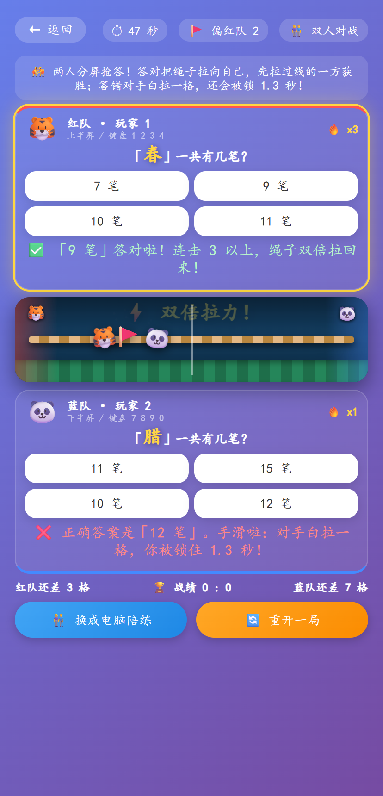
</p>

### ⛏️ 笔顺挖宝（考古探方模式）

一块沙土探方，底下埋着文物——**答对一题领两把铲子**，点格子开挖，挖空了会告诉你离宝物还有几格：

- 🔥 **冷热线索推理**：每挖开一格空格，沙子上就留下 🔥（1 格内）、♨️（2 格）、🌡️（3 格）、❄️（还远）+ 距离数字，孩子像小考古学家一样把线索拼起来定位宝藏
- ⛏️ **铲子靠答题赚**：答对 +2 把铲子、连击 ≥3 变 +3 把；答错吃一场 🌪️ 沙暴：扣 4 秒、扣 8 分、铲子被埋一把、断连击，当场就还
- 💥 **深埋要连挖**：陶罐一铲就出，刀币两铲，青铜鼎三铲——碰到硬的东西会显示「💥 还差 N」，越贵越费铲子，孩子自己会算「这格值得再挖」
- 🏺 **12 件文物图鉴**：从 🐚 贝币、🪙 刀币到 🐉 玉龙、👑 金冠、🦚 凤冠，跨局存进 `hz_dig_book`，第一次出土额外 +25 分并撒彩带
- 🕳️ **越挖越深**：松散表土 → 陶片层 → 古钱层 → 青铜层 → 王陵秘宝，探方从 4×3 长到 6×5，埋的文物更多也更值钱，清空一层 +12 秒 +2 铲
- 🪨 **惊喜与坑**：沙里还混着 🪨 石头格，一铲下去硬邦邦什么也没有（不过照样给你冷热线索），乱挖就是浪费铲子
- 🏆 记录最高分与最深土层（`hz_dig_best` / `hz_dig_deep`），结算页给出出土件数、层数、正确率与文物图鉴墙

<p align="center">
  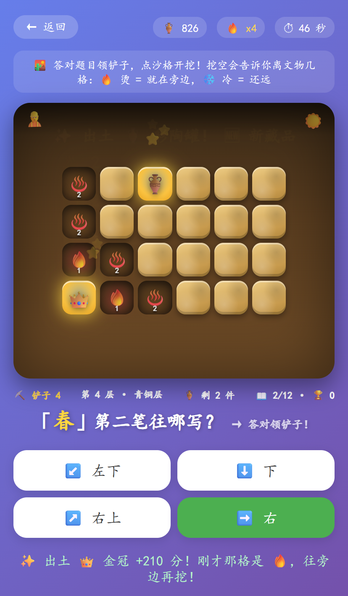
</p>

### 📅 每日签到 · 星运转盘（跨真实时间的养成钩子）

不答题也能玩，但必须「每天回来」—— 签到按真实日期算，跨 0 点才刷新：

- 🔥 **连签火焰**：连续签到天数决定称号，🌱 签到新人 → 🔥 三日火苗 → 🏅 七日勋章 → 🎖️ 两周铁杆 → 👑 月度皇冠 → 🐉 神兽之友 → 🏆 百日笔顺王；断签只会让火焰重燃，累计天数永远不清零
- 🎁 **7 天宝箱循环**：第 1 天 +5⭐ 一路涨到第 7 天 👑 +25⭐，签到条上提前看得到后面几天的奖励，孩子自己就惦记着明天
- 🎡 **技巧型幸运转盘**：拆完宝箱转盘立刻开转，转速按正弦忽快忽慢，只有盯住「慢下来那一瞬」点停才停得准 —— 8 个奖项：💫 星星×2、👑 星星×3、🌟 +12⭐、✨ +6⭐、🎁 盲盒、🐣 宠物口粮、💎 徽章碎片、🌱 谢谢参与
- 💎 **碎片换徽章**：转盘落到碎片格，攒满 3 块自动兑换一枚还没解锁的徽章，荣耀墙 🔥🎖️👑🐉🏆 逐盏点亮
- ⭐ **星星进总账**：签到所得走 `addStars()`，顺手喂养宠物、推进动物收藏馆，等于给所有玩法接了一条每日回访线
- 📍 首页卡片带红点提醒，没签到就一直写着「今天还没签到，点开领星星！」；空格 = 拆宝箱 / 急停转盘

<p align="center">
  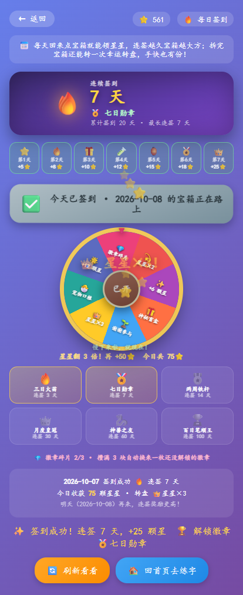
</p>

### 🐍 笔顺贪吃蛇（越写越长、越长越快）

一条小蛇在 11×13 的方格盘上游走，蛇身就是孩子一笔一笔「写」出来的：

- 🍎 **答对才解锁食物**：每回合盘面给一个 🔒 苹果 + 一道「『春』的第二笔往哪写？」的方向题；答对了锁开、苹果发亮，蛇头碰到它就吞下去，蛇身长一节、那笔的箭头永久留在节上
- 🧱 **答错会被封路**：答错断连击、扣分，盘上立刻多一颗 💣 炸弹，食物也被重新挪走——孩子得先看题再规划路线，而不是乱转
- 📏 **一笔一笔成一个字**：蛇身把「春」的所有笔顺方向按顺序吃满，就 `🎉 写成『春』` +大额奖励 + 撒彩带 + 成字数 +1，比音游更直观地感受「笔画组成字」
- ⚡ **升级提速加石头**：每成两个字升一级，步伐间隔从 300ms 压到 150ms，并额外撒两颗 🪨 石头，蛇身越长越考验路线规划
- 💥 **四种撞法都算事故**：撞墙、撞石头、撞炸弹、撞到自己身子都会扣一颗 ❤️，剩两颗心时原地重生 3 格小蛇（自动清掉身边危险格），3 心耗尽才结算
- 🎮 **三种操作任选**：键盘方向键 / WASD、盘面下方 d-pad 按钮、手指在盘面上滑动；按 1–4 数字键直接作答
- 🏆 记录最高分、累计成字数与最长蛇身（`hz_snake_best` / `hz_snake_chars` / `hz_snake_len`），结算页给出本局分数、等级、正确率

<p align="center">
  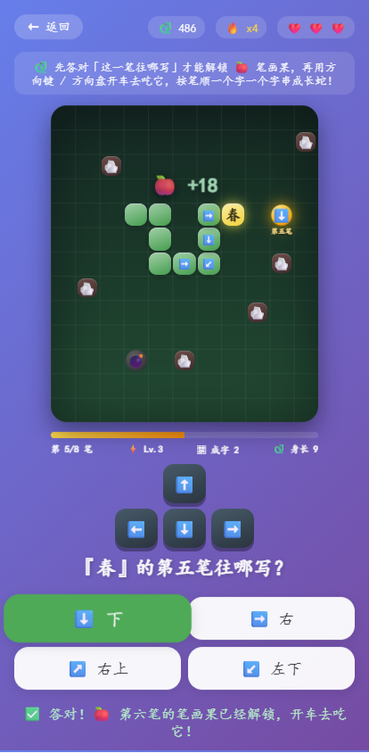
</p>

### 🍬 笔顺消消乐（答对才给交换的三消）

7×8 糖果盘，五种颜色的糖块分别写着 ➡️ 横、⬇️ 竖、↙️ 撇、↘️ 捺、↗️ 点——**想交换两颗糖，先答一道笔顺方向题**：

- 🔓 **答案就是钥匙**：每答对一题攒 1 次「交换机会」（最多攒 2 次），而且这一笔的方向会当场变成**本关目标色**——盘面上所有同色糖块亮起金边，孩子一眼看到「原来我要消的是竖」
- 🎯 **消对颜色才算进度**：三个同方向连成一线就消除，但只有目标色计入 `9/17` 进度条，其余颜色只是帮你腾地方的辅助消除，逼着孩子带着目标去看盘
- ❌ **答错不给交换**：答错断连击、扣 3 分、震屏，并且红块 + 绿框同时标出正确答案，交换机会一次也不给——想玩就得先把这一笔想清楚
- ⭐ **四连出星星块**：连成 4 个会留下一颗 ⭐，再交换它就把周围 3×3 一起炸开；🌈 **五连出彩虹**：把彩虹和任意颜色对调，全场同色一次清光
- 🔗 **连锁升音阶**：消除后糖块下落补位，自动连环消除，每多一连锁分数 ×1.5 倍，音效沿 C-D-E-G-A-C-D 音阶往上爬
- 🔄 **换不动了自动洗牌**：死局检测 + 无解交换自动重排（不额外扣步数），换不出三连的尝试会原样退回、步数与交换机会一并还给你
- 🍭 **无限过关**：第 1 关消 11 个，每过一关目标 +3、补 15 步，通关 +3⭐ 撒彩带；步数用尽才结算，记录最高分、最高通关数与累计特殊糖块（`hz_m3_best` / `hz_m3_lv` / `hz_m3_wins` / `hz_m3_sp`）
- 🎮 手指拖动相邻两颗糖即可交换，点选也行；键盘 1–4 直接作答

<p align="center">
  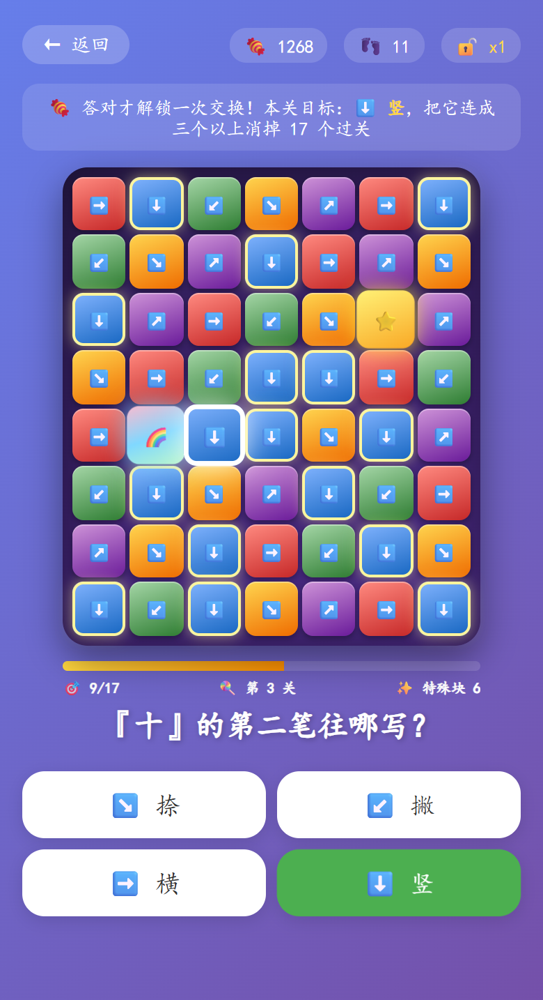
</p>

### 🎫 笔顺刮刮卡（答对印卡 · 硬币刮开涂层）

把「答对一题」变成一张真的能刮的彩票：屏幕上按住手指来回蹭，银色涂层就被 🪙 硬币一点点刮掉，露出下面九个奖格——

- 🪙 **真·刮涂层**：涂层是一张 canvas，手指经过的地方按像素擦除，边刮边飞银色碎屑、沙沙音效，刮到哪露到哪，比点按钮爽得多
- 🎫 **卡是答对印出来的**：每答对一题（数笔画 / 这一笔往哪写）立刻印出一张新卡；答错也能刮，但卡片会「印糊」——涂层更厚、要刮更多才翻开，符号池也更差
- 🍀 **刮出三个一样就是 BINGO**：金边高亮 + 彩带 + 大奖分数，BINGO 越多星星越多；💎 钻石、👑 皇冠、🐉 龙这些高级符号第一次刮到还会进「稀有符号图鉴」
- 🥉→🐉 **卡面会升级**：每答对 2 题卡面涨一档（铜 / 银 / 金 / 钻 / 龙），卡面越贵符号越值钱，孩子自己就想「再答对两题换龙卡」
- 📊 **幸运值看得见**：连击越高，本张卡出 BINGO 的概率越大，答题快、答得准真的能「手气变好」
- 🧽 **不逼孩子刮到累**：刮到八成涂层自动帮你刮完（+20 干净奖励），也可以随时点「一键刮开这张」，卡照样结算
- 🏆 一局 8 张卡，记录单张最佳、单局最高奖金、累计张数、BINGO 次数与符号图鉴（`hz_sc_best` / `hz_sc_score` / `hz_sc_cards` / `hz_sc_bingo` / `hz_sc_rare`），结算页给奖金、正确率与图鉴进度

<p align="center">
  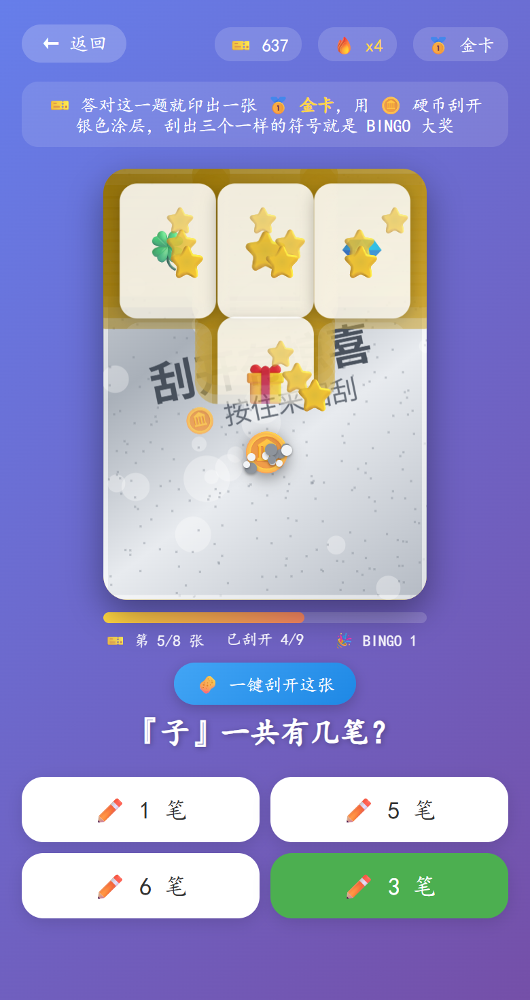
</p>

### 🀄 笔顺多米诺（越立越值钱，敢不敢推倒领钱）

把「再答一题」变成一次赌博：骨牌一张比一张值钱，随时可以推倒领钱，但答错或手慢就整条链哗啦倒塌——

- 🀄 **答对一题立一张牌**：第 1 张 10 分、第 2 张 14 分……按 6×3 蛇形牌道一路排下去，牌越立越贵，孩子自己就会算「再立一张多几分」
- 🔥 **随时推倒领钱**：按下去整条链按顺序一张张倒下，配一路升高的五声音阶音效 + 火花 + 彩带，攒的分数全额入账；也可以贪到底继续答
- 💥 **答错 / 手慢就塌链**：只有 **35%** 能保住，连击和倍率当场清零——「见好就收」和「再搏一张」的拉扯就是这个模式的上瘾点
- ⭐ **金牌 / 🐉 龙牌翻倍**：每 5 张一张金牌面值 ×2，第 18 张是龙牌；整条链排满 18 张再推倒直接 **×2 一条龙**，结算页给 🐉 称号
- ⏳ **引线会烧**：每题 8–12 秒引线（链数越高越快），最后 3 秒滴答报警，逼孩子果断而不是磨蹭
- 🐣→👑 **称号靠攒牌**：累计骨牌数解锁 小板牙 → 小蛇龙 → 翻江龙 → 骨牌之王，结算页实时显示还差几张升级
- 📊 一局 5 条链，记录单局最高金币、累计骨牌、稳稳收手次数、单链最长与一条龙次数（`hz_dp_score` / `hz_dp_total` / `hz_dp_lines` / `hz_dp_chain` / `hz_dp_dragon`）
- 🎮 键盘 1–4 作答、按 C 直接推倒；卡壳了可以「🔄 换一张」扣 15 分保命

<p align="center">
  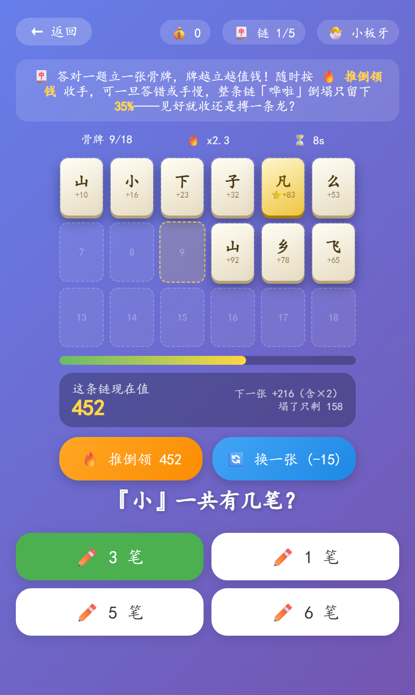
</p>

### 🗼 笔顺叠叠塔（答对一题发一块砖，看准时机叠成摩天大楼）

把「叠叠乐」的爽感接到笔顺练习上：砖只有答对才发，但**能不能叠正全看落砖的那一下手感**——

- 🧱 **答对才发砖**：砖从塔顶左右滑出，滑得越快越难瞄；点一下（或空格）让它落下，越正剩下的越宽
- ✂️ **切边真实惩罚**：落歪了只保留重叠部分，切掉的那截「哗啦」掉出画面——塔越叠越窄，下一次容错越小，孩子会自己屏住呼吸瞄准
- ✨ **完美对齐连击**：落点正负 6 像素内算 PERFECT，砖自动吸附满宽、金框亮起、分数按连击递增（+25 → +35 → +45…），四连完美放彩带
- 😵 **答错发歪砖**：不是直接扣血，而是给一块**更窄、更快、还标红**的歪砖，且这一砖不许算 PERFECT——手滑答错的代价留在塔上
- ⛅ **越叠越换天**：每 8 层升一个场景（🌱 田野 → ⛅ 云端 → 🌙 月宫 → 🌌 银河），云朵飞鸟换成星月行星，相机跟着往上推，「再看一层」的冲动停不下来
- ❤️ **三颗心**：完全落空才算摔一次，掉一颗心并震屏；心掉光本局结束，塔倒了也不打击人
- 🚀 **楼越高砖越快**：滑动速度随层数递增（95 → 252 px/s），同一道题在高层瞄准的难度完全不同
- 📊 记录最高层数、单局最高分、累计完美次数与累计认字数（`hz_stack_best` / `hz_stack_score` / `hz_stack_perfect` / `hz_stack_chars`）
- 🎮 键盘 1–4 作答，空格 / 回车或点塔区落砖；窗口变窄时整塔按比例重映射，手机上也不会歪

<p align="center">
  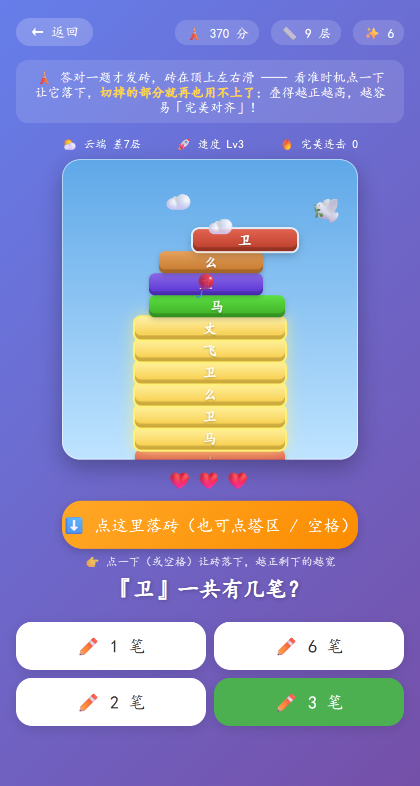
</p>

### 🎡 笔顺扭蛋机（答对攒币，抽你的汉字精灵馆）

把「抽卡」这套让人上头的机制反过来用：**币只能靠答对笔顺题挣**，越爱抽就越爱答：

- 🪙 **答对才给币**：单抽 1 枚、十连 8 枚（打八折），普通题 +1，连击 3 以上每题 +2，答错零收益并清零连击——想抽卡就得先把笔画方向想清楚
- 🎡 **真会转的机器**：点抽之后胶囊在罩子里翻滚、掉进托盘、再「啪」地开蛋出卡，全程有节奏音阶配音，稀有度越高升的音越多
- 🐉 **五档稀有度按笔画分**：🐣 N（≤3 画）→ 🐰 R（≤5）→ 🦊 SR（≤7）→ 🦄 SSR（≤9）→ 🐉 UR（更难），权重 600/250/110/35/5——**字越难写抽到越稀有**，孩子会主动去认那些没见过的字
- 🏷️ **精灵有名字**：每只按字形取「🌸花花 · 春 / 9 画 · 第一笔 ➡️ 往右」，卡面直接复述笔顺知识点，抽到就是复习一次
- 🔥 **30 抽保底**：保底条实时倒计时，攒满 30 抽必出 SSR 以上；十连若全是 N/R，最后一张自动升级为 SR，绝不会「十连全垃圾」
- 🧩 **重复不白抽**：抽到已有的精灵转成碎片（N 1 / R 2 / SR 5 / SSR 12 / UR 30 片），碎片可在图鉴里兑换没抽到的 SR 以上精灵（15 / 40 / 90 片三档）
- 📚 **汉字精灵馆图鉴**：66 格按稀有度上色分区，未收集的 SR+ 格子带「换」角标，顶部图例逐档显示 `SR 3/14` 进度；集齐一整档触发全家大奖（+10 ~ +150⭐，走 `addStars()` 进总账）
- 🔴 **回访钩子**：币够单抽时首页卡片亮红点并提示「🪙 有 N 枚币，够抽 1 发」，把「先答几题攒币」变成每天的回机理由
- 🎮 键盘 1–4 作答、G 直接单抽；币 / 碎片 / 保底 / 图鉴全部落盘（`hz_gg_coin` / `hz_gg_frag` / `hz_gg_pity` / `hz_gg_pulls` / `hz_gg_book` / `hz_gg_sets`）

<p align="center">
  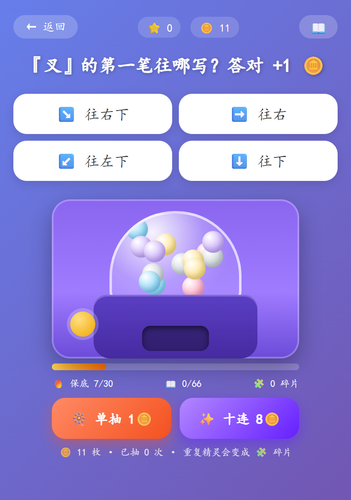
  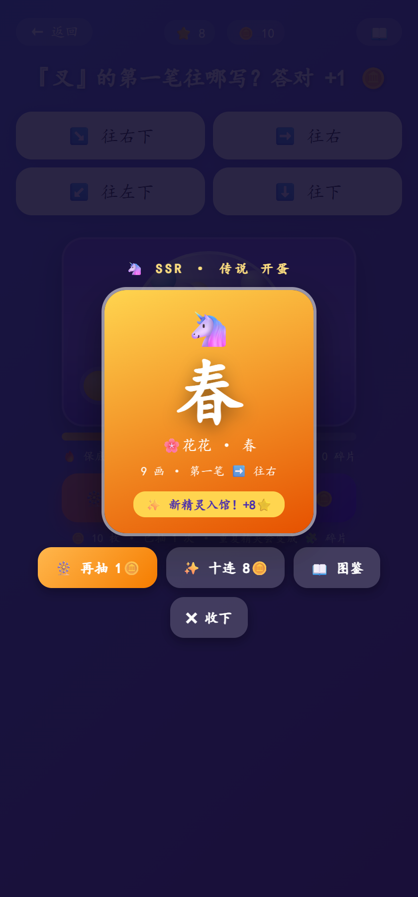
  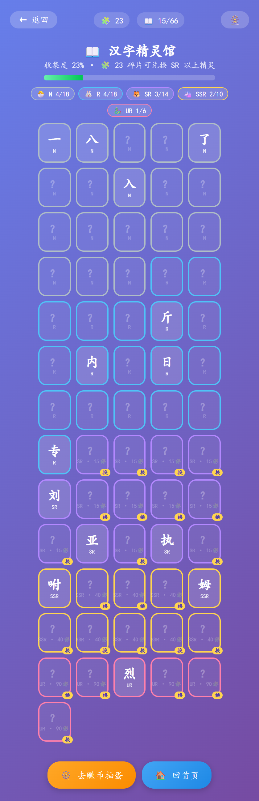
</p>

### 🧩 笔顺合合合（汉字版 2048：只有笔画数相同的字才能合）

把 2048 的「滑动合成」换成**数笔画**——孩子要先把两个字的笔画数数对，才知道它们能不能合：

- 🔢 **合并规则即知识点**：两块砖的**笔画数相同**才能合成「多一笔」的新字（1 画「一」→ 2 画「人」→ 3 画「川」→…→ 16 画），砖面上直接印着真实汉字与 `N 画`，每次滑动都是一回全班数笔画
- 🧱 **砖只能靠答对题掉**：棋盘不会自己长砖——答对一道笔顺题才掉一块新字砖；答错砸下一块 🪨 **石砖**占格（不能移动合并），把「答错的代价」明明白白摆在棋盘上
- 🔥 **连击会掉高级砖**：连对 4 题开始掉 2 画砖、连对 8 题掉 3 画砖，越顺开局越豪华；一次滑动里合成多对算连合成，分数按 ×1 → ×1.5 → ×2 递增
- 🔮 **能量与合成术**：每答对一题攒 1 点能量（最多 3 点），满 3 点放「合成术」——优先炸掉挡路的石砖，没有石砖就自动帮孩子合掉最低级的一对，是给卡壳时的救命按钮
- ↩️ **悔一步 ×3**：每局 3 次反悔，滑错了能整盘复原（含分数 / 能量 / 石砖），鼓励孩子大胆试而不是不敢动
- 👑 **16 画汉字之王**：合到 16 画那格会亮起金框、全屏彩带并永久记录 `字王次数`，是这套玩法里最硬的荣誉勋章
- 📊 记录最高分、最高合到几画、累计合成 / 累计答对 / 字王次数（`hz_mg_best` / `hz_mg_top` / `hz_mg_merges` / `hz_mg_answers` / `hz_mg_king`），结算星星走 `addStars()` 进总账
- 🎮 方向键 / WASD / 手指拖动棋盘 / 屏幕四向按钮四种操作，键盘 1–4 作答、X 放合成术；砖块滑动、合并弹跳、飘分都有独立动画

<p align="center">
  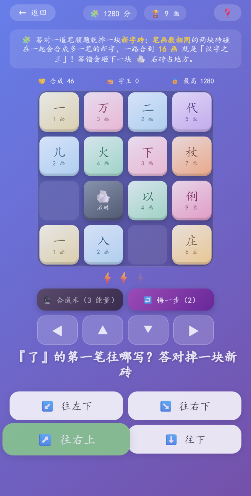
  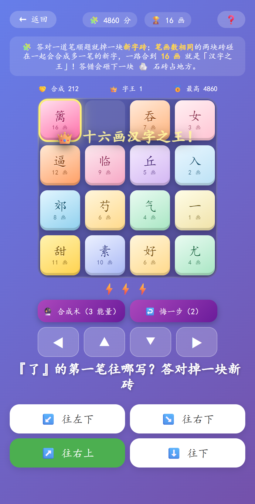
  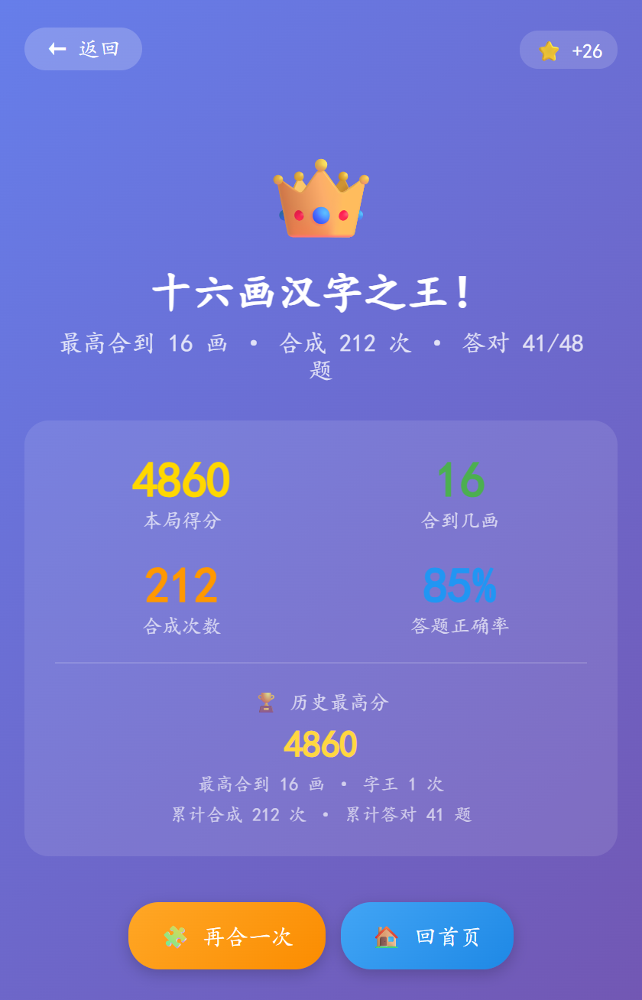
</p>

### 🐰 笔顺跳一跳（答案就写在远处三块平台上，蓄力跳过去）

把微信「跳一跳」的蓄力手感接到笔顺上——**这一跳既是选择题，也是力度题**：

- 🎯 **答案是落点**：三块候选平台漂在前方，板面上直接印着「✏️ 4 笔」「↙️ 往左下」这样的答案，先算对笔顺、再跳到那块板上，答错就是踩空
- 🔋 **按住蓄力**：按住屏幕或空格，力度条 0→100%→0 来回摆，松手起跳；跳多远完全由力度决定，**算对了但蓄力不够照样掉进缝里**
- ✨ **完美落心**：落在平台正中心触发「完美落心」，这一跳分数直接翻倍，连击 3 以上还会放彩带
- 🕳️ **容错但不白给**：单次踩空只清连击不扣心，累计三次空跳才掉一颗 ❤️；跳上写错答案的板子立刻扣心，并把真正正确的平台亮一圈绿框
- 🎁 **礼物台**：连击 5 以上会随机出现金框礼物板，跳上去 +60 分还顺手补一颗心
- 🌙 **月亮台**：每第 10 跳必出紫月亮板，落上去分数 ×3，是这一局的里程碑
- 📏 **越跳越远**：平台间距随跳数慢慢拉开（最多 ×1.18），后程既要算得快也要控得准
- 📖 **踩过的字会复述**：每次落稳都在提示条上重念一遍知识点（「『木』第 3 笔 ↙️ 往左下」），跳 30 格等于复习 30 次
- 🎮 按住屏幕 / 按住空格蓄力，松手起跳；最高分、累计跳格 / 完美 / 答对 / 局数落盘（`hz_jump_best` / `hz_jump_hops` / `hz_jump_perfect` / `hz_jump_answers` / `hz_jump_games`）

<p align="center">
  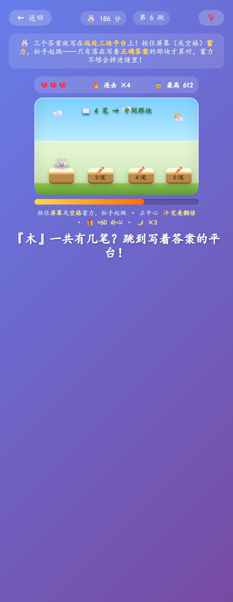
  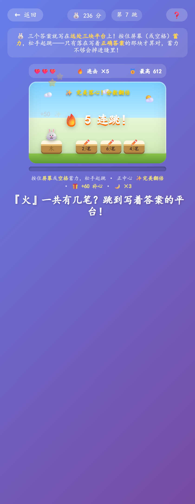
  
</p>

### 🎳 笔顺保龄球（答对拿大力球，瞄准口袋位一票全倒）

把保龄球搬进手机：**能不能进袋，取决于笔顺题答得对不对**——答错只能拿软绵绵的"奶油球"，同一角度最多扫倒三四瓶：

- 💪 **答题决定球的硬度**：答对 → 🔵 大力球（球速快、撞瓶角度大、能连锁），答错 → 🟠 软球（能量衰减快、倒得少），错一题这一帧就亏大了
- 🎯 **答对才亮口袋位**：答对后球道上会出现一圈金色虚线"口袋位"（1-3 号瓶之间，真实保龄球的最优入射点），它是程序现场暴扫 −14°~+14° 全部角度算出来的**这一局真正能打全倒的角度**
- 📐 **会走的瞄准线**：黄色瞄准线左右来回扫，按空格 / 点屏幕定角度；线越歪越容易吃边沟，节奏感 + 判断力双重考验
- 🎳 **物理是真算出来的**：球逐格爬球道、撞瓶后按左右偏转、能量逐帧衰减、飞出去的瓶子还能再撞倒别的瓶（连锁深度 2），所以**全倒靠的是打进口袋位而不是蒙**——正中心直球反而会留 1-2 号分瓶
- 🕳️ **边沟会吃球**：球道两侧收窄，角度太大直接掉进边沟零得分，配音效告诉你这球废了
- 🧾 **标准十帧记分牌**：全倒记 X 加后两球、补中记 / 加下一球、第 10 帧最多三球，未定帧留空——孩子顺手就学会看真的保龄球记分表
- 🔥 **连击与横幅**：连续全倒触发「🎳 STRIKE!」横幅 + 彩带 + 上行琶音，补中亮 ✨，结算按总分/全倒/补中给星（`addStars()` 进总账）
- 🎮 空格 / 回车投球，键盘 1–4 作答；最高分、累计全倒 / 补中 / 倒瓶数 / 答题数 / 局数落盘（`hz_bw_best` / `hz_bw_strike` / `hz_bw_spare` / `hz_bw_pins` / `hz_bw_answers` / `hz_bw_games`）

<p align="center">
  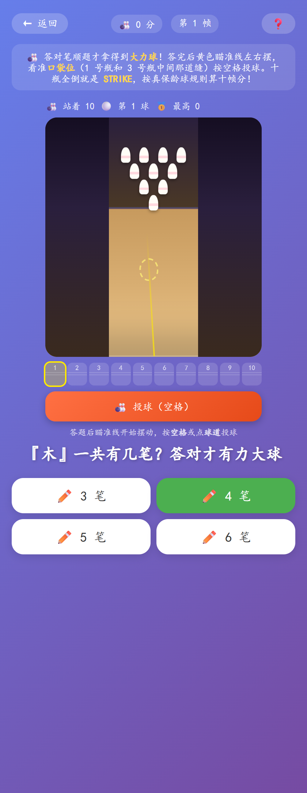
  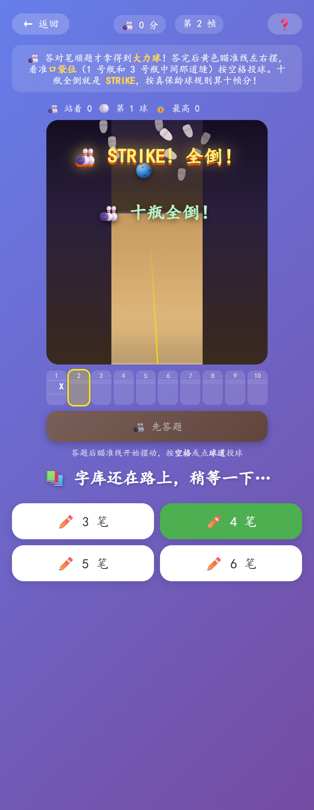
  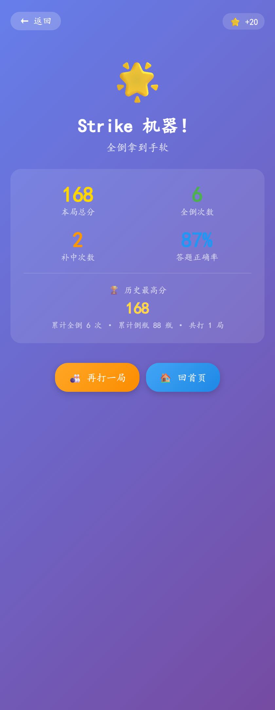
</p>

### 📦 笔顺推箱子（汉字箱推到笔画线索格上，一关一关推上去）

把最经典的推箱子搬进笔顺课堂：**箱子上写的不是编号，而是一个汉字和它的笔画数**；地板上的金色线索格只写要求——「4 笔」「首笔➡️」「末笔⬇️」。推哪只箱、往哪推，全看孩子会不会数笔画、记笔顺：

- 🧠 **一格就是一道选择题**：把「木 4 笔」推上「4 笔」格算对，推上「首笔⬇️」格立刻判错，判词还会把这只箱子的『笔画数 · 首笔 · 末笔』整条念一遍——**数笔画和辨首末笔两种练法混在一关里**
- 🚧 **推不动才是真难点**：箱后是墙、是另一只箱子就推不动，人得绕到对面去推，一步一算，比点选择题费脑子得多
- 🔁 **每一关都保证有解**：地图不是随机摆的，是程序从"已经全归位的终局"**倒着拉箱子**反推出来的，再用产品自带的 BFS 走法校验器现场走一遍，走不通的地图根本不会生成
- 👣 **步数预算 + 每关最佳**：真解步数当场算出来，按它给步数上限，HUD 实时显示「27/44 步」「过关参考 30 步 / 7 次推箱」，每关单独记最佳步数，剩 3 步会报警
- ↩️ **撤销不罚步、提示会指路**：按 U 退回上一步（走过的步数不退，防止无限试错），按 H 同时点亮该推的箱子和它的目标格 2.6 秒，只扣 12 分
- 🔥 **强反馈**：归位 → 箱子变绿 + 五声音阶上行 + 星星飞散 + 「✅「日」4 笔，和「末笔➡️」对上了！×3」，连击 3 / 6 弹横幅；放错 → 红圈闪 + 震屏 + 判词把正确笔顺再教一遍
- 🏅 **过关即进阶**：全部归位自动进下一关，棋盘从 5×5 一路长到 7×7，箱子 2 只长到 4 只，墙越摆越刁，但拉箱次数被压在小学生的耐心范围内
- 🎮 方向键 / WASD 走动、U 撤销、H 提示；屏下十字键、点相邻格、盘面滑动四向都能推，单手手机可玩（`hz_tk_lv` / `hz_tk_par` / `hz_tk_pushes` / `hz_tk_chars` / `hz_tk_best`）

<p align="center">
  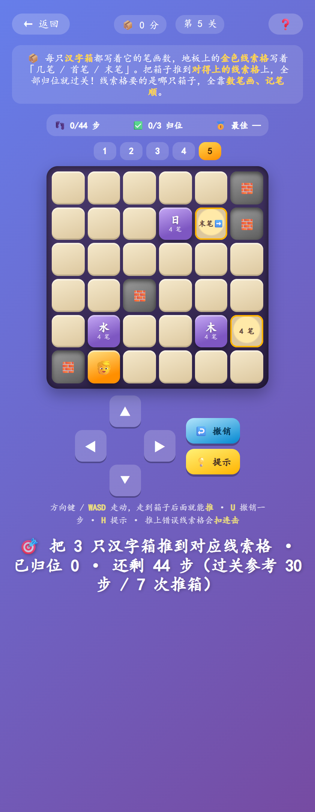
  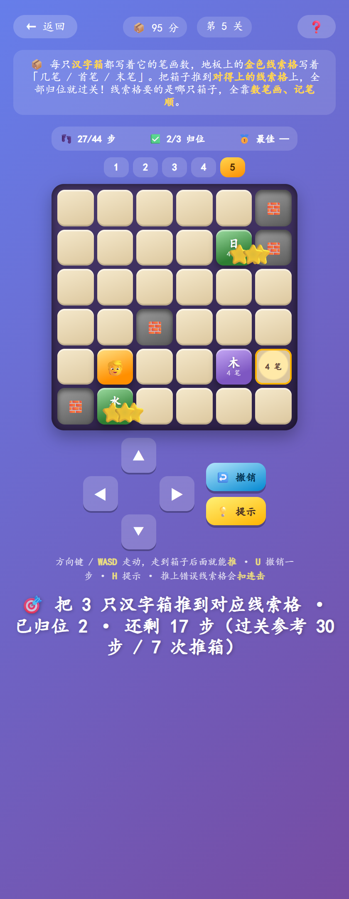
  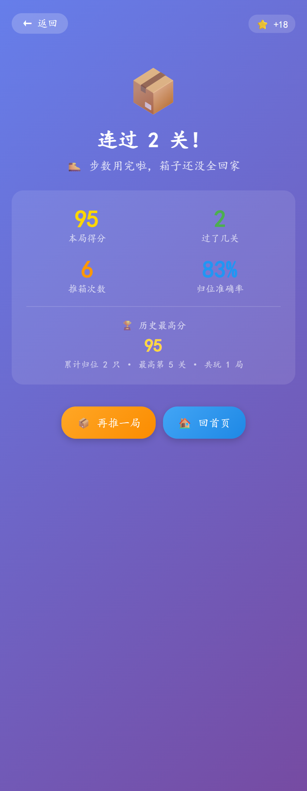
</p>

### ⚖️ 笔顺天平屋（汉字当砝码，凑够顾客要的笔画数）

开一间「汉字礼物摊」：顾客一上门就报一个数——**「我要买 11 笔的礼物！」**。货架上每个汉字都是一块砝码，**牌子上写着它自己的笔画数**。点字放上天平，天平是真的会歪：哪边重哪边沉，横梁回到水平的那一刻，就是加法算对的那一刻：

- 🧮 **数笔画变成了看得见的物理**：`木 4 笔 + 王 4 笔 + 小 3 笔 = 11 笔`，判词当场把整条加法念出来——**数笔画 + 口算加法**一次练两样，而且算错了天平立刻歪给孩子看
- 🥇 **一称就中**：一次没拿回、一次没放错就称平，额外大奖加横幅，逼孩子先把笔画数清楚再伸手
- 😡 **轻了和重了不一样**：轻了只提示「还差 N 笔」继续试；重了盘子砸歪、扣一颗 ❤️；三颗心没了就收摊
- 🕐 **顾客有耐心值**：进度条走完顾客就走掉了（第 1 档 28 秒，够小学生一笔一画数），档位越高越催
- 🎯 **高档位顾客会挑笔顺**：第 2 档起可能提出「每个字首笔都要↙️」——加法凑对了但字不合要求，盘子照样翻，笔顺方向躲不过去
- 🔥 **强反馈**：每上一块砝码按笔画数弹一个音、成交金盘 + 彩带 + 星星飞散、连击每 +1 单多 +15 分，每成交 3 单升一档（货架更长、砝码更多、订单更刁）
- 💡 **换一单扣 20 分**：这单实在凑不出来就换一单，只断连击不扣心
- 🎮 点货架字上秤、点盘里的字拿回来、空格称重、1-8 快速上货、H 换一单（`hz_bl_best` / `hz_bl_sold` / `hz_bl_exact` / `hz_bl_lv` / `hz_bl_chars`）

<p align="center">
  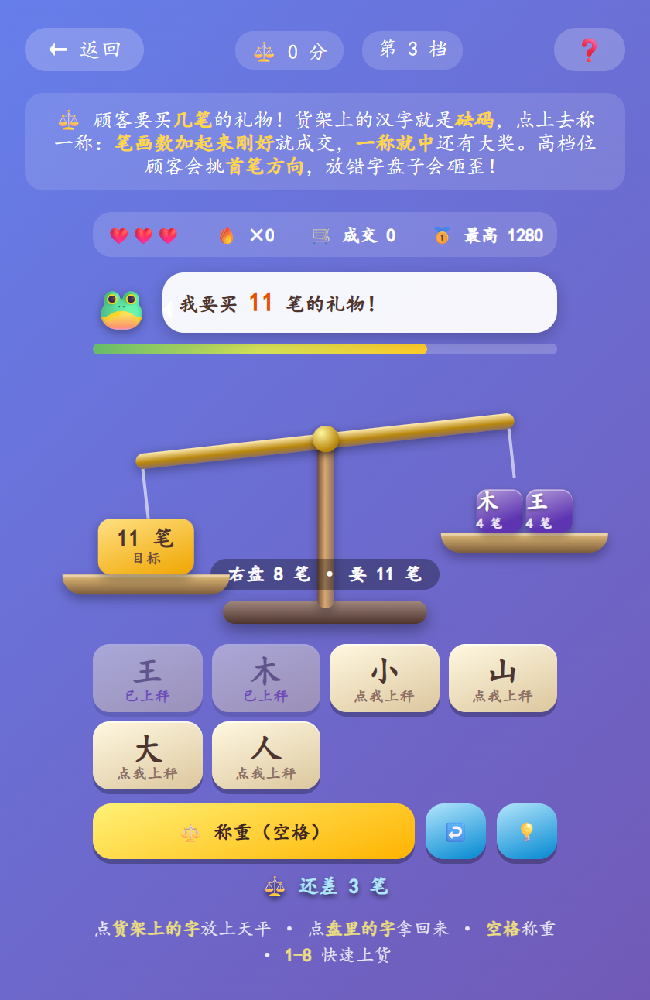
  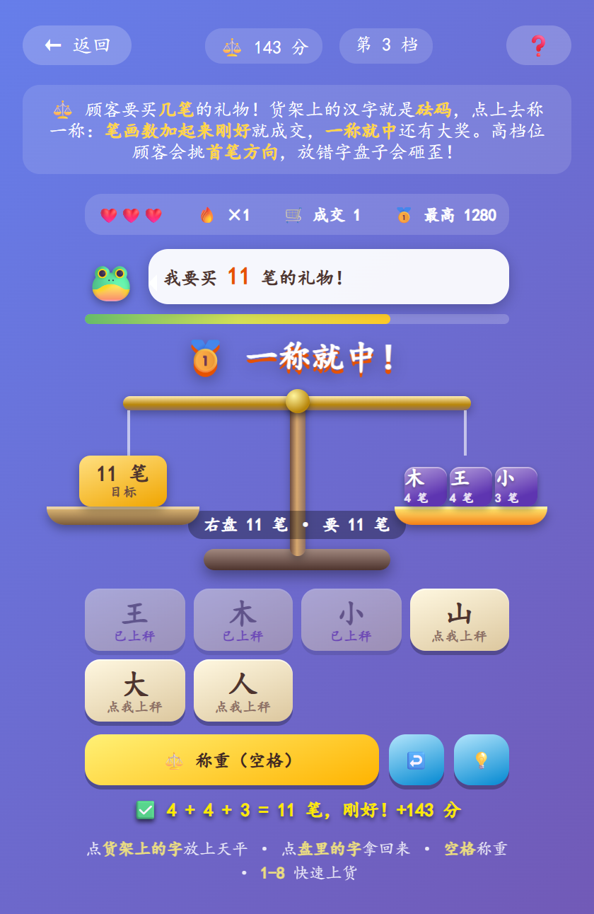
  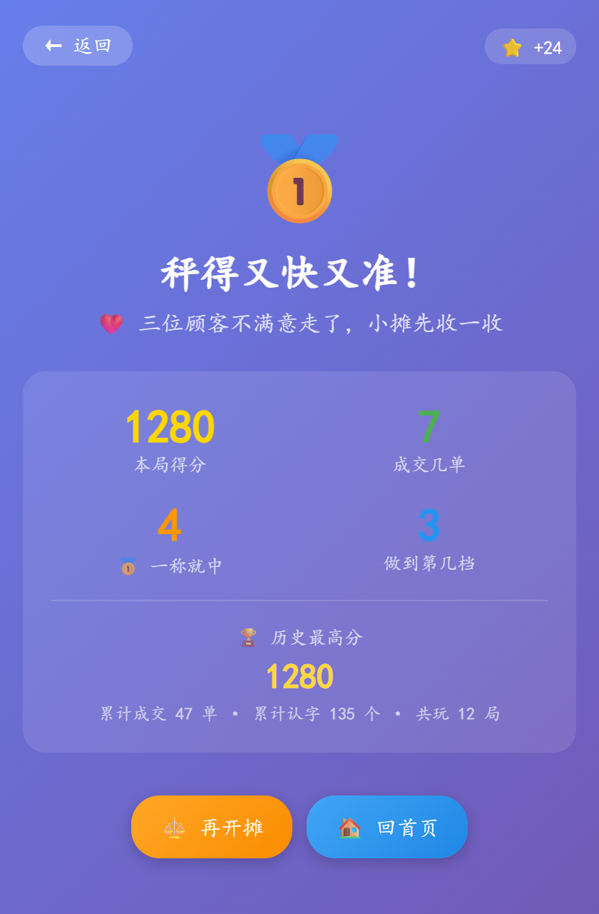
</p>

### 🕵️ 记忆翻翻屋（汉字和它的笔画数，藏在牌背后面）

一间「侦探事务所」接的新案子：**桌上摊着一排扣着的牌，一半写着汉字、一半写着笔画数**，一张字卡只能和属于它自己的那个数字配上。翻开两张，配上了就绿，配错了就红——而下一次翻开之前，孩子得先记住刚才瞥见的那一眼：

- 🧠 **练的是「记住」而不是「猜对」**：牌翻回去之后位置不变，第二对、第三对全靠上一眼记下的画面，短期记忆被反复调用，笔顺数就在一遍遍「刚才那个 3 画在哪儿」里记住了
- 🔒 **答案保证唯一**：每一关挑出来的汉字笔画数互不相同，一张字卡只有一个合法对象，孩子不可能靠碰运气蒙对，也不可能配出歧义
- ⏳ **沙漏代替生命**：配成一对回 4 秒、配错扣 2.5 秒，漏完就收队——想拖延不去记牌，时间反而会先跑光
- 🔍 **连对三次触发「侦探直觉」**：全场牌面自动亮一秒，把孩子的记忆奖励给他看，然后立刻扣回去——最上瘾的就是这一秒
- 💡 **两条求助通道**：点「看一对」花 5 秒只亮一对，按 🔍 花 8 秒全场亮一下，都是拿时间换信息，用不用由孩子自己权衡
- 🎯 **判词当场念答案**：配上时报「🎯 「口」就是 3 画！+60 分 · ⏳+4s」，配错时报「🙈 「山」和 4 画不配对，⏳−2.5 秒」，侦探再补一句「记住它们的位置，下次就不会翻错了」——读一遍就是一次复习
- 📈 **牌桌越玩越大**：第 1 关 3 对 6 张，每过一关多一对，最多加到 8 对 16 张；沙漏也跟着变长，但封顶 96 秒——要记的画面翻了一倍，时间却不会翻倍地给
- 💎 **完美搜查**：一局里一次都没配错，结算给钻石和额外 120 分，比单纯通关更值得吹
- 🎮 点牌翻开、一次翻两张、1-9/0 快速翻牌、H 看一对、P 全场闪视（`hz_mm_best` / `hz_mm_lv` / `hz_mm_pairs` / `hz_mm_perfect` / `hz_mm_games` / `hz_mm_chars`）

<p align="center">
  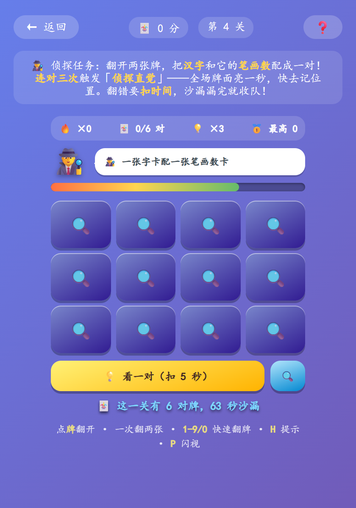
  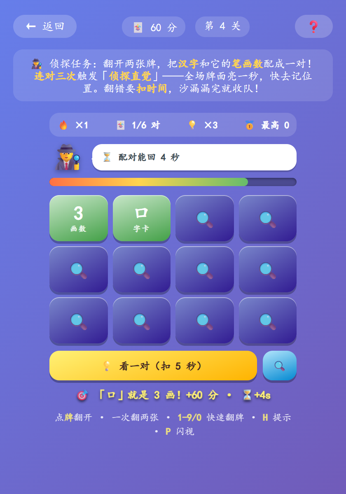
  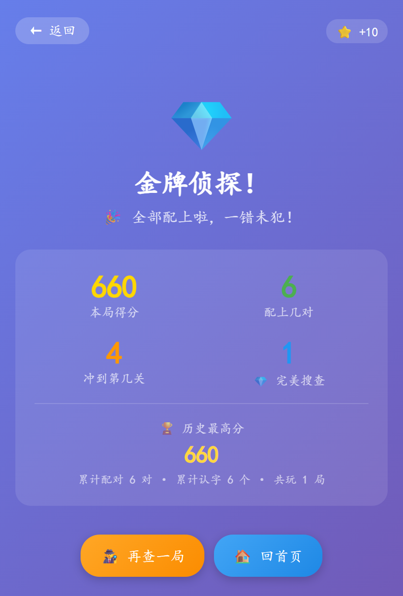
</p>

### 🧪 笔顺倒水杯（打翻的笔画墨水，一杯杯按方向倒回来）

实验桌上打翻了墨水：**横➡️ 红、竖⬇️ 蓝、撇↙️ 绿、捺↘️ 橙、点↗️ 紫**，五种笔画方向混在几只量杯里层层压着。玩法就是经典的倒水排序解谜——点一杯**拿起来**，再点一杯**倒过去**，但孩子马上会发现规则卡在笔顺上：**只能倒最上面那一段同色的水，而且只能倒进同方向的杯子里**。想把某一笔救出来，就得先想清楚它上面压着谁：

- 🧠 **倒水排序 = 排序思维**：谁压着谁、先给谁腾位置，一步棋错要退回三步——空间与顺序推理被反复调用，而判词只负责鼓励，不负责给答案
- 🎯 **参考步数是真的能走到**：每一关都由「已排好的笔顺」逆向打乱生成，打乱几次就是参考几步，所以盘面**保证有解**，孩子不会撞上死局，也不会觉得题目在骗人
- 🎨 **颜色就是笔画方向**：倒满一杯立刻报「🎉 倒满一杯 点（↗️）！「子」的第 1 笔就是它 +168 分」，下面那排笔顺小格同步亮起——一杯一杯倒完，这个字的笔顺走向也就顺着念完了
- 🔥 **连击越倒越响**：每倒一步 +6 分、连击每加一层多 +3 分，倒满一杯 80 + 连击×20 + 关卡×8，五声音阶一段段往上爬，星星从杯口飞出来
- 💎 **完美倒水**：一整关一次都没倒错（没试过颜色对不上、也没试过满杯），额外 +150 分和钻石，结算称号直接给「金牌调香师」
- 💡 **三条求助，各扣各的**：提示（每关 3 次，-20 分，把该倒的两只杯子描边 1.2 秒）、撤销（3 次，不罚分只断连击）、重摆（换个乱法重来，参考步数跟着变）
- 📈 **越往后杯子越多、水层越深**：第 1 关 3 种方向 / 3 层，每过 3 关多一种方向，第 3 关起水深变成 4 层，最多 5 种方向 7 只杯子；连过 5 关自动收工去结算
- 🎮 点杯拿起 / 再点一杯倒过去、1-8 直接选杯、H 提示、U 撤销、R 重摆（`hz_wc_best` / `hz_wc_lv` / `hz_wc_cups` / `hz_wc_perfect` / `hz_wc_steps` / `hz_wc_games` / `hz_wc_chars`）

<p align="center">
  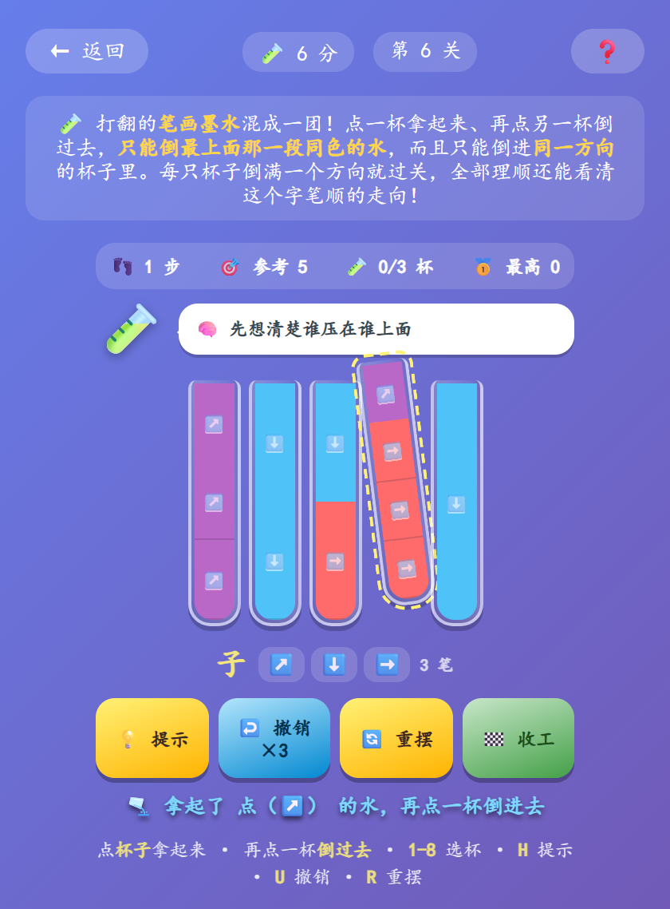
  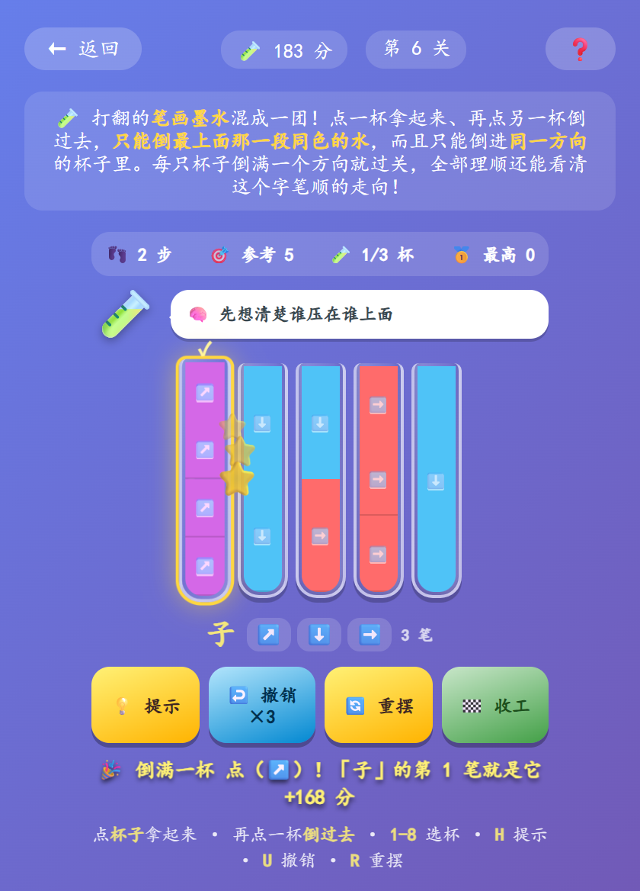
  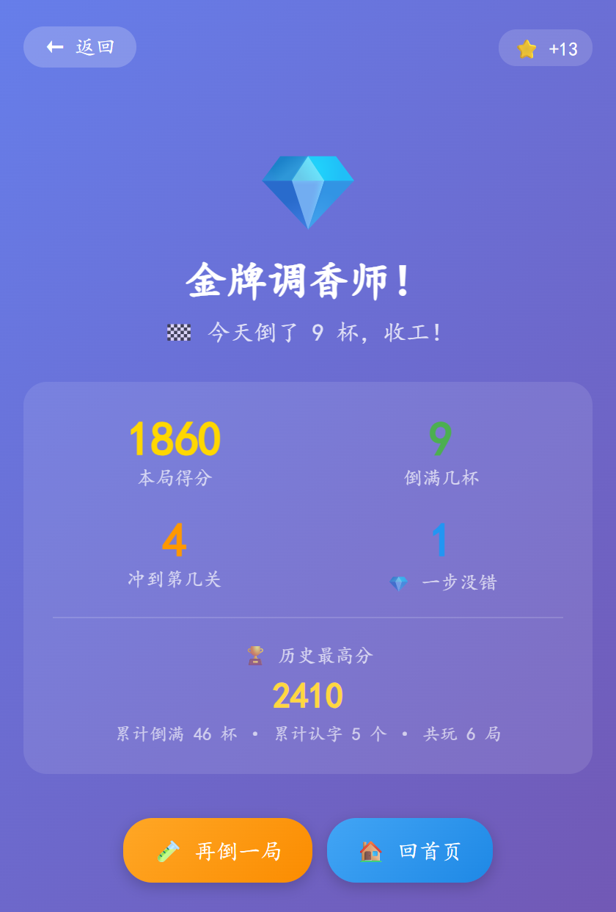
</p>

### 🫧 笔顺泡泡龙（答对装同色弹，瞄准三个连成一片炸）

天花板上挂着一整片**笔画方向泡泡**：**横➡️ 红、竖⬇️ 蓝、撇↙️ 绿、捺↘️ 橙、点↗️ 紫**。这是经典泡泡龙（射击三消），但弹药不是随便给的——**答对一道笔顺题，炮口才装上那一发**，而且装的颜色就是正确答案的方向。孩子要一边算「这一笔往哪写」，一边算「这一发该打到哪一片」：

- 🎯 **答案就是弹药颜色**：题目问「『二』的第一笔往哪写？」，答对「横」就装上一发**红色**泡泡——想打红色那一片，就必须先答对题，答题和瞄准变成同一件事
- 📐 **拖动瞄准 + 撞墙反弹**：虚线弹道实时预览，会在左右墙之间反弹，落点亮出虚线圈并标 `+3` / `+5`，一眼看出这一发能炸几个，空间与角度直觉在反复用
- 💥 **三个同色连成一片就炸**：六边形蜂窝盘（奇偶行 9/8 列错位），炸完还会做**悬空判定**——被炸断的那一串会整串掉下来，每个再算 20 分，一次「断链收割」比乱打十发都值钱
- 🔥 **连击越打越响**：连着炸合算连击，每片分数 ×(1+0.3×(连击-1))，连击 ≥6 时答对一题直接发**两发**，屏幕中间甩出「连击 ×N!」
- ⬇️ **顶上会压下来一行**：每打 7 发（越往后越快，最少 4 发）顶上挂下新一行，泡泡越过黄色警戒线就收工——答错也压一行，所以「瞄得准」和「答得对」同样重要
- 🌈 **一关关打干净**：把整片泡泡全炸光直接 +180+60×关卡 并放彩带进下一关；颜色从 3 种涨到 5 种、初始行数从 4 行涨到 8 行，越往后越要挑着打
- 💡 **三条求助各扣各的**：提示（每关 3 次，-20 分，扫遍所有角度挑最炸的一发并给它邻居描边）、撤销（3 次，把这一发原样收回不罚分）、换一题（-15 分）
- 🎮 在盘面拖动瞄准 / 松手发射、←→ 微调、空格发射、1-4 答题、H 提示、U 撤销、R 换题（`hz_bb_best` / `hz_bb_lv` / `hz_bb_pops` / `hz_bb_drops` / `hz_bb_shots` / `hz_bb_games` / `hz_bb_chars`）

<p align="center">
  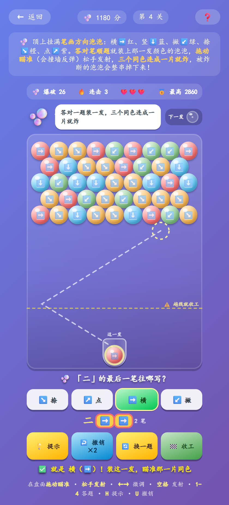
  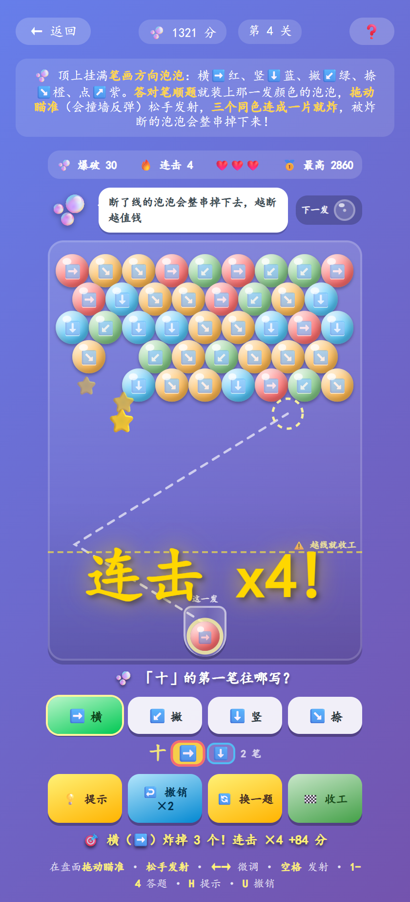
  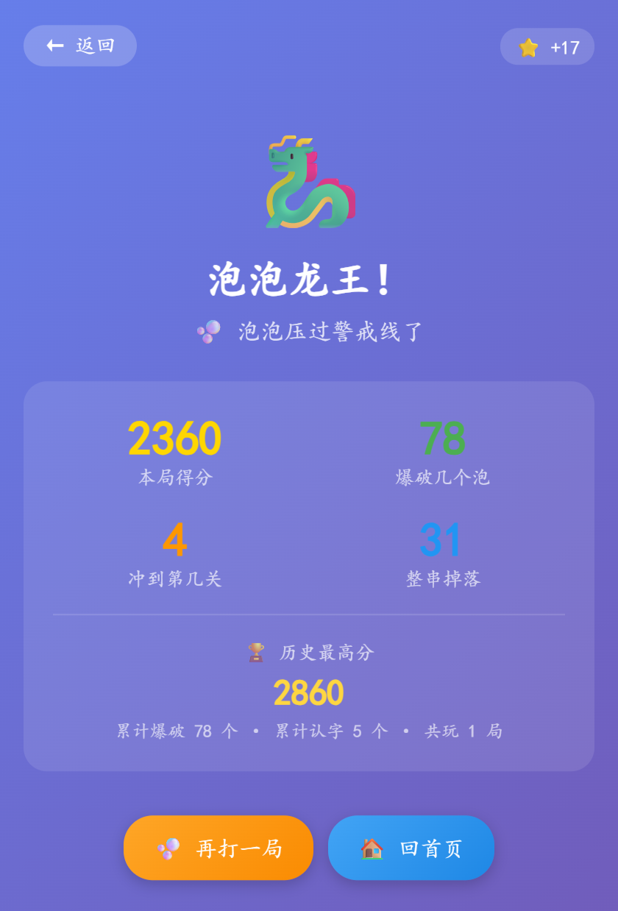
</p>

### 🎲 笔顺大富翁（掷骰走汉字小城 · 答题赚金币 · 买地收租）

一座 16 格的**汉字小城**绕成一圈：`学校大门 → 写字摊 → 一笔巷 → 神秘屋 → 二文铺 →…`，每块地皮都写着一个汉字。孩子和 AI 对手「小墨」轮流掷骰子走格，**先攒够目标金币的一方赢**——而金币的主要来源不是运气，是笔顺：

- ✏️ **写字摊是提款机**：踩到 4 个写字摊就答一道笔顺题（几笔？这一笔往哪写？），答对当场进账 `26 + 连击×6 + 关卡×3` 金币，连击越长越肥；答错只扣 14，不驱赶孩子
- 🏠 **买地才收得到租**：无主地（一笔巷 60 → 大雨城 180）当场能买下，对手再踩到就交 `地价×30%` 过路费；踩自家地可**翻修**，一级再涨 `地价×24%`，角标 `×2 ×3` 一眼看清投入
- 🎁 **神秘屋抽事件卡**：10 张卡有赚有赔——写春联 +30、老鼠叼走零钱 -22、免租卡 🛡️（挡一次过路费）、免费翻修、再掷一次 🎲、坐公交回起点补薪水，运气也讲策略
- 💰 **经过学校大门就发薪水**：走一圈保底进账，越往后关卡薪水越高（22 → 34），答错也不至于破产出局；破产两次或金币清零才判负
- 🐼 **小墨会算账**：AI 按关卡提升答题正确率（54% → 86%）与买地欲望（50% → 92%），第 1 关温柔、第 6 关开始抢地盘，孩子始终有个「刚好打得过」的对手
- 🔁 **反悔不罚款**：每局 2 次反悔，把棋子、金币、地皮、回合整体退回上一次掷骰前——鼓励孩子「想清楚再走」而不是乱掷碰运气；提示（3 次）划掉两个错答案，代价是这一笔奖励打六折
- 📈 **过关涨目标**：目标金币 240 → 636、回合 22 → 34，赢了自动开下一关；累计收租、置地、认字都进结算屏，`纪录` 一栏盯着历史最高金币
- 🎮 点**掷骰子**或空格、1-4 答题、点格子看这块地的行情、H 提示、U 反悔（`hz_mf_best` / `hz_mf_lv` / `hz_mf_wins` / `hz_mf_rent` / `hz_mf_estates` / `hz_mf_games` / `hz_mf_chars`）

<p align="center">
  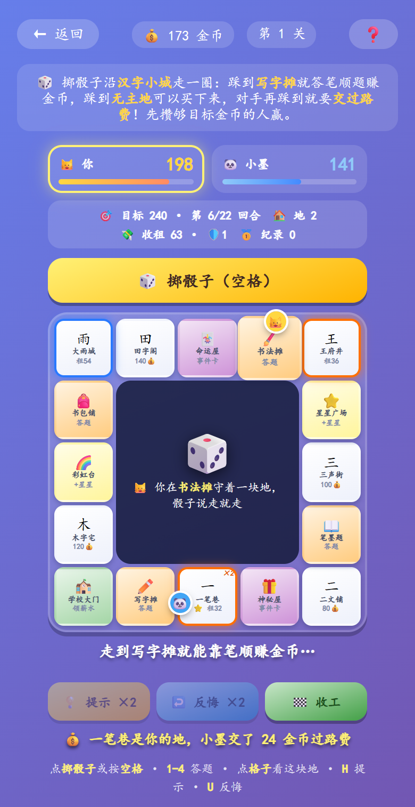
  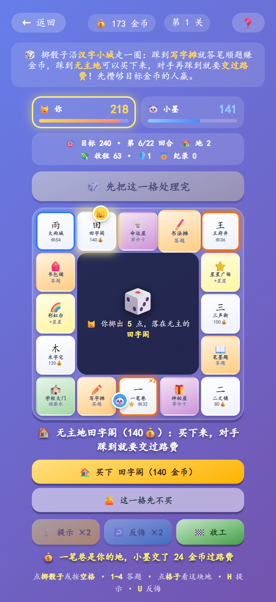
  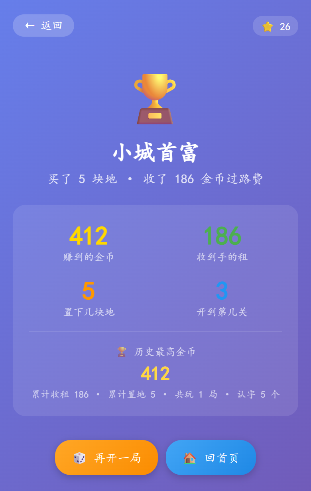
</p>

### 💧 笔顺水管屋（转管道引墨水 · 水阀必须按笔顺开）

一张 4×4 到 6×5 的**水管地图**：左边是**墨池**🖌️，路上钉着几颗**田字格水阀**🚰，编号 1、2、3……就是今天要写的**第 1 笔、第 2 笔、第 3 笔**。孩子点管道把它转一格，墨水会自己顺着接好的管子一路淌过去——但**关着的水阀是单向阀门，墨水顶到就停**，所以想开第 2 号阀，必须先把第 1 笔答对：

- 🔒 **笔顺就是物理规则**：越位顶到的阀门会当场抖一下并说「墨水堵在第 3 号阀，得先开第 1 号」——写倒笔顺在这个游戏里是真的通不了水，比十句提醒都管用
- 🧩 **一格一转，墨水自己找路**：直管 ⟪I⟫ 和弯管 ⟪L⟫ 混排，转对了墨水「咕」地往前推一格并亮起、音阶一格一格往上涨；转错就是转错，随时 ↩️ 转回原样
- 🎯 **每开一阀答一笔**：面板问「『永』的第 2 笔往哪写？」，四个方向选项（➡️ 横 / ⬇️ 竖 / ↙️ 撇 / ↘️ 捺 / ↗️ 点），答对 +60 分并按连击加成，答错扣一颗心但**管子不用重转**，再答一次就行
- 🏅 **一步不差才算真会**：每关开局就按真实解算出「参考步数」，收工时转管数 ≤ 参考步数直接甩出「💧 一步不差！」横幅 + 完美奖励，逼孩子先看清整条路再动手
- 🌊 **一关关涨难度**：第 1 关 16 格 2 阀、每 2 关多一颗阀，格子最多涨到 30 格 5 阀、干扰管最多 8 根；倒计时 50–85 秒，**答题时自动暂停**，不会一边想笔顺一边被时间追着跑
- 💡 **三条求助各扣各的**：提示（每关 3 次，闪一根真转错的管子，代价是扣 5 秒）、转回（3 次，把上一根管子原样退回、步数也退回）、重新打乱（R 键，同一张图换个乱法，分数关卡都不掉）
- 📈 **成长都在账上**：累计开水阀、通关数、完美关、认过的字分开记账，结算屏给「水管大师 / 越通越顺」称号，星星进总账
- 🎮 点**管子**转一格、1-4 答水阀题、H 提示、U 转回、R 重新打乱（`hz_pi_best` / `hz_pi_lv` / `hz_pi_valves` / `hz_pi_levels` / `hz_pi_perfect` / `hz_pi_games` / `hz_pi_chars`）

<p align="center">
  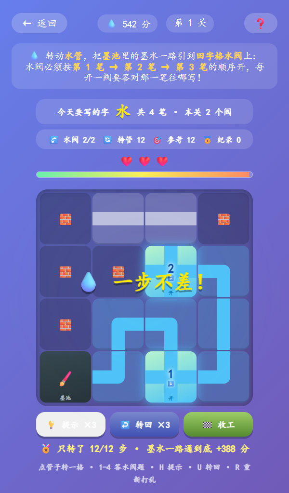
  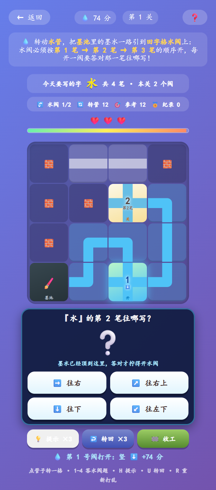
  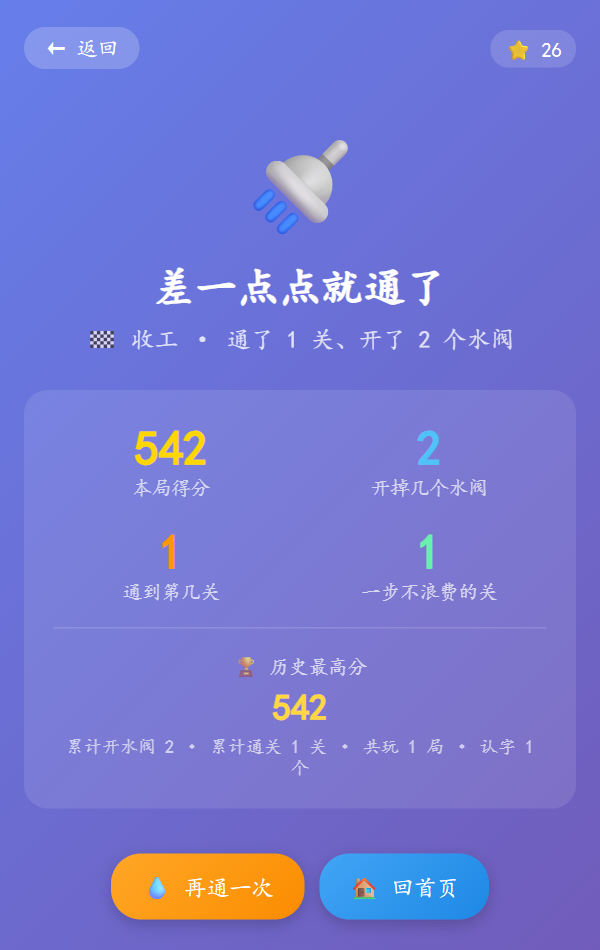
</p>

### 🧸 笔顺娃娃机（一爪一题 · 夹中才考这个字 · 答对才落袋）

一台**竖屏娃娃机**：箱子里堆着七八个会互相挤压、会弹跳的娃娃，每个娃娃挂着一个真实汉字——**爪子落下去夹住谁，就问谁的第 N 笔**，答对了才搬去取物口落袋，答错它当场从爪子里滑回娃娃堆。孩子天生就懂这台机器的痛：「明明夹住了，怎么又掉了！」

- 🪙 **游戏币就是燃料**：落一爪花一枚币，**答对立刻返一枚**——答得准就能一直玩下去，乱抓八下就见底。第 1 关发 8 枚，之后逐关加到 14 枚
- 🧲 **抓取圈按稀有度收紧**：第 1 关爪子抓取半径 19.4px（一路缩到第 12 关的 13px），普通娃娃按这个半径算、稀有 ÷1.35、闪光 ÷1.7——**越值钱的娃娃越滑**，正上方偏一点点就空爪；爪子合拢前会实时判定，落点差之毫厘，夹上来的就是隔壁那个
- ✍️ **题目只问手里这个字**：面板写「夹到『禾』🐝 的第 1 笔往哪写？」，四个方向选项（➡️ / ⬇️ / ↙️ / ↘️ / ↗️），答对爪子往左挪去取物口、撒星星；答错扣一颗心、公布正确答案、娃娃**掉回堆里再弹一下**，爪子空着升回去
- 🏆 **闪光娃娃是硬通货**：8% 概率出闪光（分值 220 起、全屏彩带），稀有 22%（90 起）；连击每多一题单只娃娃贵 20%，第三只起触发连击特效
- 📖 **抓到的字进图鉴**：每个落袋的字记进 `hz_cw_book`，机台顶栏实时显示「📖 图鉴 N 个字」，跨局不清，孩子会为了凑字专门去夹没抓过的娃娃
- 🎯 **四种求助各管各的**：💪 强爪（下一爪抓取圈 ×1.9，3 次）、🎯 对准（站到最值钱的娃娃正上方，3 次）、💡 提示（划掉两个错答案，3 次）、🔀 换娃（整箱重新倒一遍，2 次）
- 📈 **关卡目标是「抓满几个」**：第 1 关抓 3 个、每两关加一个（最多 8 个），过关奖励按剩余游戏币结算，爱心回一颗、四种求助全部补满，箱子里的娃娃也变多
- 🏅 **结算与总账**：按过关数和抓到数量给「娃娃机大师 / 满载而归 / 差一点点就夹住」，最高分、最高关、累计抓娃、闪光娃娃、答对题数、落爪次数、局数分开记账
- 🎮 **拖动**爪子瞄准 · **空格 / 双击**落爪 · **1-4** 答题 · **J** 强爪 · **N** 对准 · **H** 提示 · **T** 换娃（`hz_cw_best` / `hz_cw_lv` / `hz_cw_dolls` / `hz_cw_shiny` / `hz_cw_answers` / `hz_cw_drops` / `hz_cw_games` / `hz_cw_book`）

<p align="center">
  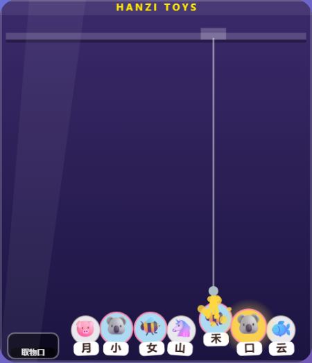
  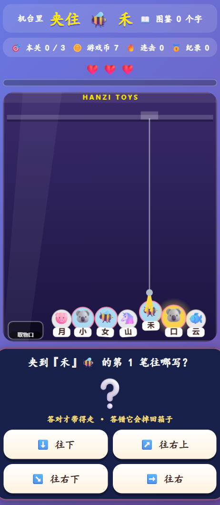
  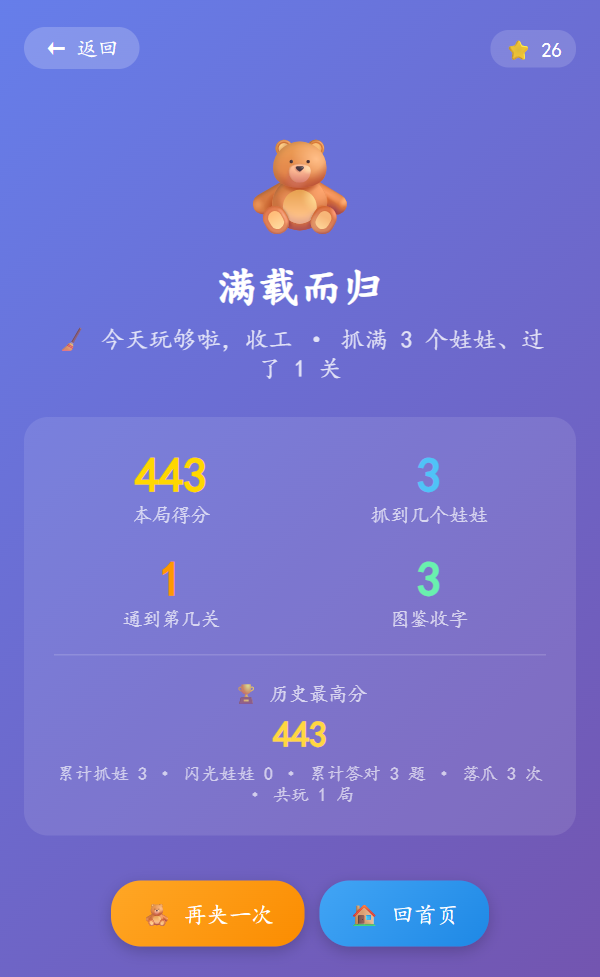
</p>

### 🔮 笔顺弹珠台（答对一笔领一颗珠 · 撞进 ×5 大奖格）

一台**竖屏弹珠机**：钉阵从第 1 关的 6 排一路长到第 10 关的 9 排，底下是一排倍率奖格——**正中间 ×5，往两边依次降到 ×3、×2、×1**。规则简单到孩子一听就懂：**答对一笔才发一颗珠子**，珠子从顶上滑下来，一颗一颗撞钉子，最后掉进哪格就按哪格结算：

- 🎯 **答题是唯一的领珠方式**：面板问「『永』的第 5 笔往哪写？」，四个方向选项（➡️ 往右 / ⬇️ 往下 / ↙️ 往左下 / ↘️ 往右下 / ↗️ 往右上），答对收起面板进入瞄准，答错扣一颗心、当场把正确答案亮出来——**不答题，机器里一颗珠子都没有**
- 🕹️ **拖动瞄准、松手就投**：按住画布左右拖出虚线瞄准线（键盘 ← → 也能挪），松手或按空格投珠。重力 1500、碰钉弹性 0.42、每次弹跳带 ±15 的随机侧推，珠子走的是**真轨迹**，不是抽奖动画
- 🌟 **金珠翻倍**：连击 3 题以上，下一颗自动烧成**金珠**，落格分数直接 ×2，撞进中间格就是「🌟 头奖 ×5！」全屏撒彩带，单珠最高能拿五百多分
- 🧲 **三种求助各扣各的账**：💡 提示（每关 3 次，划掉两个错答案，-12 分）、🧲 磁铁（2 次，-15 分，下一颗会被**真的吸**向中间大奖格）、🔤 换题（3 次，-8 分，换一个字从第 1 笔重来，连击清零）
- 📈 **一关一个目标**：每关只发 10～16 颗珠，要在珠子投完前把「本关分」攒到 480～2180；过关剩的珠子按每颗 18 分折进奖励，爱心回一颗、提示磁铁换题全部补满，钉阵当场变密一档
- ✍️ **整字写完另算**：一个字的每一笔都答完，额外给「100 + 关卡×10」的整字奖励并自动换下一个字——所以**多答一题就是多一颗珠，也是离写完一个字更近一步**
- 🏅 **称号与总账**：结算按过关数和头奖次数给「弹珠大师 / 越投越顺 / 差一点点就够」，最高分、最高关、累计投珠、头奖、答对题数、写完的字全部分开记账，星星进总账
- 🎮 **拖动**瞄准 · **空格**投珠 · **1-4** 答题 · **H** 提示 · **G** 磁铁 · **T** 换题（`hz_pl_best` / `hz_pl_lv` / `hz_pl_jack` / `hz_pl_beads` / `hz_pl_answers` / `hz_pl_chars` / `hz_pl_games`）

<p align="center">
  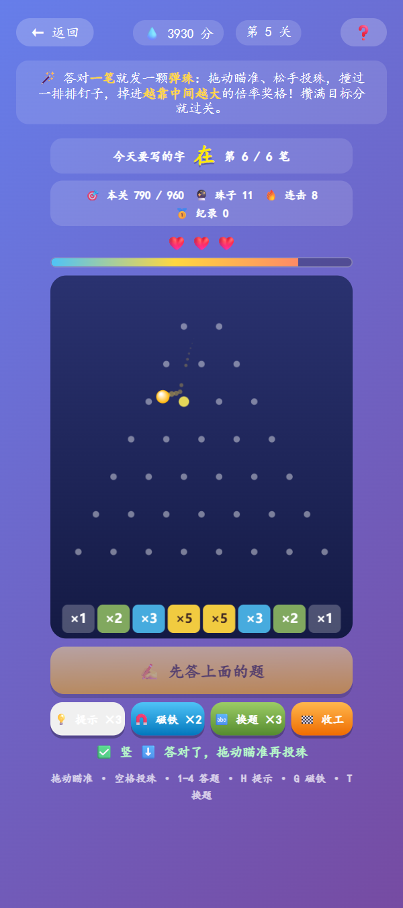
  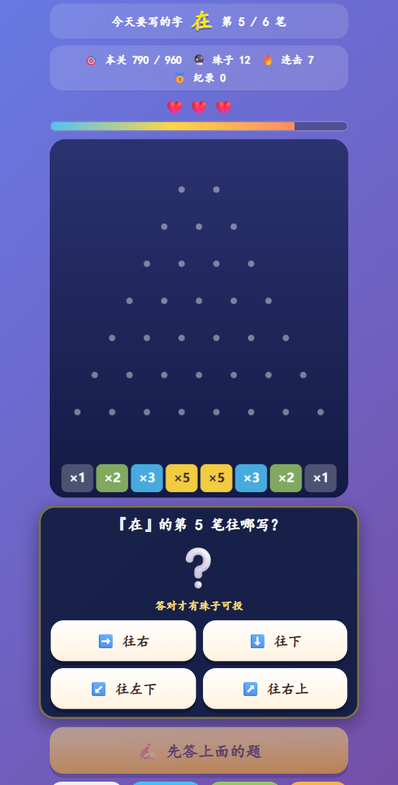
  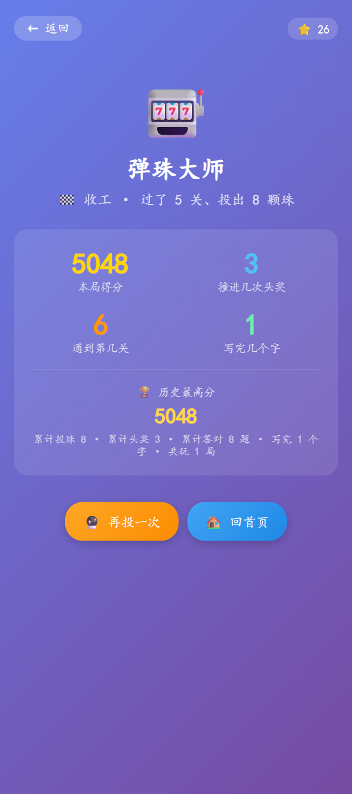
</p>

### 🧐 笔顺神探（只露几笔 · 从形近字里认出它）

全仓库唯一一个**笔画是题目**的模式：其它玩法都是「答对才有奖励」，这里则是把字一笔一笔露出来让孩子**认字**——米字格里只有前两笔，四个候选字长得几乎一样，靠笔画的走向和形状判断到底是谁。孩子会自己喊出「我知道！」，因为答案就在屏幕上，只是要看清每一笔。

- 🔍 **逐笔线索，越要越便宜**：本案分值 = `(70 + 关卡×12) × 折扣`，每要一条线索按 `[100%, 74%, 55%, 40%, 30%, 24%]` 掉一档（保底 12 分）。**一条线索都没要就答对 = 🧠 一眼看穿 ×1.35**，屏幕正中盖下红色「结案」印章 + 全屏彩带
- 🖌 **四种线索**：`🖌 再露一笔`（把下一笔琥珀色高亮、顶上带方向角标）、`📏 共几笔`（说出总笔画数和还藏几笔）、`🧭 方向串`（➡️ ⬇️ ️ ↗️…整字的笔顺方向一次给全）、`🔍 排除`（每关 2 次，划掉两个不像的候选，-8 分）
- 🎯 **干扰项是真·形近字**：把每个字光栅化成 40×40 笔画轮廓，按「轮廓重合度 ×0.5 + 笔画数差 ×0.2 + 笔顺方向串最长公共子序列 ×0.3」算相似度，**候选永远是跟目标最像的那几个**（未/末、己/已、王/玉这种）；第 4 关起只在**同笔画数**的字里挑干扰，前三关则混进一个明显不相干的送分选项
- 📓 **错字复仇手册**：看走眼的字自动记进 `hz_dt_book`（最多 12 个），下一局开局**第一个案子就是它**；只靠一条线索就认回来 → 当场销案 +60 分，手册清空时结算页会写「看错的字都认回来了」
- ❤️ **三颗心 · 答错不判死**：猜错扣一颗心、本案立刻贬值，但**白送一笔线索**（多露一笔），孩子可以盯着正确的字再来一次；心用完才结案
- 🔥 **连击加成封顶 3 倍**：连对不断涨（每连一击 +22%），答错清零；每关破满 3～5 案过关，奖励 `90 + 关卡×20 + 剩余心×25`，爱心回一颗、排除补满、关卡最高到第 12 关（候选从 4 个涨到 6 个、起手只露 1 笔）
- 🏅 **称号与总账**：按分数与破案的案子给「神探大师 / 一眼就认出你 / 破了不少案子 / 差一点点就看出来了」，最高分、最高关、连破纪录、累计破案、一眼看穿、答对、看走眼、局数分开记账
- 🎮 **1-6** 选字 · **S** 再露一笔 · **N** 共几笔 · **D** 方向串 · **H** 排除（`hz_dt_best` / `hz_dt_lv` / `hz_dt_streak` / `hz_dt_cases` / `hz_dt_easy` / `hz_dt_answers` / `hz_dt_miss` / `hz_dt_games` / `hz_dt_book`）

<p align="center">
  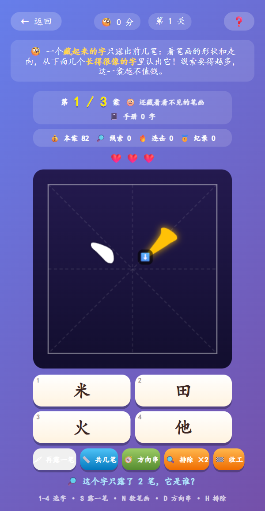
  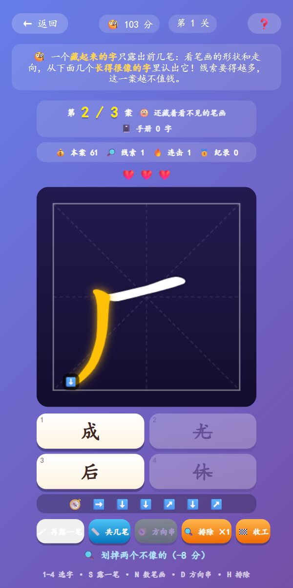
  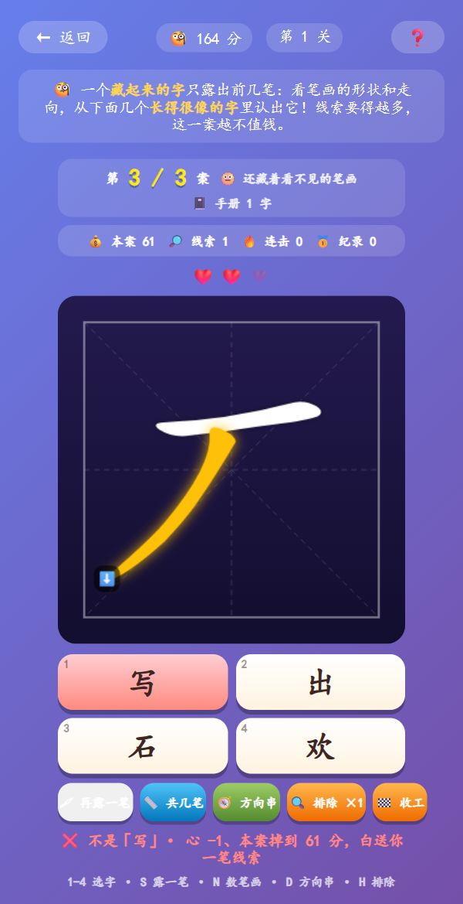
  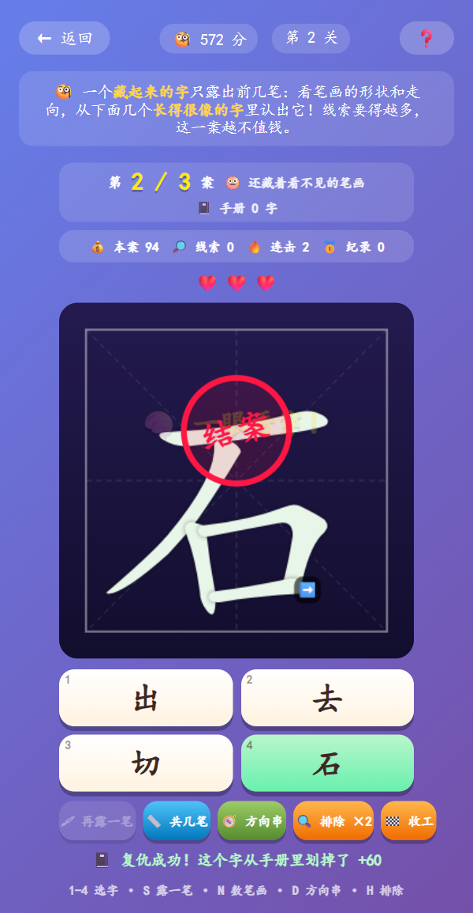
  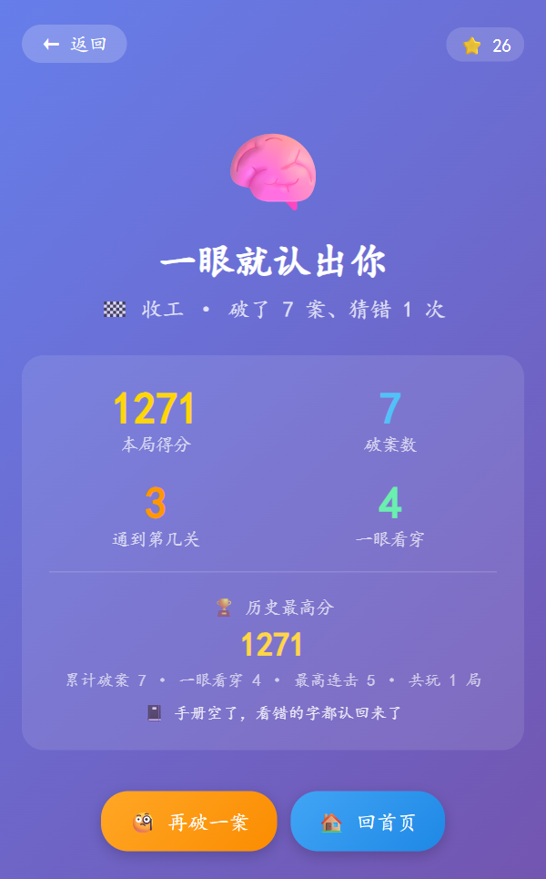
</p>

### 🔴 笔顺四子棋（答案挂在列上 · 答对才落得进 · 和 AI 抢四连）

把「答题」变成「抢地盘」：七列六行的棋盘顶上挂着四个答案，**正确答案同时印在两列上**。答对了才落得进子，而且还能自己挑要占哪一列；答错，那颗子直接归 AI。孩子为了连成四子会主动去数笔画、辨方向——落点是自己选的，输了也只怪自己没看清笔顺。

- 🧠 **答案挂在列上**：一题四个答案占四列，正确的那个印在**两列**上，挑一列落子；倒计时（`11000-段位×750ms`，最短 5.2 秒）归零 = 手慢，AI 白捡一子
- 👥 **连击双子**：连击 ≥3 触发 🛡️ 护身（答错不送子），连击 ≥4 再开 👥 双子（两个正确列各落一子，一步占两地）
- 🎯 **答对才涨分**：单题得分 `(14 + 段位×3) × (1 + min(1.5, 连击×0.12))`，连击越长越值钱
- ⚫ **先连成四子的人赢**：横/竖/两条斜线都算，赢一盘 `120 + 段位×40 + min(60, 连击×6)` 分，四颗子点亮金框 + 全屏彩带；棋盘下满没人连上算和棋 +30 分
- 🥉 **三颗挑战星**：输一盘掉一颗，掉完收官；段位按本局胜局升到 `min(8, 1+胜局)`，从「新手村」一路下到「棋坛小神童」
- 🤖 **AI 会成长**：失误率 `max(.10, .45-段位×.05)`、来堵你的概率 `min(.78, .20+段位×.12)`、思考 `max(420, 1000-段位×70)ms`。新手村的 AI 常常忘记堵你，高段位会先收官、再堵人、还会算「这一手会不会送你四连」
- 💡 **三种求助**：`💡 提示`（每局 2 次，划掉一个错答案列）、`🔀 换题`（2 次，同一个棋盘换一个字的题）、`⏪ 悔棋`（1 次，把上一手你和 AI 的子一起收回）
- ⚖️ **实测平衡**：让一个「每次都答对、还会挑更好落点」的机器人自玩 60 盘/段位，lv1 胜率 80%、lv3 75%、lv5~8 约 45%——低段位敢下，高段位要算
- 🎮 **1-7** 选列落子 · **H** 提示 · **T** 换题 · **U** 悔棋（`hz_c4_best` / `hz_c4_lv` / `hz_c4_streak` / `hz_c4_games` / `hz_c4_wins` / `hz_c4_losses` / `hz_c4_answers` / `hz_c4_miss` / `hz_c4_slow` / `hz_c4_boards`）

<p align="center">
  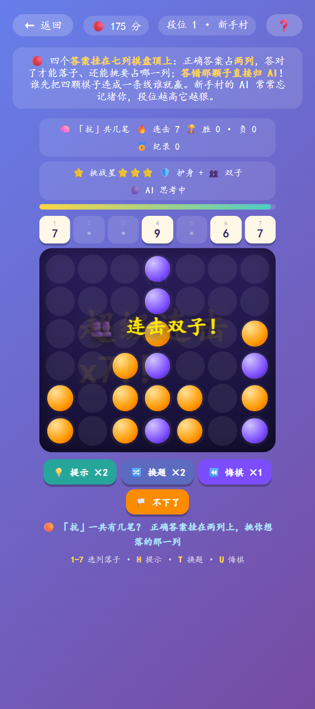
  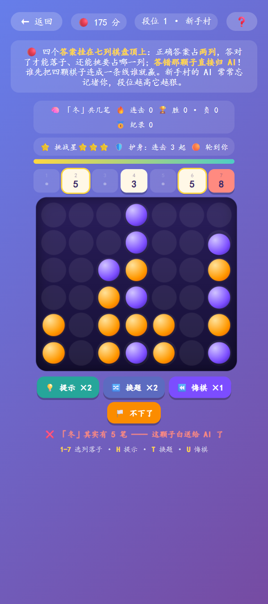
  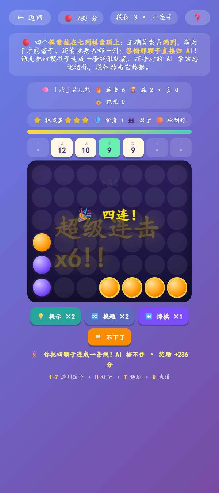
  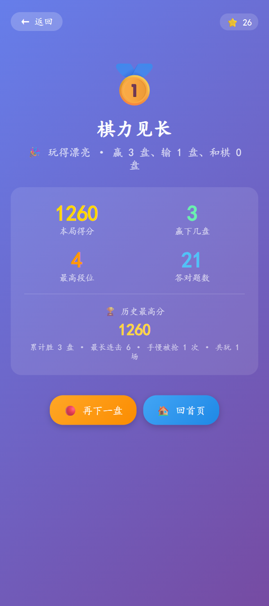
</p>

### 📸 笔顺闪现（大字只闪一下 · 凭这一眼答题 · 答对的字永久留在记忆墙）

其它玩法都是「看着字答」，这一个偏不让看：米字格里的大字只闪 1.85 秒（九段只剩 0.65 秒），快门一亮字就收走，屏幕上空空如也——它**第几笔往哪写**、**一共几笔**、**刚才到底是哪个字**，全凭孩子脑子里留下的那一眼。练的正是「看一眼就记住」的整体字形识别，而不是逐笔描红。

- 📸 **一眼定分**：闪字时长 `max(650, 2000-段位×150)ms`（一段 1.85 秒、九段 0.65 秒），答题限时 `max(6000, 11000-段位×600)ms`；快门闪白 + 笔画碎开的粒子，字是真的「被收走了」
- ❓ **三种题型**：`第 N 笔往哪写`（四个方向箭头）、`一共几笔`（四个数字）、`刚才是哪个字`（三段起，四个**形近字**候选，复用神探那套字形相似度引擎挑「日/曰/目」这种近亲）
- ⚡ **一眼记住 ×1.35**：限时前 40% 就答对，说明这一眼确实看清了；🔥 **连拍 ×1.5**：连击 ≥5；👥 **双子 ×1.6**：六段起一次闪两个字并点名「左边那个字」，记的是一幅画面而不是一个字
- 🧠 **过目不忘**：连击 ≥3 时下一张多给 0.5 秒——状态越好眼睛越毒，形成正向循环
- 🔄 **再看一眼 ×2**：把这张字再闪一遍（只有正常时长的 60%），代价是这题得分 ×0.5；✂️ **排除 ×2**：剪掉两个不相干的候选 -8 分
- 👀 **答错就现场教学**：错一次掉一颗记忆星（3 颗用完收官），但那个字会**重新亮回来**，被考的那一笔染成金色并贴上方向标签，判词直接写明「『有』第 5 笔是 ➡️ 往右」——看错一眼胜过抄十遍
- 🧱 **记忆墙**：答对的字当场盖上墙（新字弹跳高亮），并跨局存进 `hz_fl_wall`（滚动保留最近 48 个字），一局一局攒出自己的识字量
- 🎯 **计分与段位**：单题 `(16 + 段位×4) × (1 + min(1.6, 连击×0.14))` 再叠乘上面的加成；段位 `min(9, 1+答对数÷4)`，从「快照学徒」一路升到「最强大脑」
- 🎮 **1-4** 选答案 · **R** 再看一眼 · **X** 排除 · **空格** 立刻下一张（`hz_fl_best` / `hz_fl_lv` / `hz_fl_streak` / `hz_fl_cards` / `hz_fl_easy` / `hz_fl_answers` / `hz_fl_miss` / `hz_fl_games` / `hz_fl_wall`）

<p align="center">
  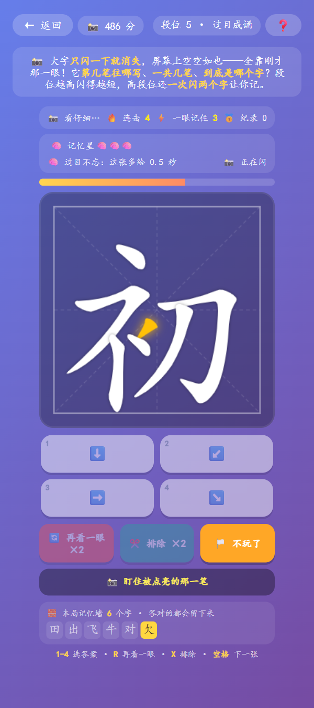
  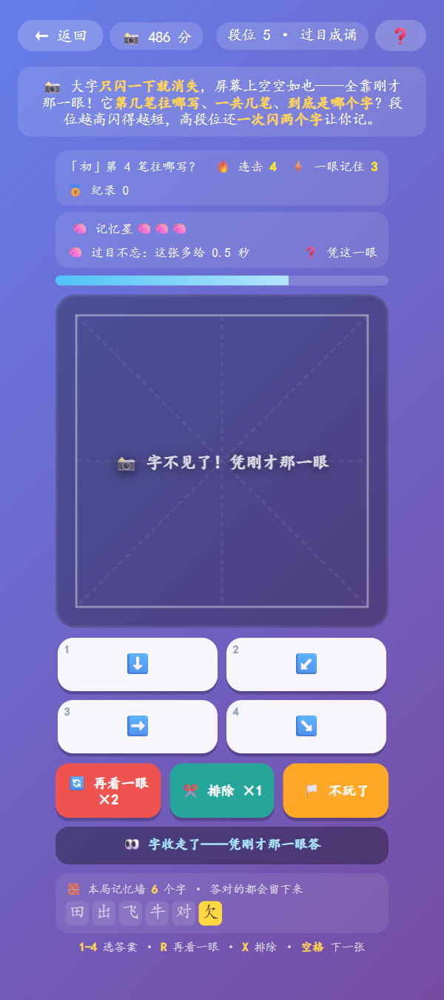
  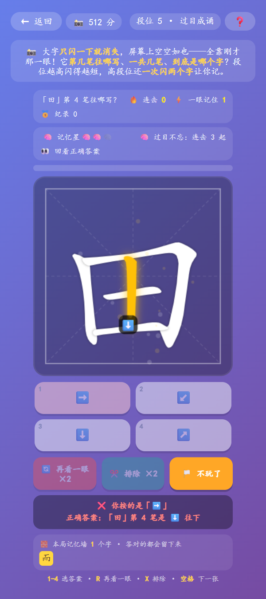
  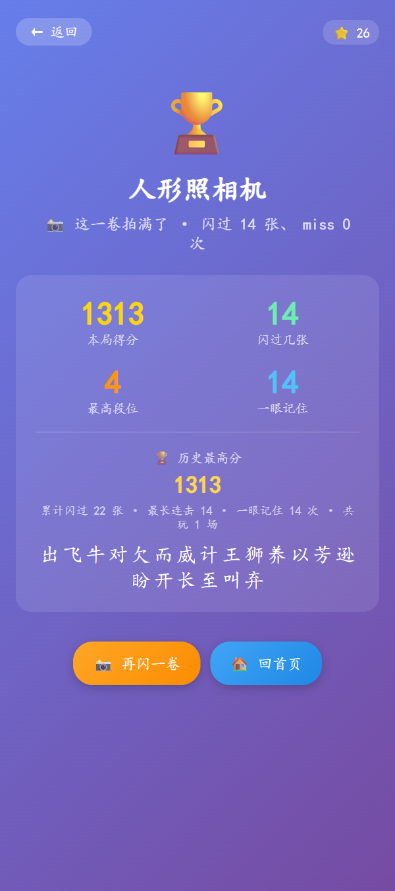
</p>

### 🔤 笔顺猜字（逐笔翻彩牌 · 用最少次数揪出那个字）

把 Wordle 的推理快感搬进笔顺里：系统从字库里挑一个**藏起来的字**，只告诉孩子它几笔，并把 10~20 个候选字摊在桌上。随便点一个去猜，这个字就**一笔一笔翻出彩牌**——🟢绿牌=方向和位置都对、🟡黄牌=这个方向它用了但站错了位、⬜灰牌=这一笔根本不是这个方向；更狠的是彩牌会**直接染到米字格的笔画上**，抽象的方向符号当场变回看得见的字形。练的是「拿笔顺反推字形」，猜得越准、次数越少，分越高。

- 🟩⬜ **两遍判定不虚报**：先数绿牌，再用目标字剩下的方向数黄牌，所以「多/夕」这种方向重复的字也算得清清楚楚，黄牌数永远不超过它真实还欠的方向数
- 🧩 **保证推得出来**：发牌时按方向串去重（`strokeTypes[ch].join('')` 相同的字只留一个），杜绝「两个字线索一模一样」的死局
- 💡 **亮一笔 ×2**：探出某一笔的真实方向，当场把不符的候选全划掉（-12 分、这局得分 ×0.7）；如果只剩一个可能，它会直接说「就是它」并且不扣这次提示
- 🔀 **换字 ×2**：另换一个字藏起来，代价是之前所有线索作废 + 得分 ×0.5
- ⚡ **四种爽感倍率**：🎯 一击即中 ×2、⚡ 闪电猜手（20 秒内猜中）×1.25、💡/🔀 用过打折，最后由 🧡 三颗爱心兜底收官
- 🏆 **段位与图鉴**：底分 `60+段位×14` 再乘 `1+min(1.2, 连胜×0.15)`，单题得分 `底分 × 剩余次数占比 × 倍率`；段位 `min(9, 1+猜中数÷2)`，从「猜字新手」一路升到「汉字大师」，机会次数从 6 次压到 4 次、笔画数从 3~5 笔涨到 7~9 笔；猜中的字永久存进 `hz_wd_book`（最近 60 个）
- 🎮 **1-9** 猜第几个字 · **H** 亮一笔 · **S** 换字 · **回车** 再来一局（`hz_wd_best` / `hz_wd_lv` / `hz_wd_streak` / `hz_wd_wins` / `hz_wd_guesses` / `hz_wd_miss` / `hz_wd_games` / `hz_wd_gsum` / `hz_wd_book`）

<p align="center">
  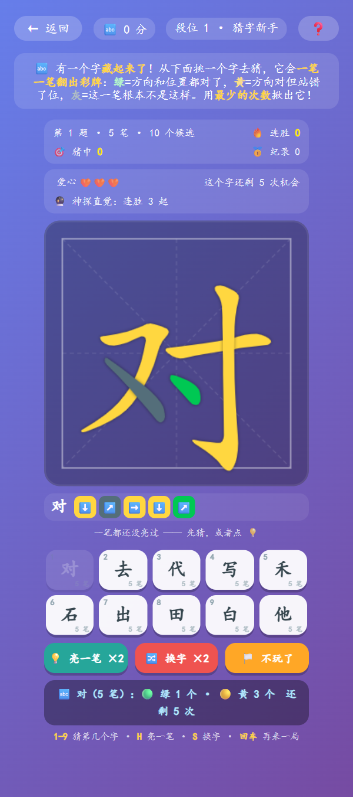
  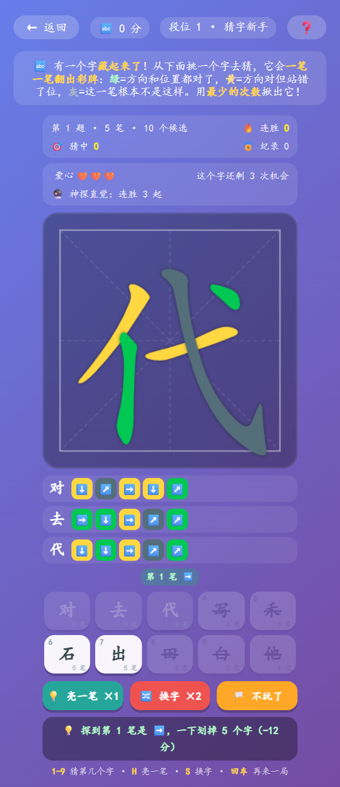
  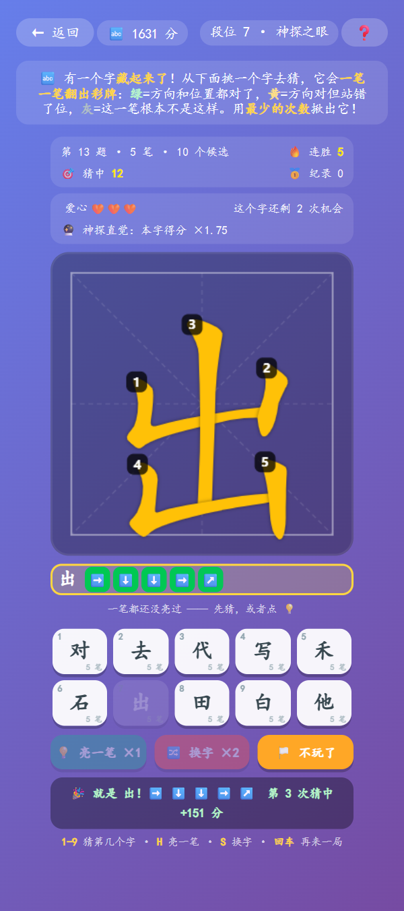
  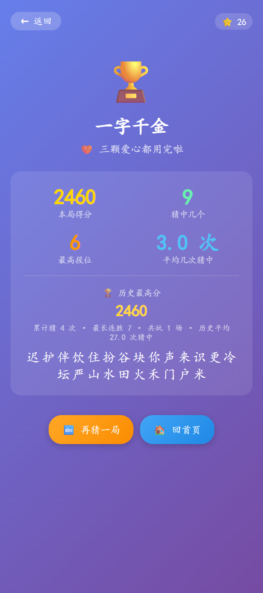
</p>

### 🏗️ 笔顺小镇（按笔顺砌砖赚材料 · 盖楼收租的放置经营）

43 个模式都在考「这一下点得对不对」，小镇考的是**长期**：把笔顺练习变成上班。孩子先到工地**按笔顺点砖**砌墙换 🧱 材料，再回小镇拿材料 + 💰 金币盖楼；楼一旦盖起来就**每秒自动产金币**，连关掉页面都在偷偷攒，于是「练字 → 赚材料 → 盖楼 → 收租 → 想再来一班」自己转了起来。练的还是同一件事：砖上写的是**笔画名**（横 / 竖 / 撇 / 捺 / 提），必须按这个字的真实笔顺点下去，点错了墙就塌。

- 🧱 **按笔顺砌砖**：米字格里摊着一堆打乱的砖，每块砖压着这个字某一笔的位置；点对了砖「飞」上墙、那一笔当场染成金牌，连击越高额外材料越多，一整面墙一堵不塌还有 **完美 +2** 奖励
- 👷 **上班要掐表**：班次从 40 秒起，小镇等级越高班越长（封顶 75 秒）；点错塌一块 **-2 秒 + 连击清零 + 整屏抖动**，🧤 护手手套能吃掉一次点错（不断连击不扣时），⏱️ 加时卡上班自动吃（一张 +8 秒，最多 90 秒）
- 🏗️ **8 张图纸逐级解锁**：🏪 小卖部 → 🥟 饺子馆 → 📚 汉字书屋 → 🏮 灯笼铺 → ⛲ 喷泉广场 → 🗼 笔顺钟楼 → 🎪 汉字戏台 → 🏯 汉字城；造价 `5 金 2 料 × 1.55^级`，每栋 9 级封顶，**小镇等级 = 所有楼等级之和**，解锁门槛 0 / 2 / 5 / 9 / 14 / 20 / 27 / 36 级
- 💰 **关掉页面也在赚钱**：楼每秒产 0.5~17 金币，钱包上限 = 产出 × 180；回来时按上次在线时间补算离线收益（最多补 1 小时），首页那张卡片上会挂着一个 **💰N 红点**喊孩子回来收租——这就是第二天还愿意打开的理由
- 🏘 **看得见的成长**：天际线上的楼随等级越长越大，称号从「一块荒地」一路升到「汉字皇城」（8 档）；砌满过的字永久收进 📖 小镇图鉴
- ⭐ **结算**：工钱 `10 + 5 × 墙数`、星星 `min(20, 1.6×墙数 + 最高连击÷6)`，最佳单班材料与累计砌墙数都会记下来
- 🎮 **W** 去工地 · **C** 收租 · **1-8** 盖对应那栋楼 · 砖角数字 **1-9** 点砖 · **回车** 下工再来一班（`hz_tw_b` / `hz_tw_coin` / `hz_tw_mat` / `hz_tw_purse` / `hz_tw_seen` / `hz_tw_work` / `hz_tw_best` / `hz_tw_games` / `hz_tw_buy` / `hz_tw_prop` / `hz_tw_pl` / `hz_tw_book`）

<p align="center">
  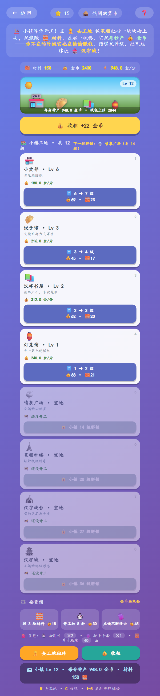
  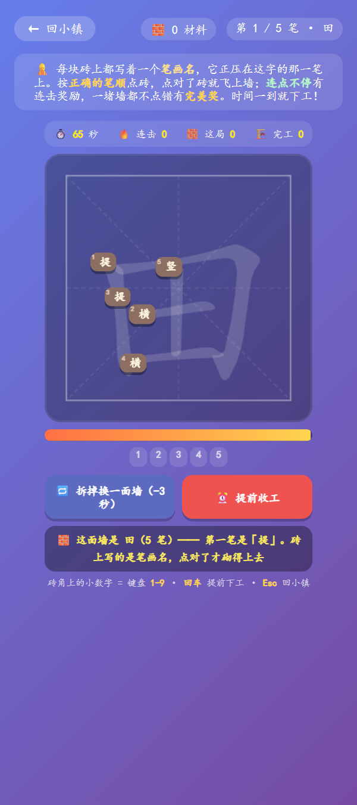
  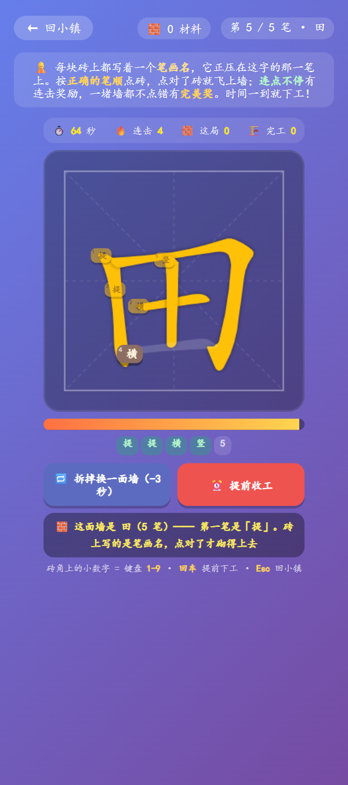
  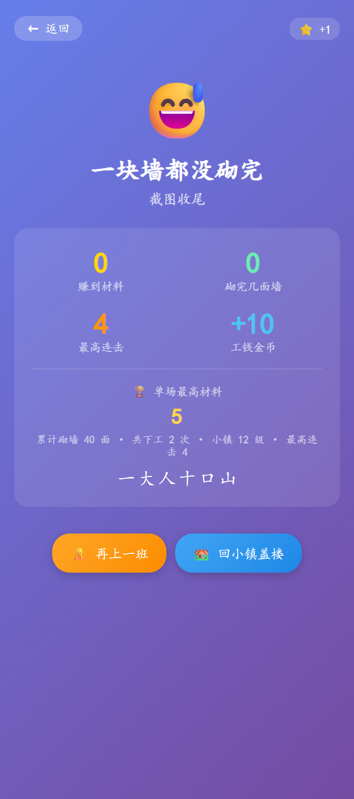
</p>

### 🗡️ 笔顺无双（踩在一个巨大的字上割草 · 撞对一笔才拔刀）

前面 44 个模式都是「答一题、动一下」，这一个是**站在字上打怪**：竞技场地板就是今天要练的那个字（1024×1024 的真实字形轮廓），四面八方涌来的「倒笔怪」每只顶着一个笔画名——横、竖、撇、捺、提。孩子操控小侠客自由跑动，**只有撞上「下一笔」那只才会拔刀**：一刀横扫一圈，那一笔当场金光刻进脚下的字；撞错了不掉进度，只掉血。于是要在当前几十只怪里认出「第 3 笔是撇」的那一只并冲过去，练的是**笔顺的直觉**，而不是选择题的手速。字一笔一笔被刻满，就通关换下一个字，波次更高、怪更凶。

- 🗡️ **撞对才拔刀**：贴身撞上顶着正确笔画名的怪 → 横扫半径内一圈全清 + 金色冲击波 + 那一笔染成金牌刻进脚下的字，连击一路涨；**撞错** → -14 点血、连击清零、整屏抖动，判词还会把「它顶的是竖，这一波要找横」再念一遍
- 🌊 **波次会自己变难**：第 1 波只出 3~5 笔的字、1.5 秒一只、同屏 7 只；越往后字越复杂（8~9 笔）、怪越快（38 → 98 px/s）、越密（0.54 秒一只、同屏 24 只），第 4 波起混进紫色的精英怪（掉 3 倍经验珠）
- 🔍 **脚下的字会「看不清」**：第 1~3 波地板字淡淡亮着当答案，第 4~6 波更淡，**第 7 波起完全消失**——这时候孩子只能靠脑子里那套笔顺打，这才是真正的验收
- ⬆️ **升级三选一（Roguelike）**：吃经验珠攒满就暂停，从 7 门绝学里挑一门：⚔️ 刀光更宽（横扫 +9）· 👟 轻功了得（移速 +8）· 🧲 吸星大法（吸取 +12）· 🛡️ 护心镜（上限 +25 并回血）· 🔥 杀意沸腾（经验 +25%）· ❄️ 剑气更快（冷却 -1.1 秒）· 🌿 回春诀（每秒回血 0.8），每门都有层数上限，每局从零开始重挑——「这一局 build 不一样」就是想再来一场的理由
- ⚡ **剑气与号角**：空格放一圈剑气，半径 94 内全清但**不刻字**（那一笔还得自己撞对），8 秒冷却；实在找不到正确那只时按 **H 报一笔**，号角会牵一只发光的过来并念出笔画名，一场只有 2 次、每次 -10 分
- 🏅 **成长看得见**：一笔不落地斩完一个字 → 收进无双图鉴、进入下一波，奖励分 `(30 + 8×波次 + 5×笔画数) × 段位加成 × 连击加成`，**一整场没掉过血再 ×1.35**；累计斩满 3 个字升一档段位，从「无双新秀」一路到「汉字无双」共 9 档，最高分 / 最高波次 / 最长存活 / 累计斩杀全部留档
- 🎮 **方向键 / WASD 或手指拖动**跑动 · **空格** 剑气 · **H** 报一笔 · **1-3** 挑绝学 · **回车** 再来一局 · **Esc** 回首页（`hz_mw_best` / `hz_mw_lv` / `hz_mw_chars` / `hz_mw_games` / `hz_mw_kills` / `hz_mw_wave` / `hz_mw_time` / `hz_mw_book`）

<p align="center">
  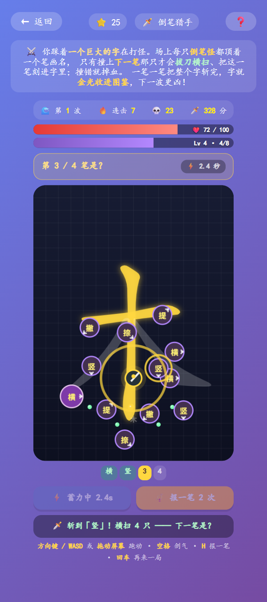
  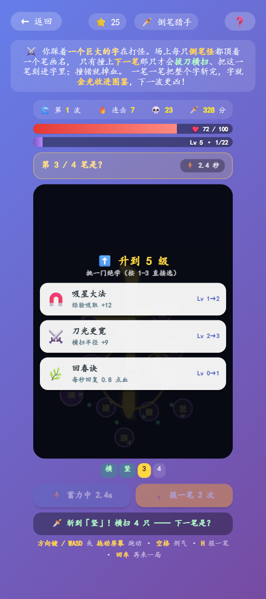
  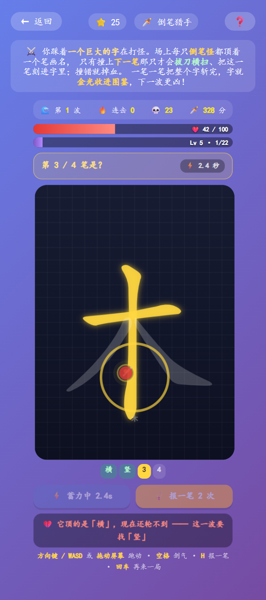
  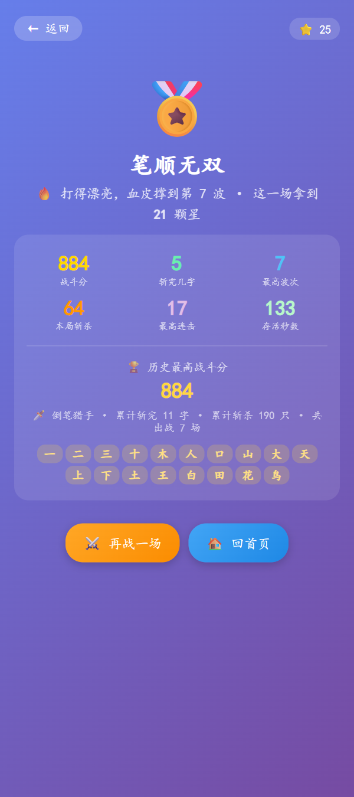
</p>

### 🐑 笔顺堆堆消（层叠抽牌 · 三张同方向才炸）

「羊了个羊」式的**层叠抽牌**，但牌面上**不写方向**——只写着「**暖 第12笔**」。孩子抽之前看得见的是「哪个字的第几笔」，**抽进槽里的那一瞬间才翻出这一笔往哪写**。桌面是一摞压了好几层的牌（最高 5 层），被压住的一律上锁（🔒），只能抽最上面那张；下面挂着 7 个空槽，**同一个方向凑满三张才「砰」地炸掉**，槽挤满 7 张当场崩盘。于是每一张牌都要先在脑子里把那个字默写一遍：「暖的第 12 笔……是横还是撇？」练的是**笔顺的回忆**，不是乱点碰运气。

- 🐑 **抽了才知道**：牌面只印「字 + 第几笔」，落槽才亮出 ➡️横 / ⬇️竖 / ↙️撇 / ↘️捺 / ↗️点，五色彩牌按方向自动挨着排，连击越高爆破音阶越往上走
- 🔒 **压着的牌看得见摸不着**：判词直接告诉你为什么点不动——「🔒 『夕』的第 3 笔被压在下面了，先抽掉压着它的那层」，先决定拆哪一层，再决定凑哪一色
- ✨ **凑成一对会提醒你**：槽里出现第二张同方向时弹出「✨ 凑成一对——再来一张就炸」（+4 分）；可要是抽来一张槽里没有的方向，🙅「连击断了」当场清零。所以真本事是**先攒两对再连着炸**，这条技巧写在玩法提示里，也有专门的断言守着
- 💥 **一次爆破 = 三个字的同一笔**：判词把炸掉的三张当场念出来——「💥 三个「横」！ 读 第6笔 · 暖 第12笔 · 么 第1笔 都往横写 → +18 分」，炸过的字收进 📖 笔顺图鉴（跨局最多存 80 个，收录新字当场加星星）
- 🧯 **三种道具**：↩️ 退一张（把槽里最后一张塞回它原来那格）· 🔄 洗牌（牌面全部重发、方向张数不变）· 📤 挪三张（挪到架子上腾 3 格，点架子上的牌还能放回来）；第 1~3 关各 1 次，第 4 关起各 2 次
- 🏔 **6 档牌型**：从 5×3 格 2 层 21 张一路摊到 7×4 格 5 层 66 张，方向从 3 种涨到 5 种，整摞拆光就进下一关，**连击跨关不清零**——攒了一晚上的对子能在下一关一次炸穿
- 🏆 **段位与留档**：爆破得分 `15 + (连击-1)×6 + 关卡×3`，段位从「堆堆新手」到「叠牌至尊」9 档（累计通关每 3 次升一档），结算给出本局分 / 炸掉几组 / 冲到第几关 / 最长连击 / 拆掉几张，还差几张通关都会写清楚
- 🎮 **点牌**抽进槽 · **点架子上的牌**放回槽 · **1/2/3** 退牌 / 洗牌 / 挪三张 · **H** 看玩法（`hz_dd_best` / `hz_dd_lv` / `hz_dd_wins` / `hz_dd_games` / `hz_dd_pops` / `hz_dd_combo` / `hz_dd_tiles` / `hz_dd_book`）

<p align="center">
  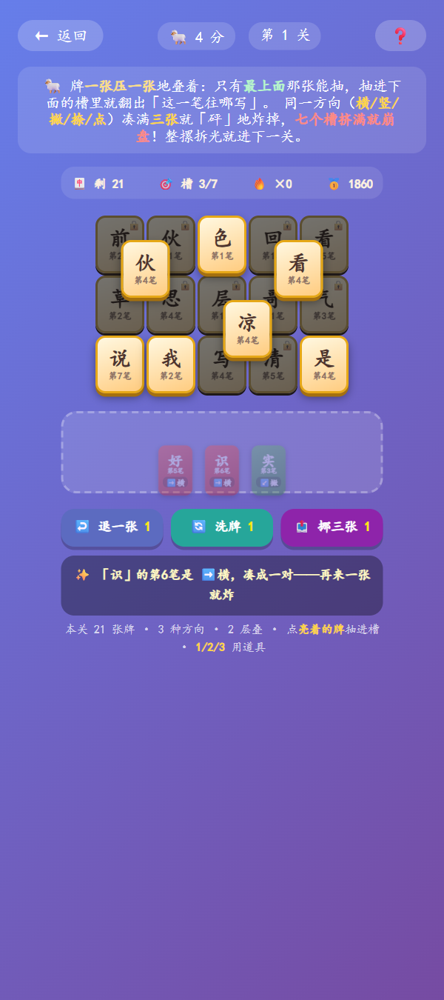
  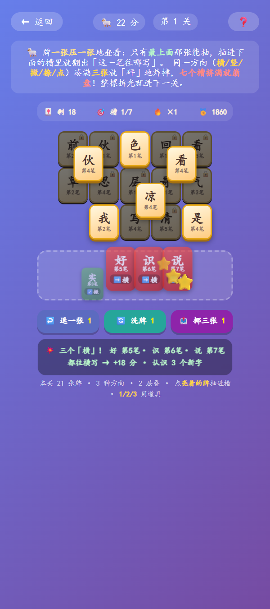
  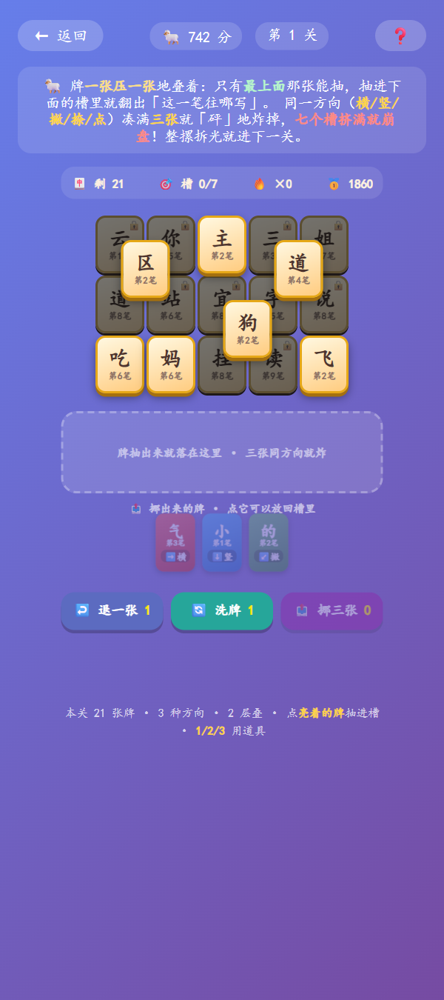
  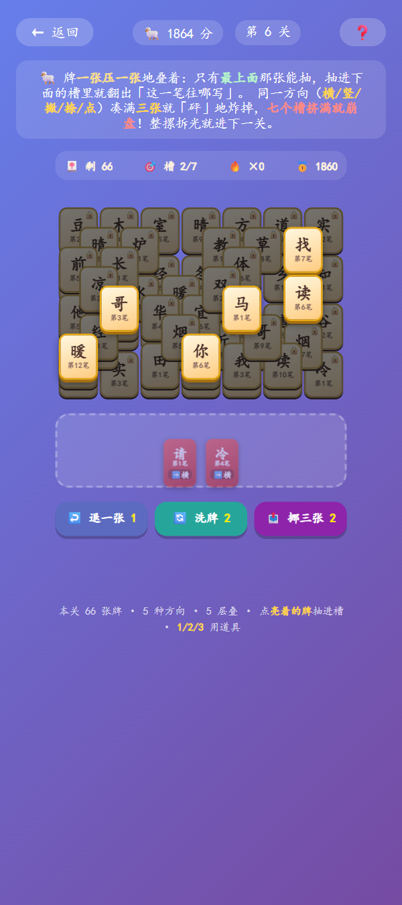
  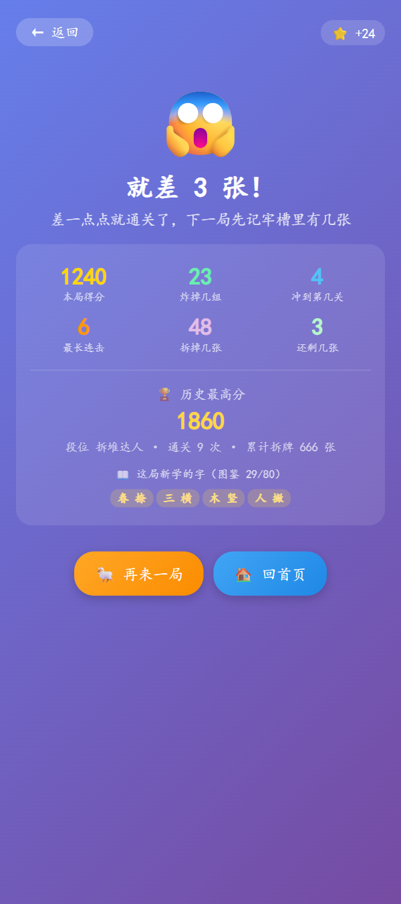
</p>

### 🏮 笔顺地宫（火把只照亮两格 · 找钥匙开石门 · 宝箱上刻着题）

前面 45 个模式都是「题目摆在脸上」，地宫把题**藏进了迷宫里**：一座随机生成的地下宫殿，手里一支火把只照亮身边一两格，其余全是黑的——走过的路会留在记忆里（暗黄），没去过的地方连墙都看不见。这一层的 🔒 石门必须先摸到 🗝️ 钥匙才开得动，而钥匙多半在最远的那个角落；路上每遇到一只 📦 宝箱，箱盖上就刻着一道笔顺题，**答得开才拿得到宝**。脚下还埋着看不见的 ⚡ 暗雷，踩过才知道。火把一直在烧，多走一步少一秒，于是「先看清 🗝️ 大概在哪头再动」变成了真本事，而练的还是那件事：**这个字的第几笔往哪写、一共几笔**。

- 🏮 **火把视野 = 记忆游戏**：第 1~4 层照亮身边 2 格、第 5~6 层只剩 1 格，黑格连里面有没有宝箱都不知道；孩子必须把看过的路记在脑子里绕路，撞墙只给一句「🧱 这一面是石墙」+ 整屏抖动，**不掉时间**
- 📦 **宝箱上刻着题**：60% 出「『气』的第 4 笔往哪写？」（➡️横 / ⬇️竖 / ↙️撇 / ↘️捺 / ↗️点 四选一），40% 出「一共有几笔？」；答对 +8 秒火把、连击越高分越多，答错 -6 秒并把正确项标绿再给一次机会——**答错两次这箱当场锈死**，这层就永远少一件宝藏
- ⏱️ **读题时火把自动停住**：题板一开，倒计时就冻住，不逼孩子边读题边掉时间；离开地宫去别家玩，计时器也会自己关掉，不会偷偷扣分
- 🗝️ **钥匙一定在最远的角落**：每层把钥匙放在离出发点 BFS 最远的那一间，没拿到钥匙时石门只会「纹丝不动」地提醒你去找它
- ⚡ **暗雷看不见，踩过才炸**：-1 颗心、-5 秒火把、连击清零，但那格从此在记忆里标着 ⚡（同一格不会炸第二次）——3 颗心炸完就得出洞
- 🕯️ **路上有补给**：🕯️ 灯油（视野永久 +1 格、火把 +6 秒、+12 分）、💧 清泉（❤️ +1，最多 3 颗），从第 3 层起才有
- 💡 **两种救急**：**H 照路**（每层 2 次）用 BFS 算出「🗝️ 宝藏/钥匙在 N 步外：先往东」并高亮下一格（-10 分）；**F 窜火把**（每层 1 次）10 秒内视野 +2 格，整层几乎全亮（-8 分）
- 🐉 **10 件宝藏图鉴**：🪙 五铢钱 / 🏺 陶罐 / 🦴 甲骨片（第 1~2 层）→ 🔔 铜铃 / 🈹 石印 / 🏮 宫灯（第 3~4 层）→ 🪞 铜镜 / 🔮 夜明珠 / 👑 金冠（第 5 层起）→ 🐉 **玉龙只有最深第 6 层才出土**（+96 分）；挖到过的字永久收进图鉴，首次收录额外 **+2 星**
- 🏔 **6 层越下越大、越黑、越快**：4×4(16 间) → 5×4 → 5×5 → 6×5 → 6×6 → 7×6(42 间)，每步耗时 1.0 → 1.4 秒，宝箱 1 → 4 个、暗雷 1 → 4 颗、火把 60 → 70 秒；迷宫用 DFS 生成后再拆掉三成死胡同留出回路，纯树形磨人的死路一律不留
- 🏆 **分数、星星与段位**：开门分 `80 + 30×层 + 35×已开箱 + 剩余时间×2（封顶 60 秒）`、首开宝箱 `40 + 10×层`、答案分 `(16+4×层)×(1+连击加成，最高 ×2.5)`；星星 `min(26, 总分÷45 + 逃出层×2 + 开箱)`；段位 9 档，从「地宫新手」到「汉字考古家」（累计每逃出 4 层升一档），最高分 / 最深层数 / 累计开箱 / 累计答题全部留档
- 🎮 **方向键 / WASD / 点相邻格 / 手指滑动**走动 · **1-4** 答题 · **H** 照路 · **F** 窜火把 · **回车** 再来一局（`hz_mz_best` / `hz_mz_depth` / `hz_mz_floors` / `hz_mz_boxes` / `hz_mz_answers` / `hz_mz_traps` / `hz_mz_runs` / `hz_mz_book`）

<p align="center">
  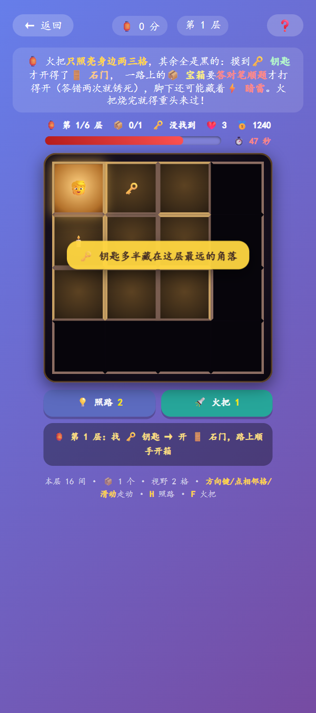
  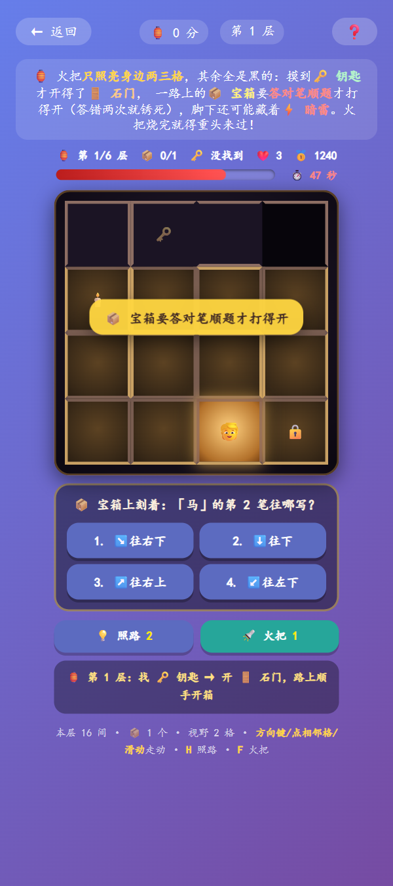
  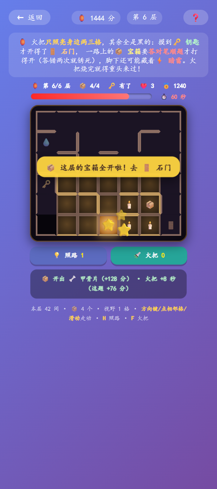
  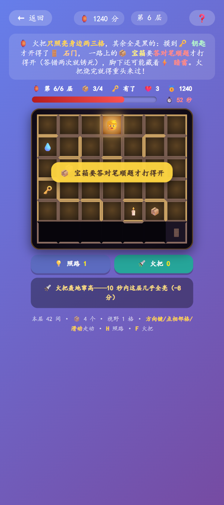
  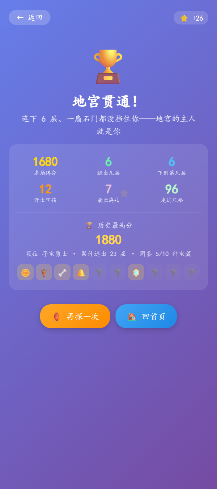
</p>

### 🗺️ 笔顺星图（40 关蛇形山路 · 答对才把路往前修一格）

前面 47 个模式各练各的，星图负责把它们**串成一条走得下去的路**：40 个关卡节点蛇形盘成 5 个村子（🌱 笔画村 → 🏘️ 偏旁镇 → 🏯 部首城 → ⛰️ 汉字山 → 🌌 云海宫），出发时脚下只有第 1 关亮着——**答对题目才会把路往前修一格**。打的还是那些题（这一笔往哪写 / 一共几笔），但孩子第一次能亲眼看见「我走到哪儿了」。

- ⭐ **点亮制解锁**：过关按失误数给 3/2/1 星，星级只升不降；下一关必须上一关至少 1 星才亮，锁着的 🔒 点一下会告诉你差多少（「先把第 5 关打穿，路才会修到这里」），而不是甩给你一张全灰的表
- 🚪 **跨村要攒 16⭐**：每村 8 关满分 24⭐，上一村攒够 16⭐ 才修得出进下一个村子的路；村子越深题越多（6 → 10 题）、时间越紧（74 → 69 → 64 → 59 → 54 秒），字池按笔画数分 5 档（≤3 画 → ≥10 画），第 5 村的孩子已经在考十几画的繁字
- 🔥 **连击关只有一条命**：每村第 5 关，8 题全程 1 条命，答错当场断——逼孩子把已经会的那一笔写稳，而不是蒙
- 🎁 **宝箱关全对宝要多一倍**：每村第 7 关只有 5 题 48 秒，打完开箱，一错不错奖励翻倍（`90+45×村`，全对再 ×2）
- 🐲 **龙巢打的是血条**：每村尽头蹲着一条笔画龙，9 格血，答对砍 1 格、答错它回 1 格，砍空才算赢；屠龙额外 +2⭐ 与 220~780 分，当场撒彩带
- 📅 **每日星关**：地图外单独的一格，每天只能打一次（5 题 45 秒 1 条命），连打天数越多星越多：+3⭐ 起，每连一天 +1，封顶 +9⭐
- 🎇 **强反馈**：连击沿十档音阶往上爬调、答对从按钮中心飞出星星、龙血一格一格掉、屠龙撒彩带、结算的 ⭐ 直接送进首页的动物收藏馆（攒够就解锁新动物）
- 🏆 **段位 9 档**：星图新手 → 探路小侠 → 关卡猎人 → 连击新星 → 宝箱达人 → 屠龙勇士 → 星海行者 → 地图征服者 → 星图霸主（每 15⭐ 升一档）；单关最高分、点亮关数、最长连击、屠龙次数全部留档，首页卡片上会亮 🆕 红点提醒你新修出了哪一关
- 🎮 **点节点进关** · **1-4** 答题 · **Esc** 收摊回地图（这关不点亮） · **回车** 直接打推进到的那一关 · **H** 复述本关目标 · **D** 打每日关

<p align="center">
  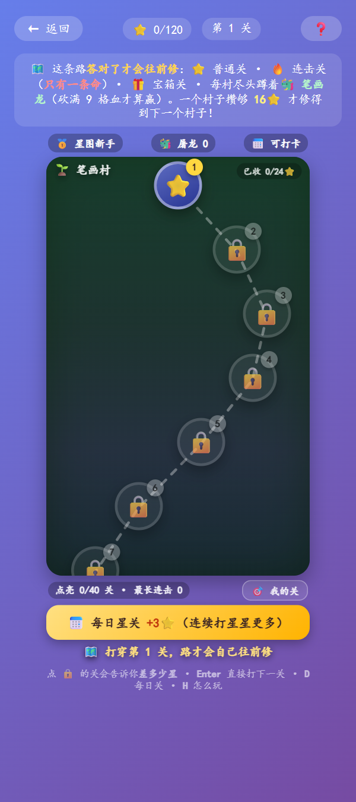
  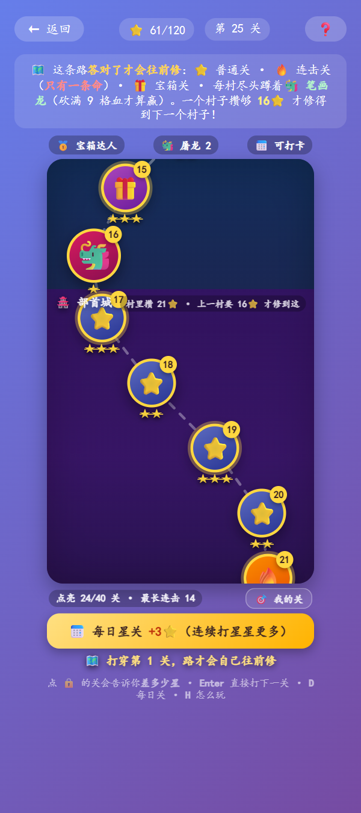
  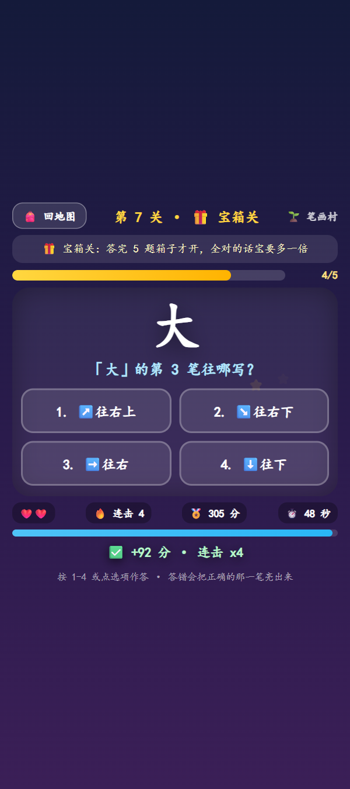
  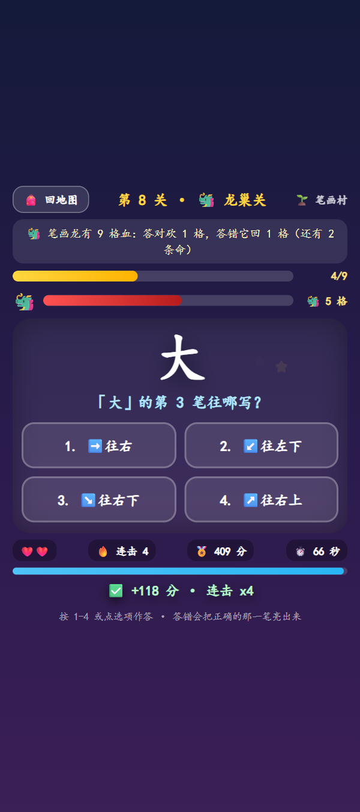
  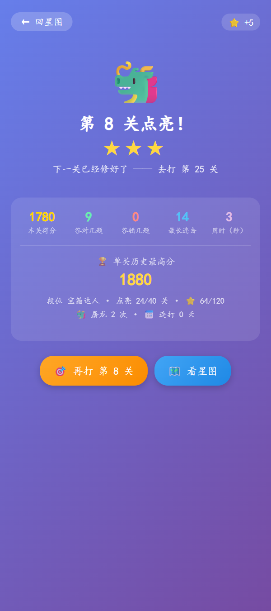
</p>

### 🧩 笔顺排排队（滑动推盘 · 把每一笔推回它的号位）

前面 48 个模式都在问「这一笔第几画、往哪写」，排排队把整个字**拆成一块一块方块**：盘面是华容道式的 3×3 / 4×4 推盘，每块方块上高亮着「凡」的一笔（其余笔画淡淡压在底下当影子，先认形再认序），每一格角上写着它该站第几笔。孩子要一边回忆笔顺、一边把方块推进空格，让 1 号位站第 1 笔、2 号位站第 2 笔——全对上的那一刻，这个字当场自己写一遍给他看。

- 🧲 **只认挨着空格的那一块**：点一块离空格还隔着一格的方块，它会当场抖一下并说「它挨不着空格」——推盘的路要自己让，先想清楚谁该进哪一格，不是乱推碰运气
- 🔒 **落对就锁死**：第 3 笔推进 3 号位立刻变绿打勾、从方块中心飞出一颗星、音效沿十档音阶往上爬一格；把它再推出去会掉锁，孩子自然会护住已经归位的方块
- 🪄 **提示「推一把」替你走一步**：每盘 2 次，只挑推完总距离真的变近的那块（步数照算，不白送）；盘面被堵死时它会说「先让开路，把挡着的挪走」，而不是给个错误答案
- 🔀 **重排 1 次**：盘面洗回乱序、步数清零，但计时不停——救急不救懒
- 📈 **4 档笔数带 · 盘面从 3×3 长到 4×4**：2-3 笔 → 4-5 笔 → 6-8 笔 → 9-12 笔，每 2 盘进一档；8 笔以内 3×3，9 笔起自动换 4×4（空格一多，让路就真变成一道谜题）；标准步数 = 打乱步数 ×1.6+4（封顶 44 步），时限从 95 秒一路压到 45 秒
- ⭐ **一步不差才算连击**：步数压进标准才给 3⭐ 并累计连击（加成最高 ×2.2），超了只给 2⭐；得分 = `基础(70+12×盘) × 连击系数 + 完美 45 + 剩余时间 ×1.5`
- 🌟 **图鉴收字**：每盘排完的那个字进 `hz_sl_book`（滚动保留 120 字），第一次排好额外 +2⭐——同一批字反复排不划算，孩子会主动往笔画更多的盘走
- 🥇 **段位按「累计归位笔数」涨**：推盘新手 → 滑动学徒 → 笔顺巧手 → 顺序达人 → 落位如飞 → 一步不差 → 归位高手 → 排排宗师 → 笔顺推盘王（每 25 笔升一档）——攒的是真推对了多少笔，不是玩了多久
- ⌨️ **方向键 = 往那个方向推**：↑ 把空格下面那块顶上来、← 把空格右边那块推过来，四个方向各走一格；`H` 复述玩法 · `P` 推一把 · `R` 重排 · 点顶部 ❓ 看规则

<p align="center">
  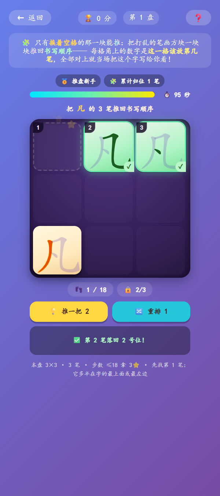
  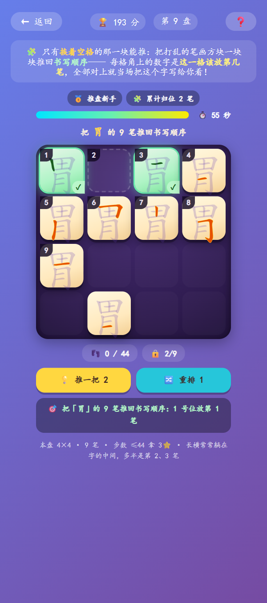
  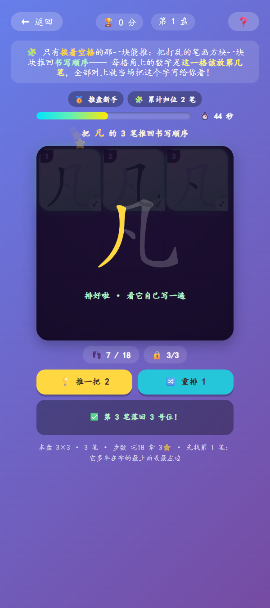
  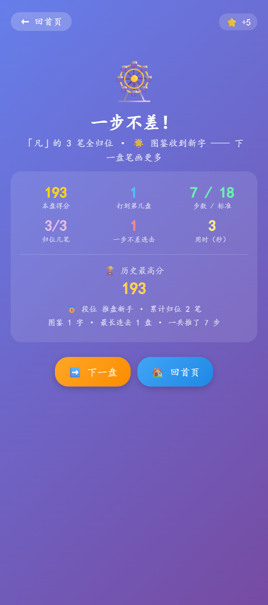
</p>

### ⚔️ 笔顺大闯关（Quiz 模式）

选择题闯关，每关随机出题，答对得星星、连击越高倍率越大：

| 题型 | 出现概率 | 示例 |
| --- | --- | --- |
| 数笔画 | 60% | 「大」字一共有几笔？ |
| 判方向 | 40% | 「大」的第二笔往哪个方向写？（➡️⬇️↙️↘️↗️） |

- 连击 ≥ 3 触发屏幕中央 "**连击 x3!**" 金色爆炸字
- 连击 ≥ 5 触发 "**超级连击 x5!!**"，星星奖励翻倍（1 → 2 → 3）
- 连击 ≥ 10 触发 "**无敌连击 x10!!!**"
- 每闯 5 关自动弹出全屏动物彩蛋 + 彩带雨

<p align="center">
  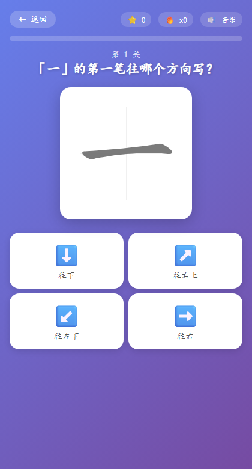
  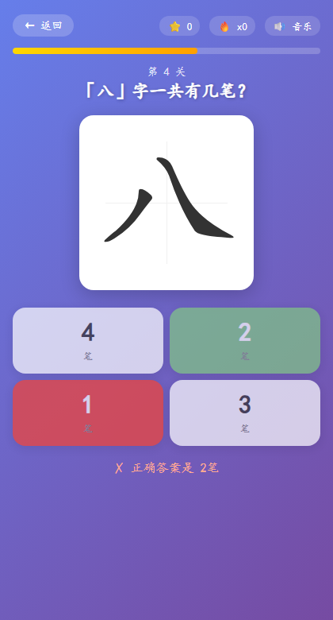
</p>

### 🔍 火眼金睛（Labels 模式）

看编号学笔顺：
- 每一笔的起点位置显示 **蓝色圆形编号**（1、2、3…），当前笔画高亮为橙色，完成变绿。
- 底部信息栏用带圈数字 ①②③ + 方向箭头图标直观展示笔画顺序。
- **▶ 播放笔顺** 按钮：逐笔动画演示整个字的书写过程。
- 点击任意编号可单独重播该笔画。

<p align="center">
  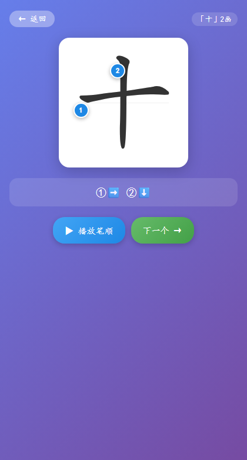
  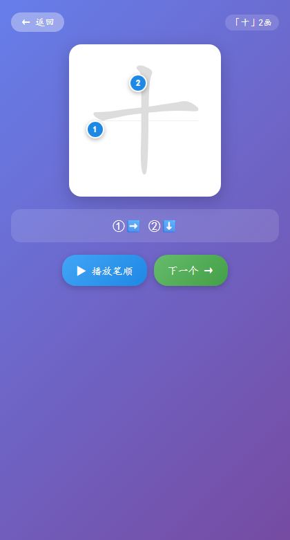
</p>

### ✏️ 妙笔生花（Write 模式）

鼠标描红练写字：
1. 打开先自动播放一次完整笔顺动画
2. 孩子用鼠标跟着虚线轮廓书写
3. `hanzi-writer` 内置 Quiz 引擎实时判断每一笔是否规范
4. 错 3 次自动高亮提示正确路径
5. **完美零失误 +3 星**，有失误 +1 星
6. 每写满 5 个字触发一次动物彩蛋

<p align="center">
  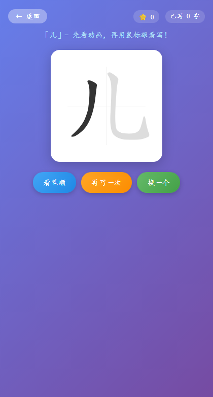
</p>

---

## 🎁 动物收藏馆

每积攒 **50 颗星星** 自动解锁一只动物，共 8 只可收集：

| 顺序 | 动物 | 需要星星 |
| --- | --- | --- |
| 1 | 🐼 熊猫 | 50 |
| 2 | 🐵 猴子 | 100 |
| 3 | 🐰 兔子 | 150 |
| 4 | 🐱 小猫 | 200 |
| 5 | 🐶 小狗 | 250 |
| 6 | 🐘 大象 | 300 |
| 7 | 🐧 企鹅 | 350 |
| 8 | 🐯 老虎 | 400 |

解锁瞬间：全屏遮罩 + 动物弹跳动画 + 4 音符欢快旋律 + 25 片彩带从顶部飘落。

<p align="center">
  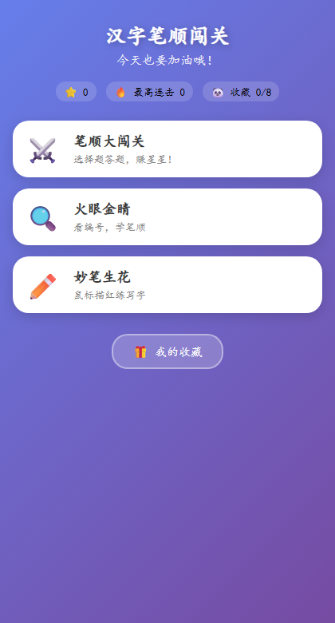
</p>

---

## 📚 字库

内置 **200+ 小学一二年级必会汉字**，覆盖人教版语文课本常见生字：

```
一 二 三 十 人 八 大 小 上 下 口 日 月 水 火 山 石 田 木 禾 米 白 云
女 儿 子 了 不 在 有 是 我 你 他 的 来 去 会 个 中 长 门 出 开 见 对
妈 爸 哥 姐 书 读 写 字 本 笔 春 风 冬 花 飞 入 姓 什 么 双 国 王 方
青 清 气 晴 情 请 生 时 动 万 吃 叫 主 住 没 以 后 更 种 样 伙 伴 玩
前 再 成 片 回 事 知 道 声 笑 跑 走 坐 站 看 听 说 唱 画 草 林 鸟 虫
鱼 牛 马 羊 猫 狗 宜 实 色 华 谷 金 尽 层 照 炉 烟 挂 川 劳 尤 其 区
...（更多见 index.html 中 CHARS 常量）
```

启动时并行预加载所有字符的 `hanzi-writer-data` JSON 数据，按 **笔画数从少到多** 排序后进入随机队列，实现难度渐进。

---

## 🛠️ 技术栈

| 类别 | 技术 |
| --- | --- |
| 前端框架 | **无框架** · 原生 HTML + CSS + JavaScript |
| 笔顺引擎 | [hanzi-writer 3.0.0](https://hanziwriter.org/) · SVG 渲染 |
| 字形数据 | [hanzi-writer-data 2.0](https://www.npmjs.com/package/hanzi-writer-data) · CDN 按需加载 |
| 音效 | Web Audio API · 代码合成正弦 / 方波 / 三角波 |
| 语音 | Web Speech API · `SpeechSynthesisUtterance` 中文播报 |
| 动画 | CSS `@keyframes` · 无第三方动画库 |
| 存储 | `localStorage` · 进度：`hz_stars` / `hz_maxCombo` / `hz_collected` / `hz_settings` / `hz_grade` · 各玩法最高分：`hz_challenge_best` / `hz_rhythm_best` / `hz_tetris_best` / `hz_mole_best` / `hz_puzzle_best` / `hz_runner_best` / `hz_boss_beat` / `hz_boss_best` · 宠物养成：`hz_pet`（成长/饱食/心情/上线时间，跨真实时间衰减） · 跳房子：`hz_hop_wins` / `hz_hop_best` · 连连消：`hz_lian_wins` / `hz_lian_best` · 切水果：`hz_fruit_wins` / `hz_fruit_best` · 打砖块：`hz_brick_lv` / `hz_brick_best` · 塔防：`hz_td_wave` / `hz_td_best` · 钓鱼：`hz_fish_book`（跨局鱼图鉴） / `hz_fish_best` / `hz_fish_caught` · 挖宝：`hz_dig_book`（跨局文物图鉴） / `hz_dig_best` / `hz_dig_deep`（最深土层） · 每日签到：`hz_sk_last`（真实日期） / `hz_sk_streak` / `hz_sk_best` / `hz_sk_total` / `hz_sk_medals` / `hz_sk_frag` · 贪吃蛇：`hz_snake_best` / `hz_snake_chars`（累计成字） / `hz_snake_len`（最长蛇身） · 消消乐：`hz_m3_best` / `hz_m3_lv`（最高通关） / `hz_m3_wins` / `hz_m3_sp`（累计特殊糖块） · 刮刮卡：`hz_sc_best`（单张最佳） / `hz_sc_score`（单局最高奖金） / `hz_sc_cards`（累计刮开张数） / `hz_sc_bingo`（累计 BINGO） / `hz_sc_rare`（稀有符号图鉴） · 多米诺：`hz_dp_score`（单局最高金币） / `hz_dp_total`（累计骨牌，决定称号） / `hz_dp_lines`（累计稳稳收手次数） / `hz_dp_chain`（单链最长） / `hz_dp_dragon`（一条龙次数） · 叠叠塔：`hz_stack_best`（最高层数） / `hz_stack_score`（单局最高分） / `hz_stack_perfect`（累计完美对齐） / `hz_stack_chars`（累计认字） · 跳一跳：`hz_jump_best`（最高分） / `hz_jump_hops`（累计跳格） / `hz_jump_perfect`（累计完美落心） / `hz_jump_answers`（累计答对） / `hz_jump_games`（累计局数） · 保龄球：`hz_bw_best`（最高分） / `hz_bw_strike`（累计全倒） / `hz_bw_spare`（累计补中） / `hz_bw_pins`（累计倒瓶） / `hz_bw_answers`（累计答题） / `hz_bw_games`（累计局数） · 推箱子：`hz_tk_lv`（解锁到第几关） / `hz_tk_par`（每关最佳步数） / `hz_tk_pushes`（累计推箱） / `hz_tk_chars`（累计归位） / `hz_tk_undo` / `hz_tk_hint` / `hz_tk_games` / `hz_tk_best`（单局最高分） · 天平屋：`hz_bl_best`（单局最高分） / `hz_bl_sold`（累计成交） / `hz_bl_exact`（累计一称就中） / `hz_bl_lv`（最高档位） / `hz_bl_chars`（累计认字） / `hz_bl_games`（累计局数） · 记忆翻翻屋：`hz_mm_best`（单局最高分） / `hz_mm_lv`（最高关卡） / `hz_mm_pairs`（累计配对） / `hz_mm_perfect`（累计完美搜查） / `hz_mm_games`（累计局数） / `hz_mm_chars`（累计认字） · 倒水杯：`hz_wc_best`（单局最高分） / `hz_wc_lv`（最高关卡） / `hz_wc_cups`（累计倒满杯数） / `hz_wc_perfect`（累计完美倒水） / `hz_wc_steps`（累计步数） / `hz_wc_games`（累计局数） / `hz_wc_chars`（倒水认过的字） · 泡泡龙：`hz_bb_best`（单局最高分） / `hz_bb_lv`（冲到第几关） / `hz_bb_pops`（累计爆破） / `hz_bb_drops`（累计整串掉落） / `hz_bb_shots`（累计发射） / `hz_bb_games`（累计局数） / `hz_bb_chars`（打泡认过的字） · 大富翁：`hz_mf_best`（单局最高金币） / `hz_mf_lv`（开到第几关） / `hz_mf_wins`（累计取胜） / `hz_mf_rent`（累计收租） / `hz_mf_estates`（累计置地） / `hz_mf_games`（累计局数） / `hz_mf_chars`（走城认过的字） · 水管屋：`hz_pi_best`（单局最高分） / `hz_pi_lv`（通到第几关） / `hz_pi_valves`（累计开水阀） / `hz_pi_levels`（累计通关） / `hz_pi_perfect`（累计一步不差） / `hz_pi_games`（累计局数） / `hz_pi_chars`（引水认过的字） · 弹珠台：`hz_pl_best`（单局最高分） / `hz_pl_lv`（通到第几关） / `hz_pl_jack`（累计撞进头奖） / `hz_pl_beads`（累计投珠） / `hz_pl_answers`（累计答对题） / `hz_pl_chars`（写完几个字） / `hz_pl_games`（累计局数） · 娃娃机：`hz_cw_best`（单局最高分） / `hz_cw_lv`（抓到第几关） / `hz_cw_dolls`（累计抓娃） / `hz_cw_shiny`（累计闪光娃娃） / `hz_cw_answers`（累计答对题） / `hz_cw_drops`（累计落爪） / `hz_cw_games`（累计局数） / `hz_cw_book`（图鉴：夹中并落袋过的字） · 笔顺神探：`hz_dt_best`（单局最高分） / `hz_dt_lv`（破到第几关） / `hz_dt_streak`（最长一眼连破） / `hz_dt_cases`（累计破案） / `hz_dt_easy`（累计一眼看穿） / `hz_dt_answers`（累计答对） / `hz_dt_miss`（累计看走眼） / `hz_dt_games`（累计局数） / `hz_dt_book`（复仇手册：看错待认回的字） · 四子棋：`hz_c4_best`（单局最高分） / `hz_c4_lv`（最高段位） / `hz_c4_streak`（最长连击） / `hz_c4_games`（累计局数） / `hz_c4_wins` / `hz_c4_losses`（累计赢/输几盘） / `hz_c4_answers`（累计答对） / `hz_c4_miss`（累计答错送子） / `hz_c4_slow`（累计手慢被抢） / `hz_c4_boards`（累计下过几盘） · 笔顺闪现：`hz_fl_best`（单局最高分） / `hz_fl_lv`（冲到第几段） / `hz_fl_streak`（最长连拍） / `hz_fl_cards`（累计闪过几张） / `hz_fl_easy`（累计一眼记住） / `hz_fl_answers`（累计答对） / `hz_fl_miss`（累计看走眼） / `hz_fl_games`（累计局数） / `hz_fl_wall`（跨局记忆墙：答对过的字） · 笔顺猜字：`hz_wd_best`（单局最高分） / `hz_wd_lv`（最高段位） / `hz_wd_streak`（最长连中） / `hz_wd_wins`（累计猜中） / `hz_wd_guesses`（累计猜字次数） / `hz_wd_miss`（累计没猜中） / `hz_wd_games`（累计局数） / `hz_wd_gsum`（猜中总用次数，算历史平均） / `hz_wd_book`（猜字图鉴：猜中过的字） · 合合合：`hz_mg_best`（最高分） / `hz_mg_top`（最高合到几画） / `hz_mg_merges`（累计合成） / `hz_mg_answers`（累计答对题） / `hz_mg_king`（字王次数） · 扭蛋机：`hz_gg_coin`（🪙 余额） / `hz_gg_frag`（🧩 碎片） / `hz_gg_pity`（保底计数） / `hz_gg_pulls`（累计抽数） / `hz_gg_book`（已收精灵） / `hz_gg_sets`（已领套装大奖） · 双人对战：`hz_duel_p1` / `hz_duel_p2`（累计战绩） / `hz_duel_streak` / `hz_duel_matches` · 笔顺小镇：`hz_tw_b`（每栋楼的等级） / `hz_tw_coin`（💰 余额） / `hz_tw_mat`（🧱 材料） / `hz_tw_purse`（待收钱包） / `hz_tw_seen`（上次在线时刻，用来算离线收益） / `hz_tw_work`（累计砌墙） / `hz_tw_best`（单班最佳材料） / `hz_tw_games`（累计下工） / `hz_tw_buy`（杂货铺购买次数，决定涨价） / `hz_tw_prop`（⏱️ 加时卡 / 🧤 护手手套背包） / `hz_tw_pl`（历史购买次数） / `hz_tw_book`（小镇图鉴：砌过的字） · 笔顺无双：`hz_mw_best`（单局最高战斗分） / `hz_mw_lv`（段位，由累计斩字数决定） / `hz_mw_chars`（累计斩完几个字） / `hz_mw_games`（累计出战几场） / `hz_mw_kills`（累计斩杀只数） / `hz_mw_wave`（冲到的最高波次） / `hz_mw_time`（最长存活秒数） / `hz_mw_book`（无双图鉴：一笔不落地斩完过的字） · 笔顺堆堆消：`hz_dd_best`（单局最高分） / `hz_dd_lv`（拆到第几关） / `hz_dd_wins`（累计整摞拆光，决定段位） / `hz_dd_games`（累计局数） / `hz_dd_pops`（累计爆破组数） / `hz_dd_combo`（最长连击） / `hz_dd_tiles`（累计拆牌张数） / `hz_dd_book`（笔顺图鉴：炸过的字） · 笔顺地宫：`hz_mz_best`（单局最高分） / `hz_mz_depth`（下到过第几层） / `hz_mz_floors`（累计逃出层数，决定段位） / `hz_mz_boxes`（累计开箱） / `hz_mz_answers`（累计答过的题） / `hz_mz_traps`（累计踩雷） / `hz_mz_runs`（累计下洞） / `hz_mz_book`（宝藏图鉴：挖到过的宝物） · 笔顺星图：`hz_map_stars`（每关星级 JSON） / `hz_map_best`（单关最高分） / `hz_map_wins`（累计点亮关，决定段位） / `hz_map_runs`（累计进关次数） / `hz_map_fails`（累计没打穿） / `hz_map_boss`（累计屠龙） / `hz_map_combo`（最长连击） / `hz_map_day`（每日关最近日期） / `hz_map_streak`（每日连打天数） / `hz_map_seen`（首页红点已读到第几关） · 笔顺排排队：`hz_sl_lv`（玩到第几盘） / `hz_sl_best`（单局最高分） / `hz_sl_fix`（累计归位笔数，决定段位） / `hz_sl_par`（累计一步不差） / `hz_sl_combo`（最长一步不差连击） / `hz_sl_moves`（累计推步数） / `hz_sl_games`（累计开局） / `hz_sl_book`（推盘图鉴：排完过的字） / `hz_sl_seen`（首页红点已读到第几盘） |
| 部署 | 任意静态服务器 · 已内置多 CDN 容错 |

---

## 🚀 快速开始

### 方式 1：直接双击运行（最简单）

```bash
git clone git@github.com:shixingya/hanzi-practice.git
cd hanzi-practice
# 直接用浏览器打开 index.html 即可
```

> ⚠️ 需要联网访问 CDN 加载笔顺库和字形数据。

### 方式 2：本地 HTTP 服务（推荐）

某些浏览器对 `file://` 协议的 fetch 请求有限制，用 HTTP 服务更稳：

```bash
# Python 3
python -m http.server 8765

# 或 Node.js
npx serve -l 8765
```

浏览器打开 http://127.0.0.1:8765 。

### 方式 3：部署到 GitHub Pages

1. 把仓库 fork 到自己的账号
2. Settings → Pages → Source 选 `main` 分支根目录
3. 等 1 分钟后访问 `https://<你的用户名>.github.io/hanzi-practice/`

---

## 📂 目录结构

```
hanzi-practice/
├── index.html          # 主应用（24925 行单文件，包含 HTML/CSS/JS）
├── assets/             # README 用图片资源
│   ├── demo.gif        # 运行演示 GIF
│   ├── scene_home.png
│   ├── scene_quiz.png
│   ├── scene_quiz_answer.png
│   ├── scene_labels.png
│   ├── scene_labels_play.png
│   ├── scene_write.png
│   ├── scene_collection.png
│   ├── scene_mole.png
│   ├── scene_puzzle.png
│   ├── scene_runner.png
│   ├── scene_boss.png
│   ├── scene_pet.png
│   ├── scene_hop.png
│   ├── scene_lian.png
│   ├── scene_fruit.png
│   ├── scene_brick.png
│   ├── scene_defense.png
│   ├── scene_fish.png
│   ├── scene_duel.png
│   ├── scene_dig.png
│   ├── scene_checkin.png
│   ├── scene_snake.png
│   ├── scene_match3.png
│   ├── scene_scratch.png
│   ├── scene_domino.png
│   ├── scene_stack.png
│   ├── scene_gacha.png
│   ├── scene_gacha_pull.png
│   ├── scene_gacha_book.png
│   ├── scene_merge.png
│   ├── scene_merge_king.png
│   ├── scene_merge_result.png
│   ├── scene_jump.png
│   ├── scene_jump_perfect.png
│   ├── scene_jump_result.png
│   ├── scene_bowl.png
│   ├── scene_bowl_strike.png
│   ├── scene_bowl_result.png
│   ├── scene_bubble.png
│   ├── scene_bubble_pop.png
│   ├── scene_bubble_result.png
│   ├── scene_push.png
│   ├── scene_push_win.png
│   ├── scene_push_result.png
│   ├── scene_balance.png
│   ├── scene_balance_sold.png
│   ├── scene_balance_result.png
│   ├── scene_memory.png
│   ├── scene_memory_pair.png
│   ├── scene_memory_result.png
│   ├── scene_cup.png
│   ├── scene_cup_pour.png
│   ├── scene_fortune.png
│   ├── scene_fortune_buy.png
│   ├── scene_fortune_result.png
│   ├── scene_pipe.png
│   ├── scene_pipe_valve.png
│   ├── scene_pipe_result.png
│   ├── scene_claw.png
│   ├── scene_claw_quiz.png
│   ├── scene_claw_result.png
│   ├── scene_plinko.png
│   ├── scene_plinko_gate.png
│   ├── scene_plinko_result.png
│   ├── scene_detect.png
│   ├── scene_detect_clue.png
│   ├── scene_detect_wrong.png
│   ├── scene_detect_win.png
│   ├── scene_detect_result.png
│   ├── scene_four.png
│   ├── scene_four_ai.png
│   ├── scene_four_win.png
│   ├── scene_four_result.png
│   ├── scene_flash.png
│   ├── scene_flash_ask.png
│   ├── scene_flash_teach.png
│   ├── scene_flash_result.png
│   ├── scene_wordle.png
│   ├── scene_wordle_hint.png
│   ├── scene_wordle_win.png
│   ├── scene_wordle_result.png
│   ├── scene_town.png
│   ├── scene_town_work.png
│   ├── scene_town_wall.png
│   ├── scene_town_result.png
│   ├── scene_dd.png
│   ├── scene_dd_boom.png
│   ├── scene_dd_props.png
│   ├── scene_dd_deep.png
│   ├── scene_dd_result.png
│   ├── scene_maze.png
│   ├── scene_maze_box.png
│   ├── scene_maze_open.png
│   ├── scene_maze_deep.png
│   ├── scene_maze_result.png
│   ├── scene_map.png
│   ├── scene_map_progress.png
│   ├── scene_map_arena.png
│   ├── scene_map_boss.png
│   ├── scene_map_result.png
│   ├── scene_slide.png
│   ├── scene_slide_write.png
│   ├── scene_slide_result.png
│   ├── scene_slide_board4.png
│   └── scene_cup_result.png
├── record_demo.js      # Puppeteer 自动录屏脚本（开发用）
├── make_gif.py         # PNG 帧合成 GIF 脚本（开发用）
├── package.json
└── README.md
```

---

## 🎬 重新录制演示 GIF

如果你想修改代码后重录 README 顶部的演示 GIF：

```bash
# 1. 安装依赖（首次）
npm install puppeteer-core
python -m pip install pillow

# 2. 启动本地服务器
python -m http.server 8765

# 3. 另开一个终端录制帧（约 30 秒）
node record_demo.js

# 4. 合成 GIF
python make_gif.py
```

录屏脚本会用无头 Chrome 依次访问：首页 → 笔顺大闯关（答 3 题）→ 火眼金睛（播放笔顺）→ 妙笔生花 → 我的收藏，全程约 92 帧 @ 5.5fps，输出 `assets/demo.gif`（约 1.9 MB）。

如需修改 Chrome 路径，设置环境变量：
```powershell
$env:CHROME_PATH = "D:\Your\Path\chrome.exe"
```

---

## 🔧 关键实现细节

### 笔画方向自动识别

`detectDir()` 函数根据 `hanzi-writer-data` 提供的 `medians`（笔画中线坐标）自动判断每一笔的方向类型：

| 代码 | 方向 | 图标 | 判定条件（角度） |
| --- | --- | --- | --- |
| R | 往右（横） | ➡️ | -25° ≤ θ < 25° |
| D | 往下（竖） | ⬇️ | -115° ≤ θ < -65° |
| P | 往左下（撇） | ↙️ | -180° ≤ θ < -115° |
| N | 往右下（捺） | ↘️ | -65° ≤ θ < -25° |
| T | 往右上（提） | ↗️ | 25° ≤ θ < 80° |

位移小于 60 单位的短笔画统一判定为「点」（往下）。

### CDN 备用加载

```javascript
var cdns = [
  'https://cdn.jsdelivr.net/npm/hanzi-writer@3.0.0/dist/hanzi-writer.min.js',
  'https://unpkg.com/hanzi-writer@3.0.0/dist/hanzi-writer.min.js',
  'https://cdnjs.cloudflare.com/ajax/libs/hanzi-writer/3.0.0/hanzi-writer.min.js'
];
```

任一 CDN 加载成功即停止尝试，全部失败时首页显示"加载失败，请检查网络后刷新"。

### 进度持久化

```javascript
localStorage.setItem('hz_stars', stars);           // 累计星星数
localStorage.setItem('hz_maxCombo', maxCombo);     // 历史最高连击
localStorage.setItem('hz_collected', JSON.stringify(collected)); // 已解锁动物名列表
```

清除数据：浏览器 DevTools → Application → Local Storage → 删除以上 key。

---

## 📱 兼容性

| 环境 | 支持情况 |
| --- | --- |
| Chrome / Edge 90+ | ✅ 完整支持 |
| Firefox 90+ | ✅ 完整支持 |
| Safari 14+ | ✅ 支持（语音可能受限于用户手势策略） |
| iOS Safari | ✅ 触屏操作 OK |
| Android Chrome | ✅ 触屏操作 OK |
| 微信内置浏览器 | ⚠️ 语音合成可能被禁用，其他正常 |

移动端已做响应式适配（`@media max-width: 420px`），字符框从 260px 缩至 220px。

---

## 🐛 已知问题

- Web Speech API 首次触发需要用户手势，个别浏览器可能第一句语音不播报，第二次起正常。
- 完整预加载 200+ 字形数据需 3–8 秒（取决于网络），期间首页显示"正在加载字库..."。
- 极少数生僻字（如「宜」「谷」）的 `medians` 数据可能不完全符合方向判定规则，会以默认「横」处理。

---

## 📄 License

MIT © 2026 shixingya

---

## 🙏 致谢

- [hanzi-writer](https://github.com/chanind/hanzi-writer) by Chanind — 提供核心笔顺动画与 Quiz 引擎
- [hanzi-writer-data](https://github.com/chanind/hanzi-writer-data) — 提供 9000+ 汉字的 SVG 路径与笔画中线数据
- [Make Me a Hanzi](https://github.com/skishore/makemeahanzi) — 字形数据的原始来源

---

<p align="center">
  <b>如果这个项目帮到了你家小朋友，欢迎点个 ⭐ Star 支持一下！</b>
</p>
